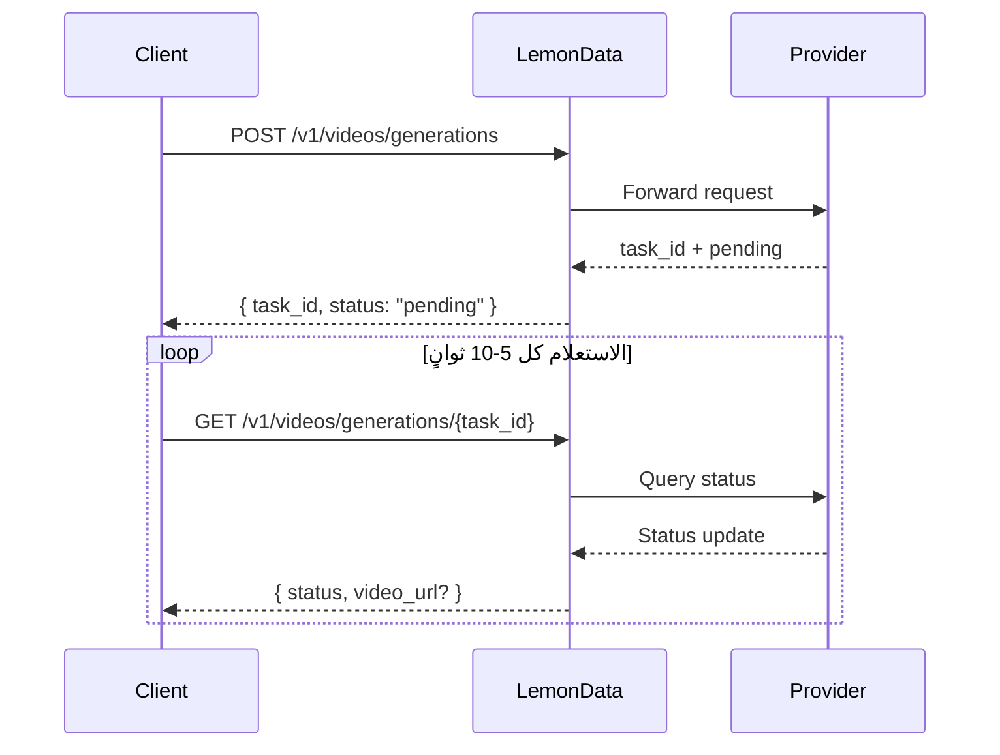

## نظرة عامة

توفر LemonData إمكانية الوصول إلى **أكثر من 69 نموذجاً لإنشاء الفيديو** من 11 مزوداً من خلال API موحد واحد. عملية إنشاء الفيديو **غير متزامنة (asynchronous)** — حيث تقوم بإرسال طلب وتتلقى معرف مهمة `task_id`، ثم تقوم بالاستعلام عن النتيجة.

<Info>
يتم تحديث قائمة النماذج بشكل متكرر. للحصول على أحدث النماذج المتاحة والأسعار، قم بزيارة [صفحة النماذج](https://lemondata.cc/ar/models) أو استخدم [Models API](/api-reference/models/list-models).
</Info>

### سير العمل غير المتزامن



<CodeGroup>

```python Python
import requests
import time

API_KEY = "sk-your-api-key"
BASE = "https://api.lemondata.cc/v1"
headers = {"Authorization": f"Bearer {API_KEY}"}

# Step 1: Submit generation request
resp = requests.post(f"{BASE}/videos/generations",
    headers=headers,
    json={
        "model": "kling-v2.6-pro",
        "prompt": "A golden retriever running on a beach at sunset, cinematic 4K",
        "duration": 5,
        "aspect_ratio": "16:9"
    }
)
task_id = resp.json()["task_id"]

# Step 2: Poll for result
while True:
    status = requests.get(f"{BASE}/videos/generations/{task_id}", headers=headers).json()
    if status["status"] in ("completed", "succeeded"):
        print(f"Video URL: {status['video_url']}")
        break
    elif status["status"] == "failed":
        print(f"Failed: {status.get('error')}")
        break
    time.sleep(10)
```

```javascript JavaScript
const API_KEY = 'sk-your-api-key';
const BASE = 'https://api.lemondata.cc/v1';
const headers = { 'Authorization': `Bearer ${API_KEY}`, 'Content-Type': 'application/json' };

// Step 1: Submit
const { task_id } = await fetch(`${BASE}/videos/generations`, {
  method: 'POST', headers,
  body: JSON.stringify({
    model: 'kling-v2.6-pro',
    prompt: 'A golden retriever running on a beach at sunset, cinematic 4K',
    duration: 5,
    aspect_ratio: '16:9'
  })
}).then(r => r.json());

// Step 2: Poll
const poll = setInterval(async () => {
  const status = await fetch(`${BASE}/videos/generations/${task_id}`, { headers }).then(r => r.json());
  if (['completed', 'succeeded'].includes(status.status)) {
    console.log('Video URL:', status.video_url);
    clearInterval(poll);
  } else if (status.status === 'failed') {
    console.error('Failed:', status.error);
    clearInterval(poll);
  }
}, 10000);
```

</CodeGroup>

## مصفوفة قدرات النماذج

تتفوق النماذج المختلفة في مهام مختلفة. استخدم هذه المصفوفة لاختيار النموذج المناسب لحالة الاستخدام الخاصة بك.

**مفتاح الرموز**: ✅ مدعوم | ❌ غير مدعوم

| السلسلة | المزود | T2V | I2V | Keyframe | Extension | Editing | أقصى مدة |
|--------|----------|-----|-----|----------|-----------|---------|-------------|
| **Sora** | OpenAI | ✅ | ❌ | ❌ | ❌ | ❌ | ~20s |
| **Kling** | Kuaishou | ✅ | ✅ | ❌ | ✅ | ❌ | 10s |
| **Veo** | Google | ✅ | ❌ | ❌ | ❌ | ❌ | 8s |
| **Seedance** | ByteDance | ✅ | ✅ | ✅ | ✅ | ✅ | 10s |
| **Hailuo** | MiniMax | ✅ | ✅ | ❌ | ❌ | ❌ | 6s |
| **Wan** | Alibaba | ✅ | ✅ | ❌ | ❌ | ❌ | 5s |
| **Runway** | Runway | ✅ | ✅ | ❌ | ❌ | ❌ | 10s |
| **Luma** | Luma | ✅ | ❌ | ❌ | ✅ | ❌ | 5s |
| **Vidu** | Vidu | ✅ | ✅ | ❌ | ❌ | ❌ | 8s |
| **Grok** | xAI | ✅ | ❌ | ❌ | ❌ | ❌ | ~10s |
| **Higgsfield** | Higgsfield | ✅ | ❌ | ❌ | ❌ | ❌ | ~5s |

### تعريفات القدرات

- **T2V (Text-to-Video)**: إنشاء فيديو من وصف نصي.
- **I2V (Image-to-Video)**: تحريك صورة ثابتة إلى فيديو باستخدام `image_url` أو `image`.
- **Keyframe**: التحكم في إطارات البداية والنهاية باستخدام `start_image` + `end_image`.
- **Extension**: تمديد مدة فيديو موجود.
- **Editing**: تعديل جوانب محددة من فيديو موجود.

## النماذج المتاحة حسب السلسلة

### Sora (OpenAI)

| النموذج | الجودة | ملاحظات |
|-------|---------|-------|
| `sora-2` | Standard | النموذج الافتراضي، توازن جيد بين الجودة والسرعة |
| `sora-2-pro` | High | جودة أعلى، وقت إنشاء أطول |
| `sora-2-characters` | Standard | إنشاء يركز على الشخصيات |

### Kling (Kuaishou)

| النموذج | القدرة | ملاحظات |
|-------|-----------|-------|
| `kling-v2.6-pro` | T2V | أحدث جيل، جودة احترافية |
| `kling-v2.6-std` | T2V | أحدث جيل، سريع |
| `kling-v2.5-turbo-pro` | T2V | سرعة فائقة (Turbo)، جودة احترافية |
| `kling-v2.1-master` | T2V/I2V | جودة Master |
| `kling-v2.1-pro` | T2V/I2V | جودة احترافية |
| `kling-v2.1-standard` | T2V/I2V | جودة قياسية |
| `kling-video` | T2V/I2V | النموذج الأساسي |
| `kling-video-extend` | Extension | تمديد مقاطع الفيديو الموجودة |
| `kling-video-o1-pro` | T2V | استنتاج O1، جودة احترافية |
| `kling-video-o1-std` | T2V | استنتاج O1، جودة قياسية |
| `kling-effects` | Effects | تطبيق تأثيرات بصرية |
| `kling-omni-video` | T2V | نموذج Omni |
| `kling-motion-control` | T2V | إنشاء مع التحكم في الحركة |

### Veo (Google)

| النموذج | الجودة | ملاحظات |
|-------|---------|-------|
| `veo3.1` | Standard | أحدث نموذج فيديو من Google |
| `veo3.1-pro` | High | جودة احترافية |
| `veo3.1-4k` | Ultra | مخرجات بدقة 4K |
| `veo3.1-fast` | Fast | إنشاء أسرع |
| `veo3.1-fast-4k` | Fast + 4K | إنشاء سريع مع مخرجات 4K |
| `veo3.1-components` | Standard | إنشاء يعتمد على المكونات |
| `veo3` | Standard | الجيل السابق |
| `veo3-pro` | High | الجيل السابق، احترافي |
| `veo3-fast` | Fast | الجيل السابق، سريع |

### Seedance (ByteDance)

| النموذج | القدرة | ملاحظات |
|-------|-----------|-------|
| `seedance-2-0` | T2V/I2V/Keyframe/Extension/Editing | الأحدث والأكثر قدرة |
| `seedance-1-5-pro` | T2V/I2V | الجيل السابق، جودة احترافية |
| `seedance-1-0-pro` | T2V/I2V | الجيل الأول، احترافي |
| `seedance-1-0-pro-fast` | T2V/I2V | الجيل الأول، سريع |
| `seedance-1-0-lite-t2v` | T2V | تحويل النص إلى فيديو خفيف الوزن |
| `seedance-1-0-lite-i2v` | I2V | تحويل الصورة إلى فيديو خفيف الوزن |

<Note>
يدعم Seedance 2.0 أوسع مجموعة من القدرات بما في ذلك تحويل الوسائط المتعددة إلى فيديو، وتمديد الفيديو، وتحرير الفيديو — كل ذلك من خلال نفس نقطة نهاية API.
</Note>

### Hailuo (MiniMax)

| النموذج | الجودة | ملاحظات |
|-------|---------|-------|
| `hailuo-2.3` | Standard | جودة جيدة |
| `hailuo-2.3-pro` | High | مخرجات بجودة أعلى |
| `hailuo-2.3-fast` | Fast | إنشاء أسرع |
| `hailuo-2.3-standard` | Standard | الفئة القياسية |
| `video-01` | Standard | MiniMax video-01 |
| `video-01-live` | Standard | إنشاء بأسلوب البث المباشر |

### Wan (Alibaba)

| النموذج | القدرة | ملاحظات |
|-------|-----------|-------|
| `wan-2.6` | T2V | أحدث تحويل للنص إلى فيديو |
| `wan2.6-i2v` | I2V | أحدث تحويل للصورة إلى فيديو |
| `wan-2.5` | T2V | الجيل السابق |
| `wan2.5-i2v-preview` | I2V | الجيل السابق I2V |
| `wan-2.2-plus` | T2V | جيل أقدم |
| `vace-14b` | T2V | معمارية VACE |

### Runway

| النموذج | المدة | ملاحظات |
|-------|----------|-------|
| `runwayml-gen4-turbo-5` | 5s | إنشاء سريع |
| `runwayml-gen4-turbo-10` | 10s | مقاطع أطول |

### Luma

| النموذج | القدرة | ملاحظات |
|-------|-----------|-------|
| `luma-video-api` | T2V | تحويل النص إلى فيديو |
| `luma-video-extend-api` | Extension | تمديد مقاطع الفيديو الموجودة |

### Vidu (Shengshu)

| النموذج | الجودة | ملاحظات |
|-------|---------|-------|
| `viduq3-pro` | High | أحدث جيل |
| `viduq2-pro` | High | الجيل السابق، احترافي |
| `viduq2-pro-fast` | Fast | الجيل السابق، احترافي سريع |
| `viduq2` | Standard | الجيل السابق، قياسي |
| `viduq2-turbo` | Fast | سرعة فائقة (Turbo) |
| `vidu2.0` | Standard | النموذج الأساسي |

### Grok (xAI)

| النموذج | ملاحظات |
|-------|-------|
| `grok-video-3` | نموذج إنشاء الفيديو من xAI |
| `grok-video-3-10s` | نسخة بمدة 10 ثوانٍ |

### Higgsfield

| النموذج | ملاحظات |
|-------|-------|
| `higgsfield-turbo` | الأسرع، تكلفة أقل |
| `higgsfield-standard` | جودة قياسية |
| `higgsfield-lite` | خفيف الوزن |

## أمثلة على الاستخدام

### تحويل النص إلى فيديو (T2V)

حالة الاستخدام الأكثر شيوعاً. تدعم جميع النماذج هذه الميزة.

```python
# مثال على تحويل النص إلى فيديو
response = requests.post(f"{BASE}/videos/generations",
    headers=headers,
    json={
        "model": "veo3.1-pro",
        "prompt": "Aerial drone shot of a coastal city at golden hour, waves crashing against cliffs",
        "duration": 5,
        "aspect_ratio": "16:9",
        "resolution": "1080p"
    }
)
```

### تحويل الصورة إلى فيديو (I2V)

تحريك صورة ثابتة. استخدم `image_url` لرابط أو `image` لبيانات base64.

```python
# استخدام رابط الصورة
response = requests.post(f"{BASE}/videos/generations",
    headers=headers,
    json={
        "model": "wan2.6-i2v",
        "prompt": "The person slowly turns and smiles at the camera",
        "image_url": "https://example.com/portrait.jpg"
    }
)

# استخدام صورة base64
import base64
with open("photo.jpg", "rb") as f:
    image_b64 = base64.b64encode(f.read()).decode()

response = requests.post(f"{BASE}/videos/generations",
    headers=headers,
    json={
        "model": "kling-v2.1-master",
        "prompt": "Gentle wind blows through the scene",
        "image": f"data:image/jpeg;base64,{image_b64}"
    }
)
```

### التحكم في الإطارات الرئيسية (صورة البداية + النهاية)

التحكم في كل من الإطارات الأولى والأخيرة لانتقالات دقيقة. مدعوم حالياً بواسطة Seedance 2.0.

```python
response = requests.post(f"{BASE}/videos/generations",
    headers=headers,
    json={
        "model": "seedance-2-0",
        "prompt": "Smooth transition from day to night, city lights gradually turning on",
        "start_image": "https://example.com/city-day.jpg",
        "end_image": "https://example.com/city-night.jpg",
        "duration": 5
    }
)
```

### تمديد الفيديو

تمديد مدة فيديو موجود. استخدم النماذج التي تدعم قدرة التمديد.

```python
response = requests.post(f"{BASE}/videos/generations",
    headers=headers,
    json={
        "model": "kling-video-extend",
        "prompt": "Continue the scene naturally",
        "image_url": "https://example.com/last-frame.jpg"
    }
)
```

## مرجع المعلمات

| المعلمة | النوع | الوصف |
|-----------|------|-------------|
| `model` | string | معرف النموذج (الافتراضي: `sora-2`) |
| `prompt` | string | **مطلوب.** وصف نصي للفيديو |
| `image_url` | string | رابط صورة البداية (لتحويل I2V) |
| `image` | string | صورة مبرمجة بترميز Base64 مع بادئة data URL (لتحويل I2V) |
| `duration` | integer | مدة الفيديو بالثواني (1-60، يعتمد على النموذج) |
| `aspect_ratio` | string | `16:9`, `9:16`, `1:1`, إلخ. |
| `resolution` | string | `1080p`, `720p`, `4k` |
| `fps` | integer | عدد الإطارات في الثانية (1-120) |
| `negative_prompt` | string | ما يجب تجنبه في الإنشاء |
| `seed` | integer | بذرة عشوائية لإعادة إنتاج النتائج |
| `cfg_scale` | number | مقياس التوجيه (0-20) |
| `motion_strength` | number | كثافة الحركة (0-1) |
| `start_image` | string | رابط إطار البداية الرئيسي |
| `end_image` | string | رابط إطار النهاية الرئيسي |

<Warning>
ليست كل المعلمات مدعومة من قبل كل نموذج. يتم تجاهل المعلمات غير المدعومة تلقائياً. تحقق من وثائق النموذج لمعرفة المعلمات المدعومة.
</Warning>

## دليل اختيار النموذج

<CardGroup cols={2}>
  <Card title="أفضل جودة" icon="crown">
    **Seedance 2.0** أو **Kling v2.6 Pro** — جودة سينمائية، تفاصيل غنية، وحركة طبيعية.
  </Card>
  <Card title="أسرع إنشاء" icon="bolt">
    **Higgsfield Turbo** أو **Hailuo 2.3** — نتائج سريعة للنماذج الأولية والتكرار.
  </Card>
  <Card title="الأكثر تنوعاً" icon="wand-magic-sparkles">
    **Seedance 2.0** — يدعم T2V، I2V، الإطارات الرئيسية، التمديد، والتحرير في نموذج واحد.
  </Card>
  <Card title="أفضل قيمة" icon="coins">
    **Wan 2.6** أو **Hailuo 2.3** — جودة تنافسية بتكلفة أقل لكل عملية إنشاء.
  </Card>
</CardGroup>

## الفوترة

يستخدم إنشاء الفيديو **تسعيراً ثابتاً لكل عملية إنشاء**. يتم محاسبتك مرة واحدة عند إرسال المهمة، بغض النظر عن مدة الفيديو. إذا فشلت عملية الإنشاء، يتم استرداد المبلغ تلقائياً.

تحقق من الأسعار الحالية في [صفحة النماذج](https://lemondata.cc/ar/models) أو عبر [Pricing API](/api-reference/pricing/get-pricing).