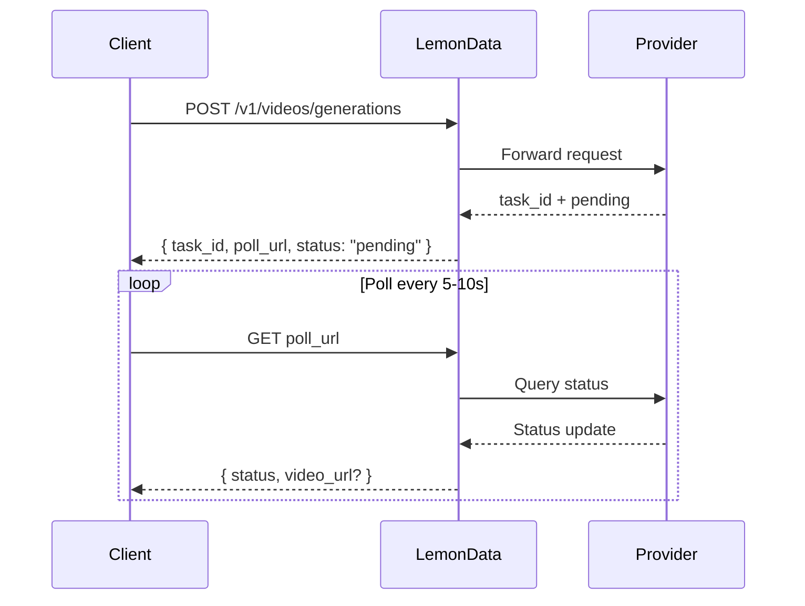

## نظرة عامة

توفر LemonData إمكانية الوصول إلى نماذج توليد الفيديو من 11 مزودًا من خلال API موحد واحد. توليد الفيديو **غير متزامن** — تقوم بإرسال طلب، وتستلم معرّف مهمة و`poll_url`، ثم تقوم بالاستعلام الدوري للحصول على النتيجة.

<Info>
يتم تحديث قائمة النماذج بشكل متكرر. للاطلاع على أحدث النماذج المتاحة والأسعار، قم بزيارة [صفحة النماذج](https://lemondata.cc/ar/models) أو استخدم [Models API](/api-reference/models/list-models).
</Info>

### سير العمل غير المتزامن


```mermaid
sequenceDiagram
    participant Client
    participant LemonData
    participant Provider

    Client->>LemonData: POST /v1/videos/generations
    LemonData->>Provider: Forward request
    Provider-->>LemonData: task_id + pending
    LemonData-->>Client: { task_id, poll_url, status: "pending" }

    loop Poll every 5-10s
        Client->>LemonData: GET poll_url
        LemonData->>Provider: Query status
        Provider-->>LemonData: Status update
        LemonData-->>Client: { status, video_url? }
    end
```

<CodeGroup>

```python Python
import requests
import time

API_KEY = "sk-your-api-key"
BASE = "https://api.lemondata.cc/v1"
headers = {"Authorization": f"Bearer {API_KEY}"}

# Step 1: Submit generation request
resp = requests.post(f"{BASE}/videos/generations",
    headers=headers,
    json={
        "model": "sora-2",
        "prompt": "A calm cinematic shot of a cat walking through a sunlit garden.",
        "operation": "text-to-video",
        "duration": 4,
        "aspect_ratio": "16:9"
    }
)
create_data = resp.json()
task_id = create_data["task_id"]
poll_url = create_data["poll_url"]

# Step 2: Poll for result
while True:
    status = requests.get(f"https://api.lemondata.cc{poll_url}", headers=headers).json()
    if status["status"] in ("completed", "succeeded"):
        print(f"Video URL: {status['video_url']}")
        break
    elif status["status"] == "failed":
        print(f"Failed: {status.get('error')}")
        break
    time.sleep(10)
```

```javascript JavaScript
const API_KEY = 'sk-your-api-key';
const BASE = 'https://api.lemondata.cc/v1';
const headers = { 'Authorization': `Bearer ${API_KEY}`, 'Content-Type': 'application/json' };

// Step 1: Submit
const { task_id, poll_url } = await fetch(`${BASE}/videos/generations`, {
  method: 'POST', headers,
  body: JSON.stringify({
    model: 'sora-2',
    prompt: 'A calm cinematic shot of a cat walking through a sunlit garden.',
    operation: 'text-to-video',
    duration: 4,
    aspect_ratio: '16:9'
  })
}).then(r => r.json());

// Step 2: Poll
const poll = setInterval(async () => {
  const status = await fetch(`https://api.lemondata.cc${poll_url}`, { headers }).then(r => r.json());
  if (['completed', 'succeeded'].includes(status.status)) {
    console.log('Video URL:', status.video_url);
    clearInterval(poll);
  } else if (status.status === 'failed') {
    console.error('Failed:', status.error);
    clearInterval(poll);
  }
}, 10000);
```

</CodeGroup>

## مصفوفة قدرات النماذج

تتفوق النماذج المختلفة في مهام مختلفة. استخدم هذه المصفوفة لاختيار النموذج المناسب لحالة الاستخدام الخاصة بك.

**المفتاح**: ✅ مدعوم | ❌ غير مدعوم

| Series | Provider | T2V | I2V | Keyframe | Extension | Editing | Max Duration |
|--------|----------|-----|-----|----------|-----------|---------|-------------|
| **Sora** | OpenAI | ✅ | ❌ | ❌ | ❌ | ❌ | ~20s |
| **Kling** | Kuaishou | ✅ | ✅ | ❌ | ✅ | ❌ | 10s |
| **Veo** | Google | ✅ | ✅ | ✅ | ❌ | ❌ | 8s |
| **Seedance** | ByteDance | ✅ | ✅ | ✅ | ✅ | ✅ | 10s |
| **Hailuo** | MiniMax | ✅ | ✅ | ❌ | ❌ | ❌ | 10s |
| **Wan** | Alibaba | ✅ | ✅ | ❌ | ❌ | ❌ | 5s |
| **Runway** | Runway | ❌ | ✅ | ❌ | ❌ | ❌ | 10s |
| **Luma** | Luma | ✅ | ❌ | ❌ | ✅ | ❌ | 5s |
| **Vidu** | Vidu | ✅ | ✅ | ✅ | ❌ | ❌ | 8s |
| **Grok** | xAI | ✅ | ❌ | ❌ | ❌ | ❌ | ~15s |
| **Higgsfield** | Higgsfield | ✅ | ❌ | ❌ | ❌ | ❌ | ~5s |

### تعريفات القدرات

- **T2V (Text-to-Video)**: أنشئ فيديو من مطالبة نصية
- **I2V (Image-to-Video)**: حرّك صورة ثابتة إلى فيديو. ولتحقيق أوسع توافق، وفّر `image_url` عامًا.
- **Keyframe**: التحكم في إطاري البداية والنهاية باستخدام `start_image` + `end_image`
- **Extension**: تمديد مدة فيديو موجود
- **Editing**: تعديل جوانب محددة من فيديو موجود

## النماذج المتاحة حسب السلسلة

### Sora (OpenAI)

| Model | Quality | Notes |
|-------|---------|-------|
| `sora-2` | قياسي | نموذج المثال الافتراضي |
| `sora-2-pro` | عالٍ | جودة أعلى، ووقت توليد أطول |
| `sora-2-characters` | قياسي | توليد يركز على الشخصيات |

### Kling (Kuaishou)

| Model | Capability | Notes |
|-------|-----------|-------|
| `kling-v2.6-pro` | T2V | أحدث جيل، جودة احترافية |
| `kling-v2.6-std` | T2V | أحدث جيل، سريع |
| `kling-v2.5-turbo-std` | T2V | فئة Turbo |
| `kling-v2.5-turbo-pro` | T2V | سرعة Turbo، جودة Pro |
| `kling-v2.1-master` | T2V/I2V | جودة Master |
| `kling-v2.1-pro` | T2V/I2V | جودة احترافية |
| `kling-v2.1-standard` | T2V/I2V | جودة قياسية |
| `kling-video` | T2V/I2V | النموذج الأساسي |
| `kling-video-extend` | Extension | تمديد مقاطع الفيديو الموجودة |
| `kling-video-o1-pro` | T2V | استدلال O1، جودة Pro |
| `kling-video-o1-std` | T2V | استدلال O1، قياسي |
| `kling-effects` | Effects | تطبيق مؤثرات بصرية |
| `kling-omni-video` | T2V | نموذج Omni |
| `kling-motion-control` | T2V | توليد مع التحكم في الحركة |

### Veo (Google)

| Model | Quality | Notes |
|-------|---------|-------|
| `veo2` | قياسي | نموذج من سلسلة Veo 2 |
| `veo3.1` | قياسي | أحدث نموذج فيديو من Google |
| `veo3.1-pro` | عالٍ | جودة احترافية |
| `veo3.1-4k` | فائق | مخرجات بدقة 4K |
| `veo3.1-fast` | سريع | توليد أسرع |
| `veo3.1-fast-4k` | سريع + 4K | توليد سريع مع مخرجات 4K |
| `veo3.1-components` | قياسي | توليد قائم على المكونات |
| `veo3` | قياسي | الجيل السابق |
| `veo3-pro` | عالٍ | الجيل السابق، احترافي |
| `veo3-fast` | سريع | الجيل السابق، سريع |

### Seedance (ByteDance)

| Model | Capability | Notes |
|-------|-----------|-------|
| `seedance-2-0` | T2V/I2V/Keyframe/Extension/Editing | الأحدث والأكثر قدرة |
| `seedance-1-5-pro` | T2V/I2V | الجيل السابق، جودة احترافية |
| `seedance-1-0-pro` | T2V/I2V | الجيل الأول، Pro |
| `seedance-1-0-pro-fast` | T2V/I2V | الجيل الأول، سريع |
| `seedance-1-0-lite-t2v` | T2V | تحويل خفيف من النص إلى الفيديو |
| `seedance-1-0-lite-i2v` | I2V | تحويل خفيف من الصورة إلى الفيديو |

<Note>
يدعم Seedance 2.0 أوسع نطاق من القدرات بما في ذلك التحويل متعدد الوسائط إلى فيديو، وتمديد الفيديو، وتحرير الفيديو — وكل ذلك من خلال نفس نقطة نهاية API.
</Note>

### Hailuo (MiniMax)

| Model | Quality | Notes |
|-------|---------|-------|
| `hailuo-2.3` | قياسي | جودة جيدة |
| `hailuo-2.3-pro` | عالٍ | مخرجات بجودة أعلى |
| `hailuo-2.3-fast` | سريع | توليد أسرع |
| `hailuo-2.3-standard` | قياسي | الفئة القياسية |
| `video-01` | قياسي | MiniMax video-01 |
| `video-01-live` | قياسي | توليد بأسلوب البث المباشر |

### Wan (Alibaba)

| Model | Capability | Notes |
|-------|-----------|-------|
| `wan-2.6` | T2V | أحدث تحويل من النص إلى الفيديو |
| `wan2.6-i2v` | I2V | أحدث تحويل من الصورة إلى الفيديو |
| `wan-2.5` | T2V | الجيل السابق |
| `wan2.5-i2v-preview` | I2V | I2V من الجيل السابق |
| `wan-2.2-plus` | T2V | جيل أقدم |
| `vace-14b` | T2V | بنية VACE |

### Runway

| Model | Duration | Notes |
|-------|----------|-------|
| `runwayml-gen4-turbo-5` | 5s | توليد سريع |
| `runwayml-gen4-turbo-10` | 10s | مقاطع أطول |

### Luma

| Model | Capability | Notes |
|-------|-----------|-------|
| `luma-video-api` | T2V | من النص إلى الفيديو |
| `luma-video-extend-api` | Extension | تمديد مقاطع الفيديو الموجودة |

### Vidu (Shengshu)

| Model | Quality | Notes |
|-------|---------|-------|
| `viduq3-turbo` | سريع | فئة Turbo |
| `viduq3-pro` | عالٍ | أحدث جيل |
| `viduq2-pro` | عالٍ | الجيل السابق، Pro |
| `viduq2-pro-fast` | سريع | الجيل السابق، Pro سريع |
| `viduq2` | قياسي | الجيل السابق، قياسي |
| `viduq2-turbo` | سريع | سرعة Turbo |
| `vidu2.0` | قياسي | النموذج الأساسي |

### Grok (xAI)

| Model | Notes |
|-------|-------|
| `grok-video-3` | نموذج توليد الفيديو من xAI |
| `grok-video-3-10s` | إصدار لمدة 10 ثوانٍ |

### Higgsfield

| Model | Notes |
|-------|-------|
| `higgsfield-turbo` | الأسرع والأقل تكلفة |
| `higgsfield-standard` | جودة قياسية |
| `higgsfield-lite` | خفيف الوزن |

## أمثلة الاستخدام

### من النص إلى الفيديو (T2V)

هذه هي حالة الاستخدام الأكثر شيوعًا. جميع النماذج تدعم ذلك.

```python
response = requests.post(f"{BASE}/videos/generations",
    headers=headers,
    json={
        "model": "sora-2",
        "prompt": "A calm cinematic shot of a cat walking through a sunlit garden.",
        "operation": "text-to-video",
        "duration": 4,
        "aspect_ratio": "16:9"
    }
)
```

### من الصورة إلى الفيديو (I2V)

حرّك صورة ثابتة. ولتحقيق أوسع توافق عبر نماذج الفيديو، استضف الصورة المصدر ومرّر `image_url`.

```python
# Using image URL
response = requests.post(f"{BASE}/videos/generations",
    headers=headers,
    json={
        "model": "hailuo-2.3-fast",
        "prompt": "The scene begins from the provided image and adds gentle natural motion.",
        "operation": "image-to-video",
        "image_url": "https://example.com/portrait.jpg",
        "duration": 6,
        "aspect_ratio": "16:9"
    }
)

```

### التحكم بإطارات المفاتيح (صورة البداية + صورة النهاية)

تحكم في كل من الإطار الأول والأخير للحصول على انتقالات دقيقة. هذا مدعوم حاليًا بواسطة Seedance 2.0.

```python
response = requests.post(f"{BASE}/videos/generations",
    headers=headers,
    json={
        "model": "viduq2-pro",
        "prompt": "Smooth transition from day to night, city lights gradually turning on",
        "operation": "start-end-to-video",
        "start_image": "https://example.com/city-day.jpg",
        "end_image": "https://example.com/city-night.jpg",
        "duration": 5,
        "resolution": "720p",
        "aspect_ratio": "16:9"
    }
)
```

### تمديد الفيديو

قم بتمديد مدة فيديو موجود. استخدم النماذج التي تدعم قدرة التمديد.

```python
response = requests.post(f"{BASE}/videos/generations",
    headers=headers,
    json={
        "model": "kling-video-extend",
        "prompt": "Continue the scene naturally",
        "image_url": "https://example.com/last-frame.jpg"
    }
)
```

## مرجع المعلمات

| Parameter | Type | Description |
|-----------|------|-------------|
| `model` | string | معرّف النموذج (الافتراضي: `sora-2`) |
| `prompt` | string | **مطلوب.** وصف نصي للفيديو |
| `image_url` | string | URL لصورة البداية (لـ I2V) |
| `image` | string | صورة مضمنة كـ data URL. مدعومة بواسطة النماذج المتوافقة، لكن `image_url` يوفر أوسع توافق. |
| `duration` | integer | مدة الفيديو بالثواني (1-60، بحسب النموذج) |
| `aspect_ratio` | string | `16:9`, `9:16`, `1:1`، إلخ. |
| `resolution` | string | `1080p`, `720p`, `4k` |
| `fps` | integer | عدد الإطارات في الثانية (1-120) |
| `negative_prompt` | string | ما يجب تجنبه أثناء التوليد |
| `seed` | integer | قيمة seed عشوائية لإمكانية إعادة الإنتاج |
| `cfg_scale` | number | مقياس التوجيه (0-20) |
| `motion_strength` | number | شدة الحركة (0-1) |
| `start_image` | string | URL لإطار المفتاح الابتدائي |
| `end_image` | string | URL لإطار المفتاح النهائي |

<Warning>
ليست كل المعلمات مدعومة من كل نموذج. يتم تجاهل المعلمات غير المدعومة بصمت. راجع وثائق النموذج للاطلاع على المعلمات المدعومة.
</Warning>

## دليل اختيار النموذج

<CardGroup cols={2}>
  <Card title="أفضل جودة" icon="crown">
    **Seedance 2.0** أو **Kling v2.6 Pro** — جودة سينمائية، تفاصيل غنية، وحركة طبيعية
  </Card>
  <Card title="أسرع توليد" icon="bolt">
    **Higgsfield Turbo** أو **Hailuo 2.3** — نتائج سريعة للنمذجة الأولية والتكرار
  </Card>
  <Card title="الأكثر تنوعًا" icon="wand-magic-sparkles">
    **Seedance 2.0** — يدعم T2V وI2V وإطارات المفاتيح والتمديد والتحرير في نموذج واحد
  </Card>
  <Card title="أفضل قيمة" icon="coins">
    **Wan 2.6** أو **Hailuo 2.3** — جودة تنافسية بتكلفة أقل لكل عملية توليد
  </Card>
</CardGroup>

## الفوترة

يستخدم توليد الفيديو **تسعيرًا ثابتًا لكل عملية توليد**. يتم تحصيل الرسوم مرة واحدة عند إرسال المهمة، بغض النظر عن مدة الفيديو. إذا فشل التوليد، يتم استرداد الرسوم تلقائيًا.

تحقق من الأسعار الحالية في [صفحة النماذج](https://lemondata.cc/ar/models) أو عبر [Pricing API](/api-reference/pricing/get-pricing).