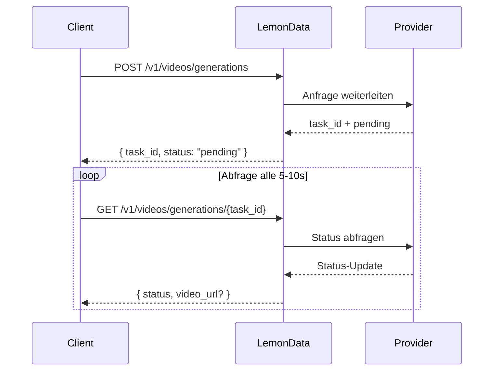

## Übersicht

LemonData bietet Zugriff auf **über 69 Video-Generierungsmodelle** von 11 Anbietern über eine einzige vereinheitlichte API. Die Video-Generierung erfolgt **asynchron** – Sie senden eine Anfrage und erhalten eine Task-ID, woraufhin Sie das Ergebnis abfragen (Polling).

<Info>
Die Modellliste wird häufig aktualisiert. Die neuesten verfügbaren Modelle und Preise finden Sie auf der [Models page](https://lemondata.cc/de/models) oder über die [Models API](/api-reference/models/list-models).
</Info>

### Asynchroner Workflow



<CodeGroup>

```python Python
import requests
import time

API_KEY = "sk-your-api-key"
BASE = "https://api.lemondata.cc/v1"
headers = {"Authorization": f"Bearer {API_KEY}"}

# Step 1: Submit generation request
resp = requests.post(f"{BASE}/videos/generations",
    headers=headers,
    json={
        "model": "kling-v2.6-pro",
        "prompt": "A golden retriever running on a beach at sunset, cinematic 4K",
        "duration": 5,
        "aspect_ratio": "16:9"
    }
)
task_id = resp.json()["task_id"]

# Step 2: Poll for result
while True:
    status = requests.get(f"{BASE}/videos/generations/{task_id}", headers=headers).json()
    if status["status"] in ("completed", "succeeded"):
        print(f"Video URL: {status['video_url']}")
        break
    elif status["status"] == "failed":
        print(f"Failed: {status.get('error')}")
        break
    time.sleep(10)
```

```javascript JavaScript
const API_KEY = 'sk-