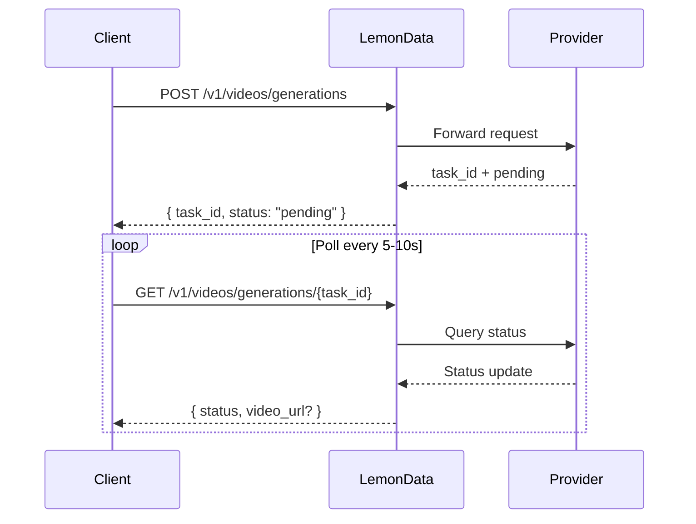

## Resumen

LemonData proporciona acceso a **más de 69 modelos de generación de video** de 11 proveedores a través de una única API unificada. La generación de video es **asíncrona**: usted envía una solicitud y recibe un `task_id`, luego realiza consultas (poll) para obtener el resultado.

<Info>
La lista de modelos se actualiza con frecuencia. Para conocer los últimos modelos disponibles y sus precios, visite la [página de Modelos](https://lemondata.cc/es/models) o utilice la [API de Modelos](/api-reference/models/list-models).
</Info>

### Flujo de trabajo asíncrono



<CodeGroup>

```python Python
import requests
import time

API_KEY = "sk-your-api-key"
BASE = "https://api.lemondata.cc/v1"
headers = {"Authorization": f"Bearer {API_KEY}"}

# Step 1: Submit generation request
resp = requests.post(f"{BASE}/videos/generations",
    headers=headers,
    json={
        "model": "kling-v2.6-pro",
        "prompt": "A golden retriever running on a beach at sunset, cinematic 4K",
        "duration": 5,
        "aspect_ratio": "16:9"
    }
)
task_id = resp.json()["task_id"]

# Step 2: Poll for result
while True:
    status = requests.get(f"{BASE}/videos/generations/{task_id}", headers=headers).json()
    if status["status"] in ("completed", "succeeded"):
        print(f"Video URL: {status['video_url']}")
        break
    elif status["status"] == "failed":
        print(f"Failed: {status.get('error')}")
        break
    time.sleep(10)
```

```javascript JavaScript
const API_KEY = 'sk-your-api-key';
const BASE = 'https://api.lemondata.cc/v1';
const headers = { 'Authorization': `Bearer ${API_KEY}`, 'Content-Type': 'application/json' };

// Step 1: Submit
const { task_id } = await fetch(`${BASE}/videos/generations`, {
  method: 'POST', headers,
  body: JSON.stringify({
    model: 'kling-v2.6-pro',
    prompt: 'A golden retriever running on a beach at sunset, cinematic 4K',
    duration: 5,
    aspect_ratio: '16:9'
  })
}).then(r => r.json());

// Step 2: Poll
const poll = setInterval(async () => {
  const status = await fetch(`${BASE}/videos/generations/${task_id}`, { headers }).then(r => r.json());
  if (['completed', 'succeeded'].includes(status.status)) {
    console.log('Video URL:', status.video_url);
    clearInterval(poll);
  } else if (status.status === 'failed') {
    console.error('Failed:', status.error);
    clearInterval(poll);
  }
}, 10000);
```

</CodeGroup>

## Matriz de capacidades de los modelos

Diferentes modelos destacan en diferentes tareas. Utilice esta matriz para elegir el modelo adecuado para su caso de uso.

**Leyenda**: ✅ Soportado | ❌ No soportado

| Serie | Proveedor | T2V | I2V | Keyframe | Extensión | Edición | Duración máx. |
|--------|----------|-----|-----|----------|-----------|---------|-------------|
| **Sora** | OpenAI | ✅ | ❌ | ❌ | ❌ | ❌ | ~20s |
| **Kling** | Kuaishou | ✅ | ✅ | ❌ | ✅ | ❌ | 10s |
| **Veo** | Google | ✅ | ❌ | ❌ | ❌ | ❌ | 8s |
| **Seedance** | ByteDance | ✅ | ✅ | ✅ | ✅ | ✅ | 10s |
| **Hailuo** | MiniMax | ✅ | ✅ | ❌ | ❌ | ❌ | 6s |
| **Wan** | Alibaba | ✅ | ✅ | ❌ | ❌ | ❌ | 5s |
| **Runway** | Runway | ✅ | ✅ | ❌ | ❌ | ❌ | 10s |
| **Luma** | Luma | ✅ | ❌ | ❌ | ✅ | ❌ | 5s |
| **Vidu** | Vidu | ✅ | ✅ | ❌ | ❌ | ❌ | 8s |
| **Grok** | xAI | ✅ | ❌ | ❌ | ❌ | ❌ | ~10s |
| **Higgsfield** | Higgsfield | ✅ | ❌ | ❌ | ❌ | ❌ | ~5s |

### Definiciones de capacidades

- **T2V (Text-to-Video)**: Generar video a partir de un prompt de texto
- **I2V (Image-to-Video)**: Animar una imagen estática en video usando `image_url` o `image`
- **Keyframe**: Controlar los fotogramas inicial y final con `start_image` + `end_image`
- **Extensión**: Extender la duración de un video existente
- **Edición**: Modificar aspectos específicos de un video existente

## Modelos disponibles por serie

### Sora (OpenAI)

| Modelo | Calidad | Notas |
|-------|---------|-------|
| `sora-2` | Estándar | Modelo predeterminado, buen equilibrio entre calidad y velocidad |
| `sora-2-pro` | Alta | Mayor calidad, mayor tiempo de generación |
| `sora-2-characters` | Estándar | Generación enfocada en personajes |

### Kling (Kuaishou)

| Modelo | Capacidad | Notas |
|-------|-----------|-------|
| `kling-v2.6-pro` | T2V | Última generación, calidad profesional |
| `kling-v2.6-std` | T2V | Última generación, rápido |
| `kling-v2.5-turbo-pro` | T2V | Velocidad turbo, calidad pro |
| `kling-v2.1-master` | T2V/I2V | Calidad maestra |
| `kling-v2.1-pro` | T2V/I2V | Calidad profesional |
| `kling-v2.1-standard` | T2V/I2V | Calidad estándar |
| `kling-video` | T2V/I2V | Modelo base |
| `kling-video-extend` | Extensión | Extender videos existentes |
| `kling-video-o1-pro` | T2V | Razonamiento O1, calidad pro |
| `kling-video-o1-std` | T2V | Razonamiento O1, estándar |
| `kling-effects` | Efectos | Aplicar efectos visuales |
| `kling-omni-video` | T2V | Modelo Omni |
| `kling-motion-control` | T2V | Generación con control de movimiento |

### Veo (Google)

| Modelo | Calidad | Notas |
|-------|---------|-------|
| `veo3.1` | Estándar | El modelo de video más reciente de Google |
| `veo3.1-pro` | Alta | Calidad profesional |
| `veo3.1-4k` | Ultra | Salida en resolución 4K |
| `veo3.1-fast` | Rápido | Generación más rápida |
| `veo3.1-fast-4k` | Rápido + 4K | Generación rápida con salida 4K |
| `veo3.1-components` | Estándar | Generación basada en componentes |
| `veo3` | Estándar | Generación anterior |
| `veo3-pro` | Alta | Generación anterior, profesional |
| `veo3-fast` | Rápido | Generación anterior, rápido |

### Seedance (ByteDance)

| Modelo | Capacidad | Notas |
|-------|-----------|-------|
| `seedance-2-0` | T2V/I2V/Keyframe/Extensión/Edición | Más reciente, más capaz |
| `seedance-1-5-pro` | T2V/I2V | Generación anterior, calidad pro |
| `seedance-1-0-pro` | T2V/I2V | Primera generación, pro |
| `seedance-1-0-pro-fast` | T2V/I2V | Primera generación, rápido |
| `seedance-1-0-lite-t2v` | T2V | Text-to-video ligero |
| `seedance-1-0-lite-i2v` | I2V | Image-to-video ligero |

<Note>
Seedance 2.0 admite la gama más amplia de capacidades, incluyendo multimodal-to-video, extensión de video y edición de video, todo a través del mismo endpoint de la API.
</Note>

### Hailuo (MiniMax)

| Modelo | Calidad | Notas |
|-------|---------|-------|
| `hailuo-2.3` | Estándar | Buena calidad |
| `hailuo-2.3-pro` | Alta | Salida de mayor calidad |
| `hailuo-2.3-fast` | Rápido | Generación más rápida |
| `hailuo-2.3-standard` | Estándar | Nivel estándar |
| `video-01` | Estándar | MiniMax video-01 |
| `video-01-live` | Estándar | Generación estilo en vivo |

### Wan (Alibaba)

| Modelo | Capacidad | Notas |
|-------|-----------|-------|
| `wan-2.6` | T2V | Último text-to-video |
| `wan2.6-i2v` | I2V | Último image-to-video |
| `wan-2.5` | T2V | Generación anterior |
| `wan2.5-i2v-preview` | I2V | I2V de generación anterior |
| `wan-2.2-plus` | T2V | Generación más temprana |
| `vace-14b` | T2V | Arquitectura VACE |

### Runway

| Modelo | Duración | Notas |
|-------|----------|-------|
| `runwayml-gen4-turbo-5` | 5s | Generación rápida |
| `runwayml-gen4-turbo-10` | 10s | Clips más largos |

### Luma

| Modelo | Capacidad | Notas |
|-------|-----------|-------|
| `luma-video-api` | T2V | Text-to-video |
| `luma-video-extend-api` | Extensión | Extender videos existentes |

### Vidu (Shengshu)

| Modelo | Calidad | Notas |
|-------|---------|-------|
| `viduq3-pro` | Alta | Última generación |
| `viduq2-pro` | Alta | Generación anterior, pro |
| `viduq2-pro-fast` | Rápido | Generación anterior, pro rápido |
| `viduq2` | Estándar | Generación anterior, estándar |
| `viduq2-turbo` | Rápido | Velocidad turbo |
| `vidu2.0` | Estándar | Modelo base |

### Grok (xAI)

| Modelo | Notas |
|-------|-------|
| `grok-video-3` | Modelo de generación de video de xAI |
| `grok-video-3-10s` | Variante de 10 segundos |

### Higgsfield

| Modelo | Notas |
|-------|-------|
| `higgsfield-turbo` | Más rápido, menor costo |
| `higgsfield-standard` | Calidad estándar |
| `higgsfield-lite` | Ligero |

## Ejemplos de uso

### Text-to-Video (T2V)

El caso de uso más común. Todos los modelos lo admiten.

```python
response = requests.post(f"{BASE}/videos/generations",
    headers=headers,
    json={
        "model": "veo3.1-pro",
        "prompt": "Aerial drone shot of a coastal city at golden hour, waves crashing against cliffs",
        "duration": 5,
        "aspect_ratio": "16:9",
        "resolution": "1080p"
    }
)
```

### Image-to-Video (I2V)

Anime una imagen estática. Use `image_url` para una URL o `image` para datos en base64.

```python
# Using image URL
response = requests.post(f"{BASE}/videos/generations",
    headers=headers,
    json={
        "model": "wan2.6-i2v",
        "prompt": "The person slowly turns and smiles at the camera",
        "image_url": "https://example.com/portrait.jpg"
    }
)

# Using base64 image
import base64
with open("photo.jpg", "rb") as f:
    image_b64 = base64.b64encode(f.read()).decode()

response = requests.post(f"{BASE}/videos/generations",
    headers=headers,
    json={
        "model": "kling-v2.1-master",
        "prompt": "Gentle wind blows through the scene",
        "image": f"data:image/jpeg;base64,{image_b64}"
    }
)
```

### Control de Keyframes (Imagen inicial + final)

Controle tanto el primer como el último fotograma para transiciones precisas. Actualmente compatible con Seedance 2.0.

```python
response = requests.post(f"{BASE}/videos/generations",
    headers=headers,
    json={
        "model": "seedance-2-0",
        "prompt": "Smooth transition from day to night, city lights gradually turning on",
        "start_image": "https://example.com/city-day.jpg",
        "end_image": "https://example.com/city-night.jpg",
        "duration": 5
    }
)
```

### Extensión de video

Extienda la duración de un video existente. Use modelos con capacidad de extensión.

```python
response = requests.post(f"{BASE}/videos/generations",
    headers=headers,
    json={
        "model": "kling-video-extend",
        "prompt": "Continue the scene naturally",
        "image_url": "https://example.com/last-frame.jpg"
    }
)
```

## Referencia de parámetros

| Parámetro | Tipo | Descripción |
|-----------|------|-------------|
| `model` | string | ID del modelo (predeterminado: `sora-2`) |
| `prompt` | string | **Requerido.** Descripción de texto del video |
| `image_url` | string | URL de la imagen inicial (para I2V) |
| `image` | string | Imagen codificada en base64 con prefijo de URL de datos (para I2V) |
| `duration` | integer | Duración del video en segundos (1-60, depende del modelo) |
| `aspect_ratio` | string | `16:9`, `9:16`, `1:1`, etc. |
| `resolution` | string | `1080p`, `720p`, `4k` |
| `fps` | integer | Fotogramas por segundo (1-120) |
| `negative_prompt` | string | Qué evitar en la generación |
| `seed` | integer | Semilla aleatoria para reproducibilidad |
| `cfg_scale` | number | Escala de guía (0-20) |
| `motion_strength` | number | Intensidad del movimiento (0-1) |
| `start_image` | string | URL del keyframe inicial |
| `end_image` | string | URL del keyframe final |

<Warning>
No todos los parámetros son compatibles con todos los modelos. Los parámetros no compatibles se ignoran silenciosamente. Consulte la documentación del modelo para conocer los parámetros admitidos.
</Warning>

## Guía de selección de modelos

<CardGroup cols={2}>
  <Card title="Mejor calidad" icon="crown">
    **Seedance 2.0** o **Kling v2.6 Pro**: calidad cinematográfica, detalles ricos, movimiento natural
  </Card>
  <Card title="Generación más rápida" icon="bolt">
    **Higgsfield Turbo** o **Hailuo 2.3**: resultados rápidos para prototipado e iteración
  </Card>
  <Card title="Más versátil" icon="wand-magic-sparkles">
    **Seedance 2.0**: admite T2V, I2V, keyframe, extensión y edición en un solo modelo
  </Card>
  <Card title="Mejor relación calidad-precio" icon="coins">
    **Wan 2.6** o **Hailuo 2.3**: calidad competitiva a un menor costo por generación
  </Card>
</CardGroup>

## Facturación

La generación de video utiliza un **precio fijo por generación**. Se le cobra una vez cuando se envía la tarea, independientemente de la duración del video. Si la generación falla, el cargo se reembolsa automáticamente.

Consulte los precios actuales en la [página de Modelos](https://lemondata.cc/es/models) o a través de la [API de Precios](/api-reference/pricing/get-pricing).