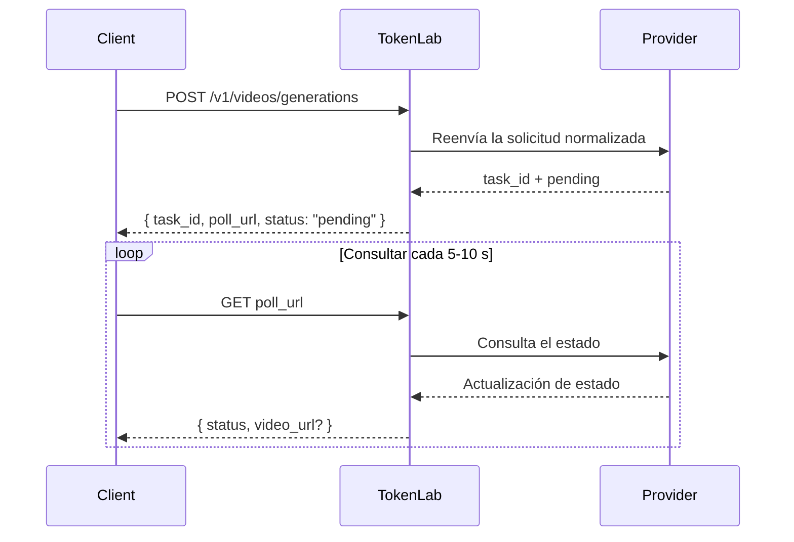

## Resumen

TokenLab ofrece generación de video mediante una API unificada. La generación es **asíncrona**: envías una solicitud, recibes `task_id` y `poll_url`, y después consultas hasta obtener el resultado final.

### Disponibilidad y sondeo

Puedes ver el inventario público actual de modelos de video a través de la [Models API](/es/api-reference/models/list-models) o en la [página de modelos](https://tokenlab.sh/es/models).

Si una respuesta de creación devuelve `poll_url`, llama exactamente a esa URL. Cuando apunte a `/v1/tasks/{id}`, trátala como el endpoint fijo canónico de estado.

### Comportamiento de modelos y medios

El comportamiento del audio depende del modelo. En TokenLab, la familia Veo 3 se trata por defecto como audio activado cuando se omite `output_audio`. Otros modelos públicos son silenciosos por defecto o no exponen un interruptor de audio estable.

En producción, es mejor usar URLs `https` públicas para imágenes, videos y audio. Los modelos compatibles siguen aceptando URLs `data:`, pero las URLs son más robustas para reintentos, observabilidad y depuración.

### Flujo asíncrono


```mermaid
sequenceDiagram
    participant Client
    participant TokenLab
    participant Provider

    Client->>TokenLab: POST /v1/videos/generations
    TokenLab->>Provider: Reenvía la solicitud normalizada
    Provider-->>TokenLab: task_id + pending
    TokenLab-->>Client: { task_id, poll_url, status: "pending" }

    loop Consultar cada 5-10 s
        Client->>TokenLab: GET poll_url
        TokenLab->>Provider: Consulta el estado
        Provider-->>TokenLab: Actualización de estado
        TokenLab-->>Client: { status, video_url? }
    end
```

## Operaciones públicas actuales

El contrato público de video de TokenLab acepta estos valores de operación. El soporte depende del modelo y cambia cuando los proveedores agregan o retiran capacidades; revisa el contrato del modelo elegido antes de depender de una operación especializada.

- `text-to-video`
- `image-to-video`
- `reference-to-video`
- `start-end-to-video`
- `video-to-video`
- `motion-control`
- `audio-to-video`
- `video-extension`

## Definiciones de operaciones

- **T2V (Text-to-Video)**: genera video desde un prompt de texto.
- **I2V (Image-to-Video)**: anima una imagen inicial. Para la compatibilidad más amplia, usa `image_url`.
- **Reference**: condiciona la generación con una o varias imágenes mediante `reference_images`; algunos modelos también aceptan videos de referencia mediante `video_urls` y audio de referencia mediante `audio_urls`.
- **Start-End**: controla el primer y último fotograma con `start_image` y `end_image`.
- **V2V (Video-to-Video)**: usa un video existente, una tarea generada o un flujo derivado específico del proveedor como fuente.
- **Motion**: combina una imagen del sujeto con un video de referencia de movimiento.
- **Audio-to-Video**: genera video desde un flujo de modelo condicionado por audio.
- **Video Extension**: continúa o extiende una tarea de video generada previamente.

## Descubrimiento de modelos

La disponibilidad de modelos de video cambia con frecuencia. Obtén la shortlist pública actual antes de elegir un modelo:

```bash
curl "https://api.tokenlab.sh/v1/models?recommended_for=video" \
  -H "Authorization: Bearer sk-your-api-key"
```

Lee el modelo seleccionado antes de enviar campos específicos del modelo:

```bash
curl "https://api.tokenlab.sh/v1/models/veo3.1" \
  -H "Authorization: Bearer sk-your-api-key"
```

Usa `tokenlab.capabilities`, `tokenlab.supported_operations`, `tokenlab.public_contract_summary` y `tokenlab.public_contract` como fuente de verdad. Los ejemplos siguientes son patrones de flujo, no un inventario exhaustivo.

## Ejemplos de uso

### Texto a video

```python
response = requests.post(f"{BASE}/videos/generations",
    headers=headers,
    json={
        "model": "veo3.1",
        "prompt": "A calm cinematic shot of a cat walking through a sunlit garden.",
        "operation": "text-to-video",
        "duration": 4,
        "aspect_ratio": "16:9"
    }
)
```

### Imagen a video

```python
response = requests.post(f"{BASE}/videos/generations",
    headers=headers,
    json={
        "model": "hailuo-2.3-standard",
        "prompt": "The scene begins from the provided image and adds gentle natural motion.",
        "operation": "image-to-video",
        "image_url": "https://example.com/portrait.jpg",
        "duration": 6,
        "aspect_ratio": "16:9"
    }
)
```

### Kling 3.0 Elements

Usa `kling_elements` con `kling-3.0-video` cuando necesites referencias de elementos. Proporciona una solicitud condicionada por imagen (`image_url`, `image_urls`, `start_image` o `end_image`) y referencia cada elemento en el prompt con `@name`. No combines `kling_elements` con `output_audio=true`; omite `output_audio` o ponlo en `false` para solicitudes con referencias de elementos.

```python
response = requests.post(f"{BASE}/videos/generations",
    headers=headers,
    json={
        "model": "kling-3.0-video",
        "prompt": "Place @hero_bag on a studio turntable with soft product lighting.",
        "operation": "image-to-video",
        "image_url": "https://example.com/studio-start.png",
        "duration": 5,
        "resolution": "720p",
        "kling_elements": [
            {
                "name": "hero_bag",
                "description": "black leather handbag",
                "element_input_urls": [
                    "https://example.com/bag-front.png",
                    "https://example.com/bag-side.png"
                ]
            }
        ]
    }
)
```

### Referencia a video

Para `seedance-2.0` y `seedance-2.0-fast`, TokenLab admite actualmente hasta 9 imágenes de referencia, además de hasta 3 videos de referencia y 3 audios de referencia. `duration` solo controla la duración del resultado generado; no define un límite independiente para la duración del video de referencia de entrada. Para `grok-imagine-video`, reference-to-video acepta hasta 7 referencias de imagen (`reference_images` o `image_urls`) y `duration` está limitada a 10 segundos. No combines referencias de imagen con entradas de primer fotograma `image_url` / `image`. `grok-imagine-video-1.5-preview` solo admite image-to-video.

```python
response = requests.post(f"{BASE}/videos/generations",
    headers=headers,
    json={
        "model": "veo3.1",
        "prompt": "Keep the same subject identity and palette while adding subtle motion.",
        "operation": "reference-to-video",
        "reference_images": [
            "https://example.com/ref-a.jpg",
            "https://example.com/ref-b.jpg"
        ],
        "duration": 8,
        "resolution": "720p",
        "aspect_ratio": "9:16"
    }
)
```

### Control de fotograma inicial y final

```python
response = requests.post(f"{BASE}/videos/generations",
    headers=headers,
    json={
        "model": "viduq2-pro",
        "prompt": "Smooth transition from day to night.",
        "operation": "start-end-to-video",
        "start_image": "https://example.com/city-day.jpg",
        "end_image": "https://example.com/city-night.jpg",
        "duration": 5,
        "resolution": "720p",
        "aspect_ratio": "16:9"
    }
)
```

### Video a video

Para video-to-video con `grok-imagine-video`, envía una URL HTTPS pública `.mp4` en `video_url`. TokenLab la traduce al cuerpo REST de xAI `video.url`. Puedes definir `resolution` como `480p` o `720p`; `duration` y `aspect_ratio` no se aceptan en ese flujo de edición.

```python
response = requests.post(f"{BASE}/videos/generations",
    headers=headers,
    json={
        "model": "grok-imagine-video",
        "operation": "video-to-video",
        "video_url": "https://example.com/source.mp4",
        "prompt": "Upscale this clip while preserving the original motion."
    }
)
```

### Control de movimiento

```python
response = requests.post(f"{BASE}/videos/generations",
    headers=headers,
    json={
        "model": "kling-3.0-motion-control",
        "operation": "motion-control",
        "prompt": "Keep the subject stable while following the motion reference.",
        "image_url": "https://example.com/subject.png",
        "video_url": "https://example.com/motion.mp4",
        "resolution": "720p"
    }
)
```

## Referencia de parámetros

| Parámetro | Tipo | Nota |
|-----------|------|------|
| `operation` | string | En producción conviene enviarlo explícitamente |
| `image_url` | string | Forma más robusta de entrada de imagen |
| `image` | string | URL `data:` útil para pruebas locales e integraciones pequeñas |
| `reference_images` | string[] | Campo público canónico para condicionamiento con referencias |
| `reference_image_type` | string | Selector opcional `asset` / `style` |
| `video_url` | string | Obligatorio para flujos `video-to-video` basados en URL de video y para `motion-control`; algunos flujos derivados usan `task_id` en su lugar. |
| `audio_url` | string | Para flujos específicos de audio a video |
| `output_audio` | boolean | La familia Veo 3 trata la omisión como `true`. `kling-3.0-video` acepta este selector para el control `sound` upstream y queda silencioso por defecto si se omite. |

## Guía rápida de selección de modelo

<CardGroup cols={2}>
  <Card title="Máxima calidad" icon="crown">
    Si la calidad importa más que la velocidad, **veo3.1**, **kling-video-o1-pro** y **viduq3-pro** son opciones fuertes.
  </Card>
  <Card title="Iteración rápida" icon="bolt">
    Para ciclos rápidos, **veo3.1-fast**, **hailuo-2.3-fast** y **viduq3-turbo** son buenos puntos de partida.
  </Card>
  <Card title="Flujos con referencias" icon="images">
    Si necesitas control dedicado por imágenes de referencia, empieza con **veo3.1**, **veo3.1-fast**, **wan-2.6** o **kling-video-o1-pro / std**.
  </Card>
  <Card title="Video a video" icon="film">
    Empieza con `GET /v1/models?recommended_for=video`; los ejemplos actuales de estilo V2V incluyen **grok-imagine-video**, **seedance-2.0**, **veo3.1** y **kling-video-o1-pro / std**.
  </Card>
</CardGroup>

## Facturación

La facturación depende del modelo. Algunos modelos públicos de video se comportan en la práctica como modelos cobrados por solicitud, mientras que otros se asemejan más a un cobro por segundo. Para la superficie pública de precios actual, consulta la [página de modelos](https://tokenlab.sh/es/models) o la [Pricing API](/es/api-reference/pricing/get-pricing).
