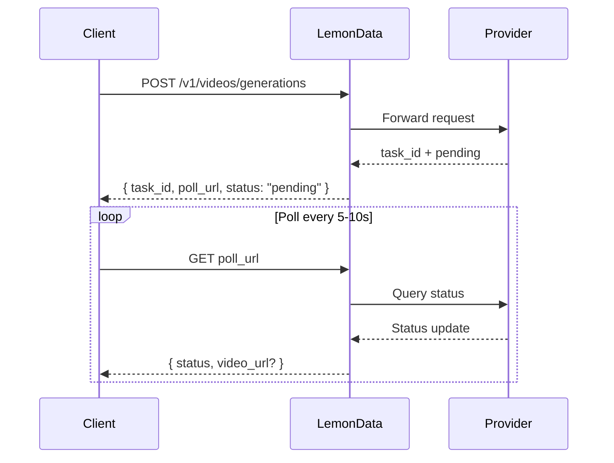

## Vue d’ensemble

LemonData fournit un accès à des modèles de génération vidéo provenant de 11 fournisseurs via une API unifiée unique. La génération vidéo est **asynchrone** — vous soumettez une requête, recevez un ID de tâche et un `poll_url`, puis interrogez ce dernier pour obtenir le résultat.

<Info>
La liste des modèles est mise à jour fréquemment. Pour consulter les derniers modèles disponibles et leur tarification, visitez la [page des modèles](https://lemondata.cc/fr/models) ou utilisez la [Models API](/api-reference/models/list-models).
</Info>

### Flux de travail asynchrone


```mermaid
sequenceDiagram
    participant Client
    participant LemonData
    participant Provider

    Client->>LemonData: POST /v1/videos/generations
    LemonData->>Provider: Forward request
    Provider-->>LemonData: task_id + pending
    LemonData-->>Client: { task_id, poll_url, status: "pending" }

    loop Poll every 5-10s
        Client->>LemonData: GET poll_url
        LemonData->>Provider: Query status
        Provider-->>LemonData: Status update
        LemonData-->>Client: { status, video_url? }
    end
```

<CodeGroup>

```python Python
import requests
import time

API_KEY = "sk-your-api-key"
BASE = "https://api.lemondata.cc/v1"
headers = {"Authorization": f"Bearer {API_KEY}"}

# Step 1: Submit generation request
resp = requests.post(f"{BASE}/videos/generations",
    headers=headers,
    json={
        "model": "sora-2",
        "prompt": "A calm cinematic shot of a cat walking through a sunlit garden.",
        "operation": "text-to-video",
        "duration": 4,
        "aspect_ratio": "16:9"
    }
)
create_data = resp.json()
task_id = create_data["task_id"]
poll_url = create_data["poll_url"]

# Step 2: Poll for result
while True:
    status = requests.get(f"https://api.lemondata.cc{poll_url}", headers=headers).json()
    if status["status"] in ("completed", "succeeded"):
        print(f"Video URL: {status['video_url']}")
        break
    elif status["status"] == "failed":
        print(f"Failed: {status.get('error')}")
        break
    time.sleep(10)
```

```javascript JavaScript
const API_KEY = 'sk-your-api-key';
const BASE = 'https://api.lemondata.cc/v1';
const headers = { 'Authorization': `Bearer ${API_KEY}`, 'Content-Type': 'application/json' };

// Step 1: Submit
const { task_id, poll_url } = await fetch(`${BASE}/videos/generations`, {
  method: 'POST', headers,
  body: JSON.stringify({
    model: 'sora-2',
    prompt: 'A calm cinematic shot of a cat walking through a sunlit garden.',
    operation: 'text-to-video',
    duration: 4,
    aspect_ratio: '16:9'
  })
}).then(r => r.json());

// Step 2: Poll
const poll = setInterval(async () => {
  const status = await fetch(`https://api.lemondata.cc${poll_url}`, { headers }).then(r => r.json());
  if (['completed', 'succeeded'].includes(status.status)) {
    console.log('Video URL:', status.video_url);
    clearInterval(poll);
  } else if (status.status === 'failed') {
    console.error('Failed:', status.error);
    clearInterval(poll);
  }
}, 10000);
```

</CodeGroup>

## Matrice des capacités des modèles

Différents modèles excellent dans différentes tâches. Utilisez cette matrice pour choisir le bon modèle selon votre cas d’usage.

**Légende** : ✅ Pris en charge | ❌ Non pris en charge

| Series | Provider | T2V | I2V | Keyframe | Extension | Editing | Max Duration |
|--------|----------|-----|-----|----------|-----------|---------|-------------|
| **Sora** | OpenAI | ✅ | ❌ | ❌ | ❌ | ❌ | ~20s |
| **Kling** | Kuaishou | ✅ | ✅ | ❌ | ✅ | ❌ | 10s |
| **Veo** | Google | ✅ | ✅ | ✅ | ❌ | ❌ | 8s |
| **Seedance** | ByteDance | ✅ | ✅ | ✅ | ✅ | ✅ | 10s |
| **Hailuo** | MiniMax | ✅ | ✅ | ❌ | ❌ | ❌ | 10s |
| **Wan** | Alibaba | ✅ | ✅ | ❌ | ❌ | ❌ | 5s |
| **Runway** | Runway | ❌ | ✅ | ❌ | ❌ | ❌ | 10s |
| **Luma** | Luma | ✅ | ❌ | ❌ | ✅ | ❌ | 5s |
| **Vidu** | Vidu | ✅ | ✅ | ✅ | ❌ | ❌ | 8s |
| **Grok** | xAI | ✅ | ❌ | ❌ | ❌ | ❌ | ~15s |
| **Higgsfield** | Higgsfield | ✅ | ❌ | ❌ | ❌ | ❌ | ~5s |

### Définitions des capacités

- **T2V (Text-to-Video)** : Générer une vidéo à partir d’un prompt textuel
- **I2V (Image-to-Video)** : Animer une image statique en vidéo. Pour la compatibilité la plus large, fournissez une `image_url` publique.
- **Keyframe** : Contrôler les images de début et de fin avec `start_image` + `end_image`
- **Extension** : Étendre la durée d’une vidéo existante
- **Editing** : Modifier des aspects spécifiques d’une vidéo existante

## Modèles disponibles par série

### Sora (OpenAI)

| Model | Quality | Notes |
|-------|---------|-------|
| `sora-2` | Standard | Modèle d’exemple par défaut |
| `sora-2-pro` | High | Qualité supérieure, temps de génération plus long |
| `sora-2-characters` | Standard | Génération orientée personnages |

### Kling (Kuaishou)

| Model | Capability | Notes |
|-------|-----------|-------|
| `kling-v2.6-pro` | T2V | Dernière génération, qualité professionnelle |
| `kling-v2.6-std` | T2V | Dernière génération, rapide |
| `kling-v2.5-turbo-std` | T2V | Niveau Turbo |
| `kling-v2.5-turbo-pro` | T2V | Vitesse Turbo, qualité pro |
| `kling-v2.1-master` | T2V/I2V | Qualité master |
| `kling-v2.1-pro` | T2V/I2V | Qualité professionnelle |
| `kling-v2.1-standard` | T2V/I2V | Qualité standard |
| `kling-video` | T2V/I2V | Modèle de base |
| `kling-video-extend` | Extension | Étendre des vidéos existantes |
| `kling-video-o1-pro` | T2V | Raisonnement O1, qualité pro |
| `kling-video-o1-std` | T2V | Raisonnement O1, standard |
| `kling-effects` | Effects | Appliquer des effets visuels |
| `kling-omni-video` | T2V | Modèle Omni |
| `kling-motion-control` | T2V | Génération contrôlée par le mouvement |

### Veo (Google)

| Model | Quality | Notes |
|-------|---------|-------|
| `veo2` | Standard | Modèle de la série Veo 2 |
| `veo3.1` | Standard | Dernier modèle vidéo de Google |
| `veo3.1-pro` | High | Qualité professionnelle |
| `veo3.1-4k` | Ultra | Sortie en résolution 4K |
| `veo3.1-fast` | Fast | Génération plus rapide |
| `veo3.1-fast-4k` | Fast + 4K | Génération rapide avec sortie 4K |
| `veo3.1-components` | Standard | Génération basée sur des composants |
| `veo3` | Standard | Génération précédente |
| `veo3-pro` | High | Génération précédente, qualité professionnelle |
| `veo3-fast` | Fast | Génération précédente, rapide |

### Seedance (ByteDance)

| Model | Capability | Notes |
|-------|-----------|-------|
| `seedance-2-0` | T2V/I2V/Keyframe/Extension/Editing | Le plus récent, le plus complet |
| `seedance-1-5-pro` | T2V/I2V | Génération précédente, qualité pro |
| `seedance-1-0-pro` | T2V/I2V | Première génération, pro |
| `seedance-1-0-pro-fast` | T2V/I2V | Première génération, rapide |
| `seedance-1-0-lite-t2v` | T2V | Text-to-video léger |
| `seedance-1-0-lite-i2v` | I2V | Image-to-video léger |

<Note>
Seedance 2.0 prend en charge la gamme la plus large de capacités, y compris multimodal-to-video, l’extension vidéo et l’édition vidéo — le tout via le même endpoint API.
</Note>

### Hailuo (MiniMax)

| Model | Quality | Notes |
|-------|---------|-------|
| `hailuo-2.3` | Standard | Bonne qualité |
| `hailuo-2.3-pro` | High | Sortie de qualité supérieure |
| `hailuo-2.3-fast` | Fast | Génération plus rapide |
| `hailuo-2.3-standard` | Standard | Niveau standard |
| `video-01` | Standard | MiniMax video-01 |
| `video-01-live` | Standard | Génération de style live |

### Wan (Alibaba)

| Model | Capability | Notes |
|-------|-----------|-------|
| `wan-2.6` | T2V | Dernier text-to-video |
| `wan2.6-i2v` | I2V | Dernier image-to-video |
| `wan-2.5` | T2V | Génération précédente |
| `wan2.5-i2v-preview` | I2V | I2V de la génération précédente |
| `wan-2.2-plus` | T2V | Génération plus ancienne |
| `vace-14b` | T2V | Architecture VACE |

### Runway

| Model | Duration | Notes |
|-------|----------|-------|
| `runwayml-gen4-turbo-5` | 5s | Génération rapide |
| `runwayml-gen4-turbo-10` | 10s | Clips plus longs |

### Luma

| Model | Capability | Notes |
|-------|-----------|-------|
| `luma-video-api` | T2V | Text-to-video |
| `luma-video-extend-api` | Extension | Étendre des vidéos existantes |

### Vidu (Shengshu)

| Model | Quality | Notes |
|-------|---------|-------|
| `viduq3-turbo` | Fast | Niveau Turbo |
| `viduq3-pro` | High | Dernière génération |
| `viduq2-pro` | High | Génération précédente, pro |
| `viduq2-pro-fast` | Fast | Génération précédente, pro rapide |
| `viduq2` | Standard | Génération précédente, standard |
| `viduq2-turbo` | Fast | Vitesse Turbo |
| `vidu2.0` | Standard | Modèle de base |

### Grok (xAI)

| Model | Notes |
|-------|-------|
| `grok-video-3` | Modèle de génération vidéo de xAI |
| `grok-video-3-10s` | Variante de 10 secondes |

### Higgsfield

| Model | Notes |
|-------|-------|
| `higgsfield-turbo` | Le plus rapide, coût réduit |
| `higgsfield-standard` | Qualité standard |
| `higgsfield-lite` | Léger |

## Exemples d’utilisation

### Text-to-Video (T2V)

Le cas d’usage le plus courant. Tous les modèles le prennent en charge.

```python
response = requests.post(f"{BASE}/videos/generations",
    headers=headers,
    json={
        "model": "sora-2",
        "prompt": "A calm cinematic shot of a cat walking through a sunlit garden.",
        "operation": "text-to-video",
        "duration": 4,
        "aspect_ratio": "16:9"
    }
)
```

### Image-to-Video (I2V)

Animez une image statique. Pour la compatibilité la plus large entre les modèles vidéo, hébergez l’image source et transmettez `image_url`.

```python
# Using image URL
response = requests.post(f"{BASE}/videos/generations",
    headers=headers,
    json={
        "model": "hailuo-2.3-fast",
        "prompt": "The scene begins from the provided image and adds gentle natural motion.",
        "operation": "image-to-video",
        "image_url": "https://example.com/portrait.jpg",
        "duration": 6,
        "aspect_ratio": "16:9"
    }
)

```

### Contrôle par keyframe (image de début + image de fin)

Contrôlez à la fois la première et la dernière image pour des transitions précises. Actuellement pris en charge par Seedance 2.0.

```python
response = requests.post(f"{BASE}/videos/generations",
    headers=headers,
    json={
        "model": "viduq2-pro",
        "prompt": "Smooth transition from day to night, city lights gradually turning on",
        "operation": "start-end-to-video",
        "start_image": "https://example.com/city-day.jpg",
        "end_image": "https://example.com/city-night.jpg",
        "duration": 5,
        "resolution": "720p",
        "aspect_ratio": "16:9"
    }
)
```

### Extension vidéo

Étendez la durée d’une vidéo existante. Utilisez des modèles disposant de la capacité d’extension.

```python
response = requests.post(f"{BASE}/videos/generations",
    headers=headers,
    json={
        "model": "kling-video-extend",
        "prompt": "Continue the scene naturally",
        "image_url": "https://example.com/last-frame.jpg"
    }
)
```

## Référence des paramètres

| Parameter | Type | Description |
|-----------|------|-------------|
| `model` | string | ID du modèle (par défaut : `sora-2`) |
| `prompt` | string | **Obligatoire.** Description textuelle de la vidéo |
| `image_url` | string | URL de l’image de départ (pour I2V) |
| `image` | string | Image inline sous forme de data URL. Pris en charge par les modèles compatibles, mais `image_url` offre la compatibilité la plus large. |
| `duration` | integer | Durée de la vidéo en secondes (1-60, selon le modèle) |
| `aspect_ratio` | string | `16:9`, `9:16`, `1:1`, etc. |
| `resolution` | string | `1080p`, `720p`, `4k` |
| `fps` | integer | Images par seconde (1-120) |
| `negative_prompt` | string | Ce qu’il faut éviter dans la génération |
| `seed` | integer | Seed aléatoire pour la reproductibilité |
| `cfg_scale` | number | Échelle de guidage (0-20) |
| `motion_strength` | number | Intensité du mouvement (0-1) |
| `start_image` | string | URL du keyframe de départ |
| `end_image` | string | URL du keyframe de fin |

<Warning>
Tous les paramètres ne sont pas pris en charge par chaque modèle. Les paramètres non pris en charge sont ignorés silencieusement. Consultez la documentation du modèle pour connaître les paramètres pris en charge.
</Warning>

## Guide de sélection des modèles

<CardGroup cols={2}>
  <Card title="Meilleure qualité" icon="crown">
    **Seedance 2.0** ou **Kling v2.6 Pro** — qualité cinématographique, détails riches, mouvement naturel
  </Card>
  <Card title="Génération la plus rapide" icon="bolt">
    **Higgsfield Turbo** ou **Hailuo 2.3** — résultats rapides pour le prototypage et l’itération
  </Card>
  <Card title="Le plus polyvalent" icon="wand-magic-sparkles">
    **Seedance 2.0** — prend en charge T2V, I2V, keyframe, extension et édition dans un seul modèle
  </Card>
  <Card title="Meilleur rapport qualité-prix" icon="coins">
    **Wan 2.6** ou **Hailuo 2.3** — qualité compétitive à un coût plus faible par génération
  </Card>
</CardGroup>

## Facturation

La génération vidéo utilise une **tarification fixe par génération**. Le montant vous est facturé une seule fois lors de la soumission de la tâche, quelle que soit la durée de la vidéo. Si la génération échoue, les frais sont automatiquement remboursés.

Consultez la tarification actuelle sur la [page des modèles](https://lemondata.cc/fr/models) ou via la [Pricing API](/api-reference/pricing/get-pricing).