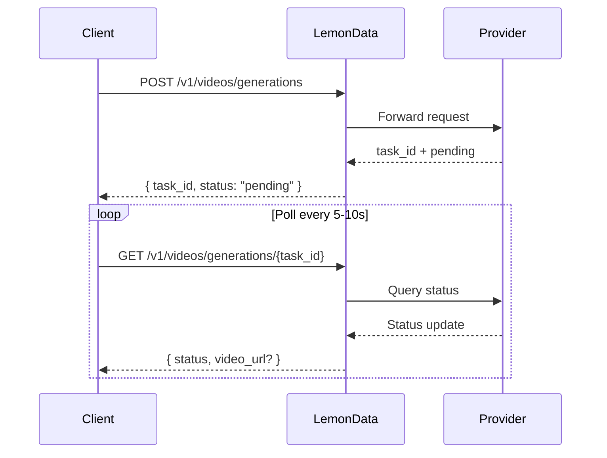

## Overview

LemonData provides access to **69+ video generation models** from 11 providers through a single unified API. Video generation is **asynchronous** — you submit a request and receive a task ID, then poll for the result.

<Info>
The model list is updated frequently. For the latest available models and pricing, visit the [Models page](https://lemondata.cc/en/models) or use the [Models API](/api-reference/models/list-models).
</Info>

### Async Workflow



<CodeGroup>

```python Python
import requests
import time

API_KEY = "sk-your-api-key"
BASE = "https://api.lemondata.cc/v1"
headers = {"Authorization": f"Bearer {API_KEY}"}

# Step 1: Submit generation request
resp = requests.post(f"{BASE}/videos/generations",
    headers=headers,
    json={
        "model": "kling-v2.6-pro",
        "prompt": "A golden retriever running on a beach at sunset, cinematic 4K",
        "duration": 5,
        "aspect_ratio": "16:9"
    }
)
task_id = resp.json()["task_id"]

# Step 2: Poll for result
while True:
    status = requests.get(f"{BASE}/videos/generations/{task_id}", headers=headers).json()
    if status["status"] in ("completed", "succeeded"):
        print(f"Video URL: {status['video_url']}")
        break
    elif status["status"] == "failed":
        print(f"Failed: {status.get('error')}")
        break
    time.sleep(10)
```

```javascript JavaScript
const API_KEY = 'sk-your-api-key';
const BASE = 'https://api.lemondata.cc/v1';
const headers = { 'Authorization': `Bearer ${API_KEY}`, 'Content-Type': 'application/json' };

// Step 1: Submit
const { task_id } = await fetch(`${BASE}/videos/generations`, {
  method: 'POST', headers,
  body: JSON.stringify({
    model: 'kling-v2.6-pro',
    prompt: 'A golden retriever running on a beach at sunset, cinematic 4K',
    duration: 5,
    aspect_ratio: '16:9'
  })
}).then(r => r.json());

// Step 2: Poll
const poll = setInterval(async () => {
  const status = await fetch(`${BASE}/videos/generations/${task_id}`, { headers }).then(r => r.json());
  if (['completed', 'succeeded'].includes(status.status)) {
    console.log('Video URL:', status.video_url);
    clearInterval(poll);
  } else if (status.status === 'failed') {
    console.error('Failed:', status.error);
    clearInterval(poll);
  }
}, 10000);
```

</CodeGroup>

## Model Capability Matrix

Different models excel at different tasks. Use this matrix to choose the right model for your use case.

**Legend**: ✅ Supported | ❌ Not supported

| Series | Provider | T2V | I2V | Keyframe | Extension | Editing | Max Duration |
|--------|----------|-----|-----|----------|-----------|---------|-------------|
| **Sora** | OpenAI | ✅ | ❌ | ❌ | ❌ | ❌ | ~20s |
| **Kling** | Kuaishou | ✅ | ✅ | ❌ | ✅ | ❌ | 10s |
| **Veo** | Google | ✅ | ❌ | ❌ | ❌ | ❌ | 8s |
| **Seedance** | ByteDance | ✅ | ✅ | ✅ | ✅ | ✅ | 10s |
| **Hailuo** | MiniMax | ✅ | ✅ | ❌ | ❌ | ❌ | 6s |
| **Wan** | Alibaba | ✅ | ✅ | ❌ | ❌ | ❌ | 5s |
| **Runway** | Runway | ✅ | ✅ | ❌ | ❌ | ❌ | 10s |
| **Luma** | Luma | ✅ | ❌ | ❌ | ✅ | ❌ | 5s |
| **Vidu** | Vidu | ✅ | ✅ | ❌ | ❌ | ❌ | 8s |
| **Grok** | xAI | ✅ | ❌ | ❌ | ❌ | ❌ | ~10s |
| **Higgsfield** | Higgsfield | ✅ | ❌ | ❌ | ❌ | ❌ | ~5s |

### Capability Definitions

- **T2V (Text-to-Video)**: Generate video from a text prompt
- **I2V (Image-to-Video)**: Animate a static image into video using `image_url` or `image`
- **Keyframe**: Control start and end frames with `start_image` + `end_image`
- **Extension**: Extend an existing video's duration
- **Editing**: Modify specific aspects of an existing video

## Available Models by Series

### Sora (OpenAI)

| Model | Quality | Notes |
|-------|---------|-------|
| `sora-2` | Standard | Default model, good balance of quality and speed |
| `sora-2-pro` | High | Higher quality, longer generation time |
| `sora-2-characters` | Standard | Character-focused generation |

### Kling (Kuaishou)

| Model | Capability | Notes |
|-------|-----------|-------|
| `kling-v2.6-pro` | T2V | Latest generation, professional quality |
| `kling-v2.6-std` | T2V | Latest generation, fast |
| `kling-v2.5-turbo-pro` | T2V | Turbo speed, pro quality |
| `kling-v2.1-master` | T2V/I2V | Master quality |
| `kling-v2.1-pro` | T2V/I2V | Professional quality |
| `kling-v2.1-standard` | T2V/I2V | Standard quality |
| `kling-video` | T2V/I2V | Base model |
| `kling-video-extend` | Extension | Extend existing videos |
| `kling-video-o1-pro` | T2V | O1 reasoning, pro quality |
| `kling-video-o1-std` | T2V | O1 reasoning, standard |
| `kling-effects` | Effects | Apply visual effects |
| `kling-omni-video` | T2V | Omni model |
| `kling-motion-control` | T2V | Motion-controlled generation |

### Veo (Google)

| Model | Quality | Notes |
|-------|---------|-------|
| `veo3.1` | Standard | Google's latest video model |
| `veo3.1-pro` | High | Professional quality |
| `veo3.1-4k` | Ultra | 4K resolution output |
| `veo3.1-fast` | Fast | Faster generation |
| `veo3.1-fast-4k` | Fast + 4K | Fast generation with 4K output |
| `veo3.1-components` | Standard | Component-based generation |
| `veo3` | Standard | Previous generation |
| `veo3-pro` | High | Previous gen, professional |
| `veo3-fast` | Fast | Previous gen, fast |

### Seedance (ByteDance)

| Model | Capability | Notes |
|-------|-----------|-------|
| `seedance-2-0` | T2V/I2V/Keyframe/Extension/Editing | Latest, most capable |
| `seedance-1-5-pro` | T2V/I2V | Previous generation, pro quality |
| `seedance-1-0-pro` | T2V/I2V | First generation, pro |
| `seedance-1-0-pro-fast` | T2V/I2V | First generation, fast |
| `seedance-1-0-lite-t2v` | T2V | Lightweight text-to-video |
| `seedance-1-0-lite-i2v` | I2V | Lightweight image-to-video |

<Note>
Seedance 2.0 supports the widest range of capabilities including multimodal-to-video, video extension, and video editing — all through the same API endpoint.
</Note>

### Hailuo (MiniMax)

| Model | Quality | Notes |
|-------|---------|-------|
| `hailuo-2.3` | Standard | Good quality |
| `hailuo-2.3-pro` | High | Higher quality output |
| `hailuo-2.3-fast` | Fast | Faster generation |
| `hailuo-2.3-standard` | Standard | Standard tier |
| `video-01` | Standard | MiniMax video-01 |
| `video-01-live` | Standard | Live-style generation |

### Wan (Alibaba)

| Model | Capability | Notes |
|-------|-----------|-------|
| `wan-2.6` | T2V | Latest text-to-video |
| `wan2.6-i2v` | I2V | Latest image-to-video |
| `wan-2.5` | T2V | Previous generation |
| `wan2.5-i2v-preview` | I2V | Previous gen I2V |
| `wan-2.2-plus` | T2V | Earlier generation |
| `vace-14b` | T2V | VACE architecture |

### Runway

| Model | Duration | Notes |
|-------|----------|-------|
| `runwayml-gen4-turbo-5` | 5s | Fast generation |
| `runwayml-gen4-turbo-10` | 10s | Longer clips |

### Luma

| Model | Capability | Notes |
|-------|-----------|-------|
| `luma-video-api` | T2V | Text-to-video |
| `luma-video-extend-api` | Extension | Extend existing videos |

### Vidu (Shengshu)

| Model | Quality | Notes |
|-------|---------|-------|
| `viduq3-pro` | High | Latest generation |
| `viduq2-pro` | High | Previous gen, pro |
| `viduq2-pro-fast` | Fast | Previous gen, fast pro |
| `viduq2` | Standard | Previous gen, standard |
| `viduq2-turbo` | Fast | Turbo speed |
| `vidu2.0` | Standard | Base model |

### Grok (xAI)

| Model | Notes |
|-------|-------|
| `grok-video-3` | xAI's video generation model |
| `grok-video-3-10s` | 10-second variant |

### Higgsfield

| Model | Notes |
|-------|-------|
| `higgsfield-turbo` | Fastest, lower cost |
| `higgsfield-standard` | Standard quality |
| `higgsfield-lite` | Lightweight |

## Usage Examples

### Text-to-Video (T2V)

The most common use case. All models support this.

```python
response = requests.post(f"{BASE}/videos/generations",
    headers=headers,
    json={
        "model": "veo3.1-pro",
        "prompt": "Aerial drone shot of a coastal city at golden hour, waves crashing against cliffs",
        "duration": 5,
        "aspect_ratio": "16:9",
        "resolution": "1080p"
    }
)
```

### Image-to-Video (I2V)

Animate a static image. Use `image_url` for a URL or `image` for base64 data.

```python
# Using image URL
response = requests.post(f"{BASE}/videos/generations",
    headers=headers,
    json={
        "model": "wan2.6-i2v",
        "prompt": "The person slowly turns and smiles at the camera",
        "image_url": "https://example.com/portrait.jpg"
    }
)

# Using base64 image
import base64
with open("photo.jpg", "rb") as f:
    image_b64 = base64.b64encode(f.read()).decode()

response = requests.post(f"{BASE}/videos/generations",
    headers=headers,
    json={
        "model": "kling-v2.1-master",
        "prompt": "Gentle wind blows through the scene",
        "image": f"data:image/jpeg;base64,{image_b64}"
    }
)
```

### Keyframe Control (Start + End Image)

Control both the first and last frames for precise transitions. Currently supported by Seedance 2.0.

```python
response = requests.post(f"{BASE}/videos/generations",
    headers=headers,
    json={
        "model": "seedance-2-0",
        "prompt": "Smooth transition from day to night, city lights gradually turning on",
        "start_image": "https://example.com/city-day.jpg",
        "end_image": "https://example.com/city-night.jpg",
        "duration": 5
    }
)
```

### Video Extension

Extend an existing video's duration. Use models with extension capability.

```python
response = requests.post(f"{BASE}/videos/generations",
    headers=headers,
    json={
        "model": "kling-video-extend",
        "prompt": "Continue the scene naturally",
        "image_url": "https://example.com/last-frame.jpg"
    }
)
```

## Parameters Reference

| Parameter | Type | Description |
|-----------|------|-------------|
| `model` | string | Model ID (default: `sora-2`) |
| `prompt` | string | **Required.** Text description of the video |
| `image_url` | string | URL of starting image (for I2V) |
| `image` | string | Base64-encoded image with data URL prefix (for I2V) |
| `duration` | integer | Video duration in seconds (1-60, model-dependent) |
| `aspect_ratio` | string | `16:9`, `9:16`, `1:1`, etc. |
| `resolution` | string | `1080p`, `720p`, `4k` |
| `fps` | integer | Frames per second (1-120) |
| `negative_prompt` | string | What to avoid in generation |
| `seed` | integer | Random seed for reproducibility |
| `cfg_scale` | number | Guidance scale (0-20) |
| `motion_strength` | number | Motion intensity (0-1) |
| `start_image` | string | URL of starting keyframe |
| `end_image` | string | URL of ending keyframe |

<Warning>
Not all parameters are supported by every model. Unsupported parameters are silently ignored. Check the model's documentation for supported parameters.
</Warning>

## Model Selection Guide

<CardGroup cols={2}>
  <Card title="Best Quality" icon="crown">
    **Seedance 2.0** or **Kling v2.6 Pro** — cinematic quality, rich detail, natural motion
  </Card>
  <Card title="Fastest Generation" icon="bolt">
    **Higgsfield Turbo** or **Hailuo 2.3** — quick results for prototyping and iteration
  </Card>
  <Card title="Most Versatile" icon="wand-magic-sparkles">
    **Seedance 2.0** — supports T2V, I2V, keyframe, extension, and editing in one model
  </Card>
  <Card title="Best Value" icon="coins">
    **Wan 2.6** or **Hailuo 2.3** — competitive quality at lower cost per generation
  </Card>
</CardGroup>

## Billing

Video generation uses **fixed per-generation pricing**. You are charged once when the task is submitted, regardless of video duration. If generation fails, the charge is automatically refunded.

Check current pricing on the [Models page](https://lemondata.cc/en/models) or via the [Pricing API](/api-reference/pricing/get-pricing).
