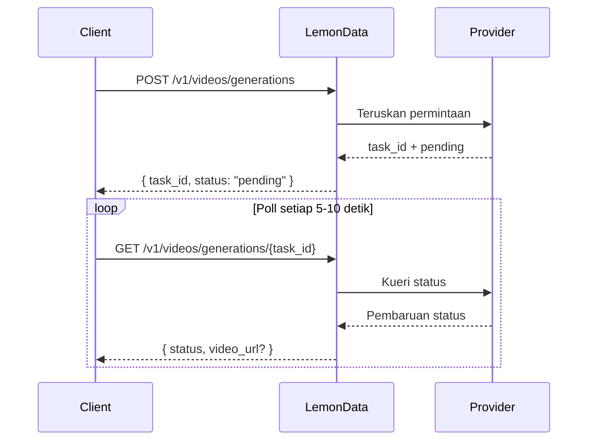

## Ikhtisar

LemonData menyediakan akses ke **69+ model generasi video** dari 11 penyedia melalui satu API terpadu. Generasi video bersifat **asinkron** — Anda mengirimkan permintaan dan menerima task ID, lalu melakukan polling untuk hasilnya.

<Info>
Daftar model diperbarui secara berkala. Untuk model dan harga terbaru yang tersedia, kunjungi [halaman Model](https://lemondata.cc/id/models) atau gunakan [API Model](/api-reference/models/list-models).
</Info>

### Alur Kerja Asinkron



<CodeGroup>

```python Python
import requests
import time

API_KEY = "sk-your-api-key"
BASE = "https://api.lemondata.cc/v1"
headers = {"Authorization": f"Bearer {API_KEY}"}

# Langkah 1: Kirim permintaan generasi
resp = requests.post(f"{BASE}/videos/generations",
    headers=headers,
    json={
        "model": "kling-v2.6-pro",
        "prompt": "A golden retriever running on a beach at sunset, cinematic 4K",
        "duration": 5,
        "aspect_ratio": "16:9"
    }
)
task_id = resp.json()["task_id"]

# Langkah 2: Poll untuk hasil
while True:
    status = requests.get(f"{BASE}/videos/generations/{task_id}", headers=headers).json()
    if status["status"] in ("completed", "succeeded"):
        print(f"Video URL: {status['video_url']}")
        break
    elif status["status"] == "failed":
        print(f"Failed: {status.get('error')}")
        break
    time.sleep(10)
```

```javascript JavaScript
const API_KEY = 'sk-your-api-key';
const BASE = 'https://api.lem