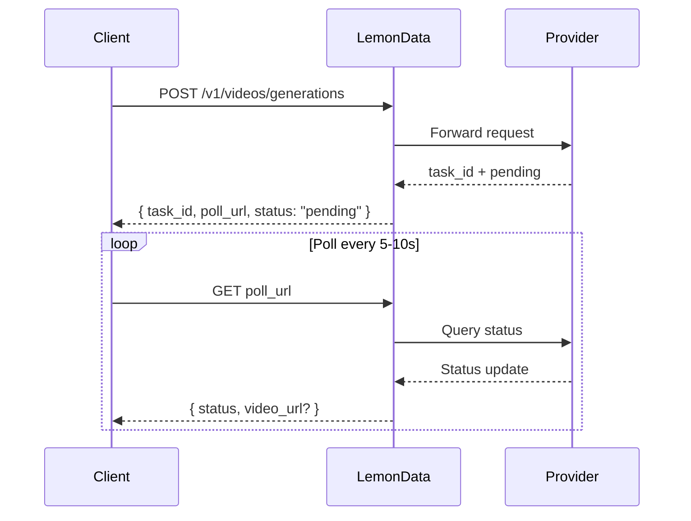

## Ringkasan

LemonData menyediakan akses ke model pembuatan video dari 11 penyedia melalui satu API terpadu. Pembuatan video bersifat **asinkron** — Anda mengirimkan request, menerima task ID dan `poll_url`, lalu melakukan poll untuk hasilnya.

<Info>
Daftar model sering diperbarui. Untuk model dan harga terbaru yang tersedia, kunjungi [halaman Models](https://lemondata.cc/id/models) atau gunakan [Models API](/api-reference/models/list-models).
</Info>

### Alur Kerja Async


```mermaid
sequenceDiagram
    participant Client
    participant LemonData
    participant Provider

    Client->>LemonData: POST /v1/videos/generations
    LemonData->>Provider: Forward request
    Provider-->>LemonData: task_id + pending
    LemonData-->>Client: { task_id, poll_url, status: "pending" }

    loop Poll every 5-10s
        Client->>LemonData: GET poll_url
        LemonData->>Provider: Query status
        Provider-->>LemonData: Status update
        LemonData-->>Client: { status, video_url? }
    end
```

<CodeGroup>

```python Python
import requests
import time

API_KEY = "sk-your-api-key"
BASE = "https://api.lemondata.cc/v1"
headers = {"Authorization": f"Bearer {API_KEY}"}

# Step 1: Submit generation request
resp = requests.post(f"{BASE}/videos/generations",
    headers=headers,
    json={
        "model": "kling-v2.6-pro",
        "prompt": "A golden retriever running on a beach at sunset, cinematic 4K",
        "duration": 5,
        "aspect_ratio": "16:9"
    }
)
create_data = resp.json()
task_id = create_data["task_id"]
poll_url = create_data["poll_url"]

# Step 2: Poll for result
while True:
    status = requests.get(f"https://api.lemondata.cc{poll_url}", headers=headers).json()
    if status["status"] in ("completed", "succeeded"):
        print(f"Video URL: {status['video_url']}")
        break
    elif status["status"] == "failed":
        print(f"Failed: {status.get('error')}")
        break
    time.sleep(10)
```

```javascript JavaScript
const API_KEY = 'sk-your-api-key';
const BASE = 'https://api.lemondata.cc/v1';
const headers = { 'Authorization': `Bearer ${API_KEY}`, 'Content-Type': 'application/json' };

// Step 1: Submit
const { task_id, poll_url } = await fetch(`${BASE}/videos/generations`, {
  method: 'POST', headers,
  body: JSON.stringify({
    model: 'kling-v2.6-pro',
    prompt: 'A golden retriever running on a beach at sunset, cinematic 4K',
    duration: 5,
    aspect_ratio: '16:9'
  })
}).then(r => r.json());

// Step 2: Poll
const poll = setInterval(async () => {
  const status = await fetch(`https://api.lemondata.cc${poll_url}`, { headers }).then(r => r.json());
  if (['completed', 'succeeded'].includes(status.status)) {
    console.log('Video URL:', status.video_url);
    clearInterval(poll);
  } else if (status.status === 'failed') {
    console.error('Failed:', status.error);
    clearInterval(poll);
  }
}, 10000);
```

</CodeGroup>

## Matriks Kapabilitas Model

Model yang berbeda unggul dalam tugas yang berbeda. Gunakan matriks ini untuk memilih model yang tepat untuk use case Anda.

**Legenda**: ✅ Didukung | ❌ Tidak didukung

| Series | Provider | T2V | I2V | Keyframe | Extension | Editing | Max Duration |
|--------|----------|-----|-----|----------|-----------|---------|-------------|
| **Sora** | OpenAI | ✅ | ❌ | ❌ | ❌ | ❌ | ~20s |
| **Kling** | Kuaishou | ✅ | ✅ | ❌ | ✅ | ❌ | 10s |
| **Veo** | Google | ✅ | ❌ | ❌ | ❌ | ❌ | 8s |
| **Seedance** | ByteDance | ✅ | ✅ | ✅ | ✅ | ✅ | 10s |
| **Hailuo** | MiniMax | ✅ | ✅ | ❌ | ❌ | ❌ | 6s |
| **Wan** | Alibaba | ✅ | ✅ | ❌ | ❌ | ❌ | 5s |
| **Runway** | Runway | ✅ | ✅ | ❌ | ❌ | ❌ | 10s |
| **Luma** | Luma | ✅ | ❌ | ❌ | ✅ | ❌ | 5s |
| **Vidu** | Vidu | ✅ | ✅ | ❌ | ❌ | ❌ | 8s |
| **Grok** | xAI | ✅ | ❌ | ❌ | ❌ | ❌ | ~10s |
| **Higgsfield** | Higgsfield | ✅ | ❌ | ❌ | ❌ | ❌ | ~5s |

### Definisi Kapabilitas

- **T2V (Text-to-Video)**: Buat video dari prompt teks
- **I2V (Image-to-Video)**: Animasikan gambar statis menjadi video. Untuk kompatibilitas terluas, berikan `image_url` publik.
- **Keyframe**: Kendalikan frame awal dan akhir dengan `start_image` + `end_image`
- **Extension**: Perpanjang durasi video yang sudah ada
- **Editing**: Ubah aspek tertentu dari video yang sudah ada

## Model yang Tersedia berdasarkan Series

### Sora (OpenAI)

| Model | Quality | Notes |
|-------|---------|-------|
| `sora-2` | Standard | Model contoh default |
| `sora-2-pro` | High | Kualitas lebih tinggi, waktu pembuatan lebih lama |
| `sora-2-characters` | Standard | Pembuatan yang berfokus pada karakter |

### Kling (Kuaishou)

| Model | Capability | Notes |
|-------|-----------|-------|
| `kling-v2.6-pro` | T2V | Generasi terbaru, kualitas profesional |
| `kling-v2.6-std` | T2V | Generasi terbaru, cepat |
| `kling-v2.5-turbo-std` | T2V | Tier Turbo |
| `kling-v2.5-turbo-pro` | T2V | Kecepatan Turbo, kualitas pro |
| `kling-v2.1-master` | T2V/I2V | Kualitas master |
| `kling-v2.1-pro` | T2V/I2V | Kualitas profesional |
| `kling-v2.1-standard` | T2V/I2V | Kualitas standar |
| `kling-video` | T2V/I2V | Model dasar |
| `kling-video-extend` | Extension | Perpanjang video yang sudah ada |
| `kling-video-o1-pro` | T2V | Penalaran O1, kualitas pro |
| `kling-video-o1-std` | T2V | Penalaran O1, standar |
| `kling-effects` | Effects | Terapkan efek visual |
| `kling-omni-video` | T2V | Model Omni |
| `kling-motion-control` | T2V | Pembuatan dengan kontrol gerakan |

### Veo (Google)

| Model | Quality | Notes |
|-------|---------|-------|
| `veo2` | Standard | Model seri Veo 2 |
| `veo3.1` | Standard | Model video terbaru Google |
| `veo3.1-pro` | High | Kualitas profesional |
| `veo3.1-4k` | Ultra | Output resolusi 4K |
| `veo3.1-fast` | Fast | Pembuatan lebih cepat |
| `veo3.1-fast-4k` | Fast + 4K | Pembuatan cepat dengan output 4K |
| `veo3.1-components` | Standard | Pembuatan berbasis komponen |
| `veo3` | Standard | Generasi sebelumnya |
| `veo3-pro` | High | Generasi sebelumnya, profesional |
| `veo3-fast` | Fast | Generasi sebelumnya, cepat |

### Seedance (ByteDance)

| Model | Capability | Notes |
|-------|-----------|-------|
| `seedance-2-0` | T2V/I2V/Keyframe/Extension/Editing | Terbaru, paling kapabel |
| `seedance-1-5-pro` | T2V/I2V | Generasi sebelumnya, kualitas pro |
| `seedance-1-0-pro` | T2V/I2V | Generasi pertama, pro |
| `seedance-1-0-pro-fast` | T2V/I2V | Generasi pertama, cepat |
| `seedance-1-0-lite-t2v` | T2V | Text-to-video ringan |
| `seedance-1-0-lite-i2v` | I2V | Image-to-video ringan |

<Note>
Seedance 2.0 mendukung rentang kapabilitas paling luas termasuk multimodal-to-video, perpanjangan video, dan pengeditan video — semuanya melalui endpoint API yang sama.
</Note>

### Hailuo (MiniMax)

| Model | Quality | Notes |
|-------|---------|-------|
| `hailuo-2.3` | Standard | Kualitas baik |
| `hailuo-2.3-pro` | High | Output dengan kualitas lebih tinggi |
| `hailuo-2.3-fast` | Fast | Pembuatan lebih cepat |
| `hailuo-2.3-standard` | Standard | Tier standar |
| `video-01` | Standard | MiniMax video-01 |
| `video-01-live` | Standard | Pembuatan bergaya live |

### Wan (Alibaba)

| Model | Capability | Notes |
|-------|-----------|-------|
| `wan-2.6` | T2V | Text-to-video terbaru |
| `wan2.6-i2v` | I2V | Image-to-video terbaru |
| `wan-2.5` | T2V | Generasi sebelumnya |
| `wan2.5-i2v-preview` | I2V | I2V generasi sebelumnya |
| `wan-2.2-plus` | T2V | Generasi yang lebih awal |
| `vace-14b` | T2V | Arsitektur VACE |

### Runway

| Model | Duration | Notes |
|-------|----------|-------|
| `runwayml-gen4-turbo-5` | 5s | Pembuatan cepat |
| `runwayml-gen4-turbo-10` | 10s | Klip lebih panjang |

### Luma

| Model | Capability | Notes |
|-------|-----------|-------|
| `luma-video-api` | T2V | Text-to-video |
| `luma-video-extend-api` | Extension | Perpanjang video yang sudah ada |

### Vidu (Shengshu)

| Model | Quality | Notes |
|-------|---------|-------|
| `viduq3-turbo` | Fast | Tier Turbo |
| `viduq3-pro` | High | Generasi terbaru |
| `viduq2-pro` | High | Generasi sebelumnya, pro |
| `viduq2-pro-fast` | Fast | Generasi sebelumnya, fast pro |
| `viduq2` | Standard | Generasi sebelumnya, standar |
| `viduq2-turbo` | Fast | Kecepatan Turbo |
| `vidu2.0` | Standard | Model dasar |

### Grok (xAI)

| Model | Notes |
|-------|-------|
| `grok-video-3` | Model pembuatan video xAI |
| `grok-video-3-10s` | Varian 10 detik |

### Higgsfield

| Model | Notes |
|-------|-------|
| `higgsfield-turbo` | Paling cepat, biaya lebih rendah |
| `higgsfield-standard` | Kualitas standar |
| `higgsfield-lite` | Ringan |

## Contoh Penggunaan

### Text-to-Video (T2V)

Use case yang paling umum. Semua model mendukung ini.

```python
response = requests.post(f"{BASE}/videos/generations",
    headers=headers,
    json={
        "model": "veo3.1-pro",
        "prompt": "Aerial drone shot of a coastal city at golden hour, waves crashing against cliffs",
        "duration": 5,
        "aspect_ratio": "16:9",
        "resolution": "1080p"
    }
)
```

### Image-to-Video (I2V)

Animasikan gambar statis. Untuk kompatibilitas terluas di berbagai model video, host gambar sumber dan kirimkan `image_url`.

```python
# Using image URL
response = requests.post(f"{BASE}/videos/generations",
    headers=headers,
    json={
        "model": "wan2.6-i2v",
        "prompt": "The person slowly turns and smiles at the camera",
        "image_url": "https://example.com/portrait.jpg"
    }
)

```

### Kontrol Keyframe (Gambar Awal + Akhir)

Kendalikan frame pertama dan terakhir untuk transisi yang presisi. Saat ini didukung oleh Seedance 2.0.

```python
response = requests.post(f"{BASE}/videos/generations",
    headers=headers,
    json={
        "model": "seedance-2-0",
        "prompt": "Smooth transition from day to night, city lights gradually turning on",
        "start_image": "https://example.com/city-day.jpg",
        "end_image": "https://example.com/city-night.jpg",
        "duration": 5
    }
)
```

### Perpanjangan Video

Perpanjang durasi video yang sudah ada. Gunakan model dengan kapabilitas extension.

```python
response = requests.post(f"{BASE}/videos/generations",
    headers=headers,
    json={
        "model": "kling-video-extend",
        "prompt": "Continue the scene naturally",
        "image_url": "https://example.com/last-frame.jpg"
    }
)
```

## Referensi Parameter

| Parameter | Type | Description |
|-----------|------|-------------|
| `model` | string | ID model (default: `sora-2`) |
| `prompt` | string | **Wajib.** Deskripsi teks dari video |
| `image_url` | string | URL dari gambar awal (untuk I2V) |
| `image` | string | Gambar inline sebagai data URL. Didukung oleh model yang kompatibel, tetapi `image_url` memberikan kompatibilitas paling luas. |
| `duration` | integer | Durasi video dalam detik (1-60, bergantung pada model) |
| `aspect_ratio` | string | `16:9`, `9:16`, `1:1`, dll. |
| `resolution` | string | `1080p`, `720p`, `4k` |
| `fps` | integer | Frame per detik (1-120) |
| `negative_prompt` | string | Hal yang harus dihindari dalam pembuatan |
| `seed` | integer | Seed acak untuk reproduksibilitas |
| `cfg_scale` | number | Skala panduan (0-20) |
| `motion_strength` | number | Intensitas gerakan (0-1) |
| `start_image` | string | URL dari keyframe awal |
| `end_image` | string | URL dari keyframe akhir |

<Warning>
Tidak semua parameter didukung oleh setiap model. Parameter yang tidak didukung akan diabaikan tanpa pemberitahuan. Periksa dokumentasi model untuk parameter yang didukung.
</Warning>

## Panduan Pemilihan Model

<CardGroup cols={2}>
  <Card title="Kualitas Terbaik" icon="crown">
    **Seedance 2.0** atau **Kling v2.6 Pro** — kualitas sinematik, detail kaya, gerakan alami
  </Card>
  <Card title="Pembuatan Tercepat" icon="bolt">
    **Higgsfield Turbo** atau **Hailuo 2.3** — hasil cepat untuk prototyping dan iterasi
  </Card>
  <Card title="Paling Serbaguna" icon="wand-magic-sparkles">
    **Seedance 2.0** — mendukung T2V, I2V, keyframe, extension, dan editing dalam satu model
  </Card>
  <Card title="Nilai Terbaik" icon="coins">
    **Wan 2.6** atau **Hailuo 2.3** — kualitas kompetitif dengan biaya per pembuatan yang lebih rendah
  </Card>
</CardGroup>

## Penagihan

Pembuatan video menggunakan **harga tetap per pembuatan**. Anda dikenai biaya satu kali saat task dikirimkan, terlepas dari durasi video. Jika pembuatan gagal, biaya akan dikembalikan secara otomatis.

Periksa harga terkini di [halaman Models](https://lemondata.cc/id/models) atau melalui [Pricing API](/api-reference/pricing/get-pricing).