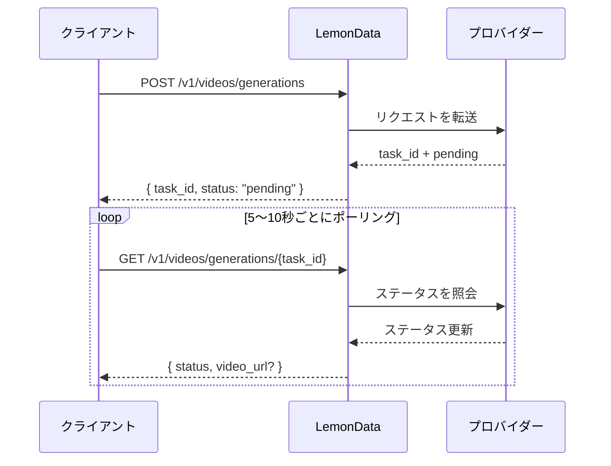

## 概要

LemonDataは、単一の統合APIを通じて、11のプロバイダーから**69以上の動画生成モデル**へのアクセスを提供します。動画生成は**非同期**で行われます。リクエストを送信してタスクIDを受け取り、その後結果をポーリングします。

<Info>
モデルリストは頻繁に更新されます。最新の利用可能なモデルと価格については、[Models page](https://lemondata.cc/ja/models)を参照するか、[Models API](/api-reference/models/list-models)を使用してください。
</Info>

### 非同期ワークフロー



<CodeGroup>

```python Python
import requests
import time

API_KEY = "sk-your-api-key"
BASE = "https://api.lemondata.cc/v1"
headers = {"Authorization": f"Bearer {API_KEY}"}

# ステップ 1: 生成リクエストを送信
resp = requests.post(f"{BASE}/videos/generations",
    headers=headers,
    json={
        "model": "kling-v2.6-pro",
        "prompt": "A golden retriever running on a beach at sunset, cinematic 4K",
        "duration": 5,
        "aspect_ratio": "16:9"
    }
)
task_id = resp.json()["task_id"]

# ステップ 2: 結果をポーリング
while True:
    status = requests.get(f"{BASE}/videos/generations/{task_id}", headers=headers).json()
    if status["status"] in ("completed", "succeeded"):
        print(f"Video URL: {status['video_url']}")
        break
    elif status["status"] == "failed":
        print(f"Failed: {status.get('error')}")
        break
    time.sleep(10)
```

```javascript JavaScript
const API_KEY = 'sk-your-api-key';
const BASE = 'https://api.lemondata.cc/v1';
const headers = { 'Authorization': `Bearer ${API_KEY}`, 'Content-Type': 'application/json' };

// ステップ 1: 送信
const { task_id } = await fetch(`${BASE}/videos/generations`, {
  method: 'POST', headers,
  body: JSON.stringify({
    model: 'kling-v2.6-pro',
    prompt: 'A golden retriever running on a beach at sunset, cinematic 4K',
    duration: 5,
    aspect_ratio: '16:9'
  })
}).then(r => r.json());

// ステップ 2: ポーリング
const poll = setInterval(async () => {
  const status = await fetch(`${BASE}/videos/generations/${task_id}`, { headers }).then(r => r.json());
  if (['completed', 'succeeded'].includes(status.status)) {
    console.log('Video URL:', status.video_url);
    clearInterval(poll);
  } else if (status.status === 'failed') {
    console.error('Failed:', status.error);
    clearInterval(poll);
  }
}, 10000);
```

</CodeGroup>

## モデル機能マトリックス

モデルによって得意なタスクが異なります。ユースケースに適したモデルを選択するために、このマトリックスを活用してください。

**凡例**: ✅ サポート済み | ❌ 未サポート

| シリーズ | プロバイダー | T2V | I2V | キーフレーム | 延長 | 編集 | 最大時間 |
|--------|----------|-----|-----|----------|-----------|---------|-------------|
| **Sora** | OpenAI | ✅ | ❌ | ❌ | ❌ | ❌ | 約20秒 |
| **Kling** | Kuaishou | ✅ | ✅ | ❌ | ✅ | ❌ | 10秒 |
| **Veo** | Google | ✅ | ❌ | ❌ | ❌ | ❌ | 8秒 |
| **Seedance** | ByteDance | ✅ | ✅ | ✅ | ✅ | ✅ | 10秒 |
| **Hailuo** | MiniMax | ✅ | ✅ | ❌ | ❌ | ❌ | 6秒 |
| **Wan** | Alibaba | ✅ | ✅ | ❌ | ❌ | ❌ | 5秒 |
| **Runway** | Runway | ✅ | ✅ | ❌ | ❌ | ❌ | 10秒 |
| **Luma** | Luma | ✅ | ❌ | ❌ | ✅ | ❌ | 5秒 |
| **Vidu** | Vidu | ✅ | ✅ | ❌ | ❌ | ❌ | 8秒 |
| **Grok** | xAI | ✅ | ❌ | ❌ | ❌ | ❌ | 約10秒 |
| **Higgsfield** | Higgsfield | ✅ | ❌ | ❌ | ❌ | ❌ | 約5秒 |

### 機能の定義

- **T2V (Text-to-Video)**: テキストプロンプトから動画を生成
- **I2V (Image-to-Video)**: `image_url`または`image`を使用して静止画を動画としてアニメーション化
- **キーフレーム**: `start_image` + `end_image`で開始フレームと終了フレームを制御
- **延長**: 既存の動画の長さを延長
- **編集**: 既存の動画の特定の要素を修正

## シリーズ別利用可能モデル

### Sora (OpenAI)

| モデル | 品質 | 備考 |
|-------|---------|-------|
| `sora-2` | 標準 | デフォルトモデル、品質と速度のバランスが良好 |
| `sora-2-pro` | 高品質 | より高品質、生成時間が長い |
| `sora-2-characters` | 標準 | キャラクターに特化した生成 |

### Kling (Kuaishou)

| モデル | 機能 | 備考 |
|-------|-----------|-------|
| `kling-v2.6-pro` | T2V | 最新世代、プロフェッショナル品質 |
| `kling-v2.6-std` | T2V | 最新世代、高速 |
| `kling-v2.5-turbo-pro` | T2V | ターボ速度、プロ品質 |
| `kling-v2.1-master` | T2V/I2V | マスター品質 |
| `kling-v2.1-pro` | T2V/I2V | プロフェッショナル品質 |
| `kling-v2.1-standard` | T2V/I2V | 標準品質 |
| `kling-video` | T2V/I2V | ベースモデル |
| `kling-video-extend` | 延長 | 既存の動画を延長 |
| `kling-video-o1-pro` | T2V | O1推論、プロ品質 |
| `kling-video-o1-std` | T2V | O1推論、標準 |
| `kling-effects` | エフェクト | 視覚効果を適用 |
| `kling-omni-video` | T2V | Omniモデル |
| `kling-motion-control` | T2V | モーション制御による生成 |

### Veo (Google)

| モデル | 品質 | 備考 |
|-------|---------|-------|
| `veo3.1` | 標準 | Googleの最新動画モデル |
| `veo3.1-pro` | 高品質 | プロフェッショナル品質 |
| `veo3.1-4k` | ウルトラ | 4K解像度出力 |
| `veo3.1-fast` | 高速 | より高速な生成 |
| `veo3.1-fast-4k` | 高速 + 4K | 4K出力による高速生成 |
| `veo3.1-components` | 標準 | コンポーネントベースの生成 |
| `veo3` | 標準 | 前世代 |
| `veo3-pro` | 高品質 | 前世代、プロフェッショナル |
| `veo3-fast` | 高速 | 前世代、高速 |

### Seedance (ByteDance)

| モデル | 機能 | 備考 |
|-------|-----------|-------|
| `seedance-2-0` | T2V/I2V/キーフレーム/延長/編集 | 最新、最も多機能 |
| `seedance-1-5-pro` | T2V/I2V | 前世代、プロ品質 |
| `seedance-1-0-pro` | T2V/I2V | 第一世代、プロ |
| `seedance-1-0-pro-fast` | T2V/I2V | 第一世代、高速 |
| `seedance-1-0-lite-t2v` | T2V | 軽量なtext-to-video |
| `seedance-1-0-lite-i2v` | I2V | 軽量なimage-to-video |

<Note>
Seedance 2.0は、マルチモーダルtoビデオ、動画の延長、動画編集など、最も幅広い機能をサポートしており、これらすべてを同じAPIエンドポイントから利用できます。
</Note>

### Hailuo (MiniMax)

| モデル | 品質 | 備考 |
|-------|---------|-------|
| `hailuo-2.3` | 標準 | 良好な品質 |
| `hailuo-2.3-pro` | 高品質 | より高品質な出力 |
| `hailuo-2.3-fast` | 高速 | より高速な生成 |
| `hailuo-2.3-standard` | 標準 | 標準ティア |
| `video-01` | 標準 | MiniMax video-01 |
| `video-01-live` | 標準 | ライブスタイルの生成 |

### Wan (Alibaba)

| モデル | 機能 | 備考 |
|-------|-----------|-------|
| `wan-2.6` | T2V | 最新のtext-to-video |
| `wan2.6-i2v` | I2V | 最新のimage-to-video |
| `wan-2.5` | T2V | 前世代 |
| `wan2.5-i2v-preview` | I2V | 前世代のI2V |
| `wan-2.2-plus` | T2V | 初期の世代 |
| `vace-14b` | T2V | VACEアーキテクチャ |

### Runway

| モデル | 時間 | 備考 |
|-------|----------|-------|
| `runwayml-gen4-turbo-5` | 5秒 | 高速生成 |
| `runwayml-gen4-turbo-10` | 10秒 | より長いクリップ |

### Luma

| モデル | 機能 | 備考 |
|-------|-----------|-------|
| `luma-video-api` | T2V | Text-to-video |
| `luma-video-extend-api` | 延長 | 既存の動画を延長 |

### Vidu (Shengshu)

| モデル | 品質 | 備考 |
|-------|---------|-------|
| `viduq3-pro` | 高品質 | 最新世代 |
| `viduq2-pro` | 高品質 | 前世代、プロ |
| `viduq2-pro-fast` | 高速 | 前世代、高速プロ |
| `viduq2` | 標準 | 前世代、標準 |
| `viduq2-turbo` | 高速 | ターボ速度 |
| `vidu2.0` | 標準 | ベースモデル |

### Grok (xAI)

| モデル | 備考 |
|-------|-------|
| `grok-video-3` | xAIの動画生成モデル |
| `grok-video-3-10s` | 10秒バリアント |

### Higgsfield

| モデル | 備考 |
|-------|-------|
| `higgsfield-turbo` | 最速、低コスト |
| `higgsfield-standard` | 標準品質 |
| `higgsfield-lite` | 軽量 |

## 使用例

### Text-to-Video (T2V)

最も一般的なユースケースです。すべてのモデルがこれをサポートしています。

```python
response = requests.post(f"{BASE}/videos/generations",
    headers=headers,
    json={
        "model": "veo3.1-pro",
        "prompt": "Aerial drone shot of a coastal city at golden hour, waves crashing against cliffs",
        "duration": 5,
        "aspect_ratio": "16:9",
        "resolution": "1080p"
    }
)
```

### Image-to-Video (I2V)

静止画をアニメーション化します。URLには`image_url`を、base64データには`image`を使用します。

```python
# 画像URLを使用する場合
response = requests.post(f"{BASE}/videos/generations",
    headers=headers,
    json={
        "model": "wan2.6-i2v",
        "prompt": "The person slowly turns and smiles at the camera",
        "image_url": "https://example.com/portrait.jpg"
    }
)

# base64画像を使用する場合
import base64
with open("photo.jpg", "rb") as f:
    image_b64 = base64.b64encode(f.read()).decode()

response = requests.post(f"{BASE}/videos/generations",
    headers=headers,
    json={
        "model": "kling-v2.1-master",
        "prompt": "Gentle wind blows through the scene",
        "image": f"data:image/jpeg;base64,{image_b64}"
    }
)
```

### キーフレーム制御 (開始 + 終了画像)

最初と最後のフレームの両方を制御して、正確なトランジションを実現します。現在はSeedance 2.0でサポートされています。

```python
response = requests.post(f"{BASE}/videos/generations",
    headers=headers,
    json={
        "model": "seedance-2-0",
        "prompt": "Smooth transition from day to night, city lights gradually turning on",
        "start_image": "https://example.com/city-day.jpg",
        "end_image": "https://example.com/city-night.jpg",
        "duration": 5
    }
)
```

### 動画の延長

既存の動画の長さを延長します。延長機能を備えたモデルを使用してください。

```python
response = requests.post(f"{BASE}/videos/generations",
    headers=headers,
    json={
        "model": "kling-video-extend",
        "prompt": "Continue the scene naturally",
        "image_url": "https://example.com/last-frame.jpg"
    }
)
```

## パラメータリファレンス

| パラメータ | 型 | 説明 |
|-----------|------|-------------|
| `model` | string | モデルID（デフォルト: `sora-2`） |
| `prompt` | string | **必須。** 動画のテキスト説明 |
| `image_url` | string | 開始画像のURL（I2V用） |
| `image` | string | データURLプレフィックス付きのBase64エンコード済み画像（I2V用） |
| `duration` | integer | 動画の長さ（秒単位、1〜60、モデルに依存） |
| `aspect_ratio` | string | `16:9`、`9:16`、`1:1`など |
| `resolution` | string | `1080p`、`720p`、`4k` |
| `fps` | integer | フレームレート（1〜120） |
| `negative_prompt` | string | 生成時に避けるべき内容 |
| `seed` | integer | 再現性のためのランダムシード |
| `cfg_scale` | number | ガイダンススケール（0〜20） |
| `motion_strength` | number | 動きの強さ（0〜1） |
| `start_image` | string | 開始キーフレームのURL |
| `end_image` | string | 終了キーフレームのURL |

<Warning>
すべてのパラメータがすべてのモデルでサポートされているわけではありません。サポートされていないパラメータは無視されます。サポートされているパラメータについては、各モデルのドキュメントを確認してください。
</Warning>

## モデル選択ガイド

<CardGroup cols={2}>
  <Card title="最高品質" icon="crown">
    **Seedance 2.0** または **Kling v2.6 Pro** — 映画のような品質、豊かなディテール、自然な動き
  </Card>
  <Card title="最速生成" icon="bolt">
    **Higgsfield Turbo** または **Hailuo 2.3** — プロトタイピングや反復のための迅速な結果
  </Card>
  <Card title="最も多機能" icon="wand-magic-sparkles">
    **Seedance 2.0** — T2V、I2V、キーフレーム、延長、編集を1つのモデルでサポート
  </Card>
  <Card title="最高のコストパフォーマンス" icon="coins">
    **Wan 2.6** または **Hailuo 2.3** — 生成あたりのコストを抑えつつ競争力のある品質を提供
  </Card>
</CardGroup>

## 料金体系

動画生成は**生成ごとの固定料金制**を採用しています。動画の長さに関わらず、タスクが送信された時点で一度課金されます。生成に失敗した場合は、料金は自動的に返金されます。

現在の価格については、[Models page](https://lemondata.cc/ja/models)を確認するか、[Pricing API](/api-reference/pricing/get-pricing)を介して取得してください。