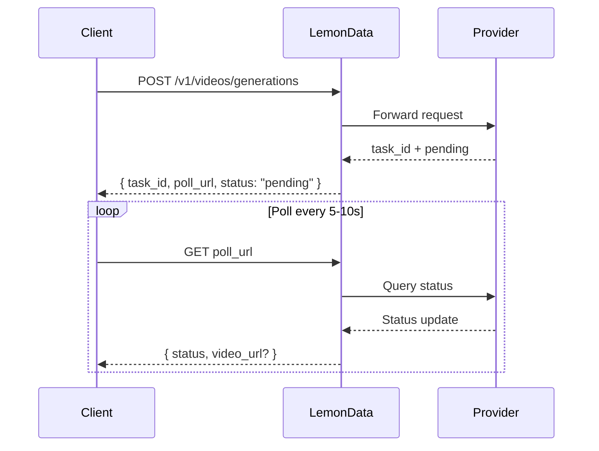

## 概要

LemonData は、11 のプロバイダーの動画生成モデルへのアクセスを、単一の統一 API を通じて提供します。動画生成は **非同期** です — リクエストを送信すると、task ID と `poll_url` を受け取り、その後結果を取得するためにポーリングします。

<Info>
モデル一覧は頻繁に更新されます。最新の利用可能なモデルと価格については、[Models page](https://lemondata.cc/ja/models) を参照するか、[Models API](/api-reference/models/list-models) を使用してください。
</Info>

<Warning>
Audio behavior is model-dependent. In LemonData, Veo 3 family requests default to audio-on when `output_audio` is omitted. Some models are silent by default or silent-only. For passthrough-governed models, pass `output_audio=true` to make a best-effort upstream audio request.
</Warning>


### 非同期ワークフロー


```mermaid
sequenceDiagram
    participant Client
    participant LemonData
    participant Provider

    Client->>LemonData: POST /v1/videos/generations
    LemonData->>Provider: Forward request
    Provider-->>LemonData: task_id + pending
    LemonData-->>Client: { task_id, poll_url, status: "pending" }

    loop Poll every 5-10s
        Client->>LemonData: GET poll_url
        LemonData->>Provider: Query status
        Provider-->>LemonData: Status update
        LemonData-->>Client: { status, video_url? }
    end
```

<CodeGroup>

```python Python
import requests
import time

API_KEY = "sk-your-api-key"
BASE = "https://api.lemondata.cc/v1"
headers = {"Authorization": f"Bearer {API_KEY}"}

# Step 1: Submit generation request
resp = requests.post(f"{BASE}/videos/generations",
    headers=headers,
    json={
        "model": "sora-2",
        "prompt": "A calm cinematic shot of a cat walking through a sunlit garden.",
        "operation": "text-to-video",
        "duration": 4,
        "aspect_ratio": "16:9"
    }
)
create_data = resp.json()
task_id = create_data["task_id"]
poll_url = create_data["poll_url"]

# Step 2: Poll for result
while True:
    status = requests.get(f"https://api.lemondata.cc{poll_url}", headers=headers).json()
    if status["status"] in ("completed", "succeeded"):
        print(f"Video URL: {status['video_url']}")
        break
    elif status["status"] == "failed":
        print(f"Failed: {status.get('error')}")
        break
    time.sleep(10)
```

```javascript JavaScript
const API_KEY = 'sk-your-api-key';
const BASE = 'https://api.lemondata.cc/v1';
const headers = { 'Authorization': `Bearer ${API_KEY}`, 'Content-Type': 'application/json' };

// Step 1: Submit
const { task_id, poll_url } = await fetch(`${BASE}/videos/generations`, {
  method: 'POST', headers,
  body: JSON.stringify({
    model: 'sora-2',
    prompt: 'A calm cinematic shot of a cat walking through a sunlit garden.',
    operation: 'text-to-video',
    duration: 4,
    aspect_ratio: '16:9'
  })
}).then(r => r.json());

// Step 2: Poll
const poll = setInterval(async () => {
  const status = await fetch(`https://api.lemondata.cc${poll_url}`, { headers }).then(r => r.json());
  if (['completed', 'succeeded'].includes(status.status)) {
    console.log('Video URL:', status.video_url);
    clearInterval(poll);
  } else if (status.status === 'failed') {
    console.error('Failed:', status.error);
    clearInterval(poll);
  }
}, 10000);
```

</CodeGroup>

## モデル機能マトリクス

モデルごとに得意なタスクは異なります。このマトリクスを使用して、ユースケースに適したモデルを選択してください。

**凡例**: ✅ 対応 | ❌ 非対応

| Series | Provider | T2V | I2V | Keyframe | Extension | Editing | Max Duration |
|--------|----------|-----|-----|----------|-----------|---------|-------------|
| **Sora** | OpenAI | ✅ | ❌ | ❌ | ❌ | ❌ | ~20s |
| **Kling** | Kuaishou | ✅ | ✅ | ❌ | ✅ | ❌ | 10s |
| **Veo** | Google | ✅ | ✅ | ✅ | ❌ | ❌ | 8s |
| **Seedance** | ByteDance | ✅ | ✅ | ✅ | ✅ | ✅ | 10s |
| **Hailuo** | MiniMax | ✅ | ✅ | ❌ | ❌ | ❌ | 10s |
| **Wan** | Alibaba | ✅ | ✅ | ❌ | ❌ | ❌ | 5s |
| **Runway** | Runway | ❌ | ✅ | ❌ | ❌ | ❌ | 10s |
| **Luma** | Luma | ✅ | ❌ | ❌ | ✅ | ❌ | 5s |
| **Vidu** | Vidu | ✅ | ✅ | ✅ | ❌ | ❌ | 8s |
| **Grok** | xAI | ✅ | ❌ | ❌ | ❌ | ❌ | ~15s |
| **Higgsfield** | Higgsfield | ✅ | ❌ | ❌ | ❌ | ❌ | ~5s |

### 機能の定義

- **T2V (Text-to-Video)**: テキストプロンプトから動画を生成
- **I2V (Image-to-Video)**: 静止画像を動画化します。最も広い互換性のため、公開された `image_url` を指定してください。
- **Keyframe**: `start_image` + `end_image` で開始フレームと終了フレームを制御
- **Extension**: 既存動画の長さを延長
- **Editing**: 既存動画の特定の要素を変更

## シリーズ別の利用可能なモデル

### Sora (OpenAI)

| Model | Quality | Notes |
|-------|---------|-------|
| `sora-2` | Standard | デフォルトのサンプルモデル |
| `sora-2-pro` | High | より高品質、生成時間は長め |
| `sora-2-characters` | Standard | キャラクター重視の生成 |

### Kling (Kuaishou)

| Model | Capability | Notes |
|-------|-----------|-------|
| `kling-v2.6-pro` | T2V | 最新世代、プロフェッショナル品質 |
| `kling-v2.6-std` | T2V | 最新世代、高速 |
| `kling-v2.5-turbo-std` | T2V | Turbo tier |
| `kling-v2.5-turbo-pro` | T2V | Turbo speed、プロ品質 |
| `kling-v2.1-master` | T2V/I2V | Master quality |
| `kling-v2.1-pro` | T2V/I2V | プロフェッショナル品質 |
| `kling-v2.1-standard` | T2V/I2V | Standard quality |
| `kling-video` | T2V/I2V | ベースモデル |
| `kling-video-extend` | Extension | 既存動画を延長 |
| `kling-video-o1-pro` | T2V | O1 reasoning、プロ品質 |
| `kling-video-o1-std` | T2V | O1 reasoning、標準 |
| `kling-effects` | Effects | 視覚効果を適用 |
| `kling-omni-video` | T2V | Omni model |
| `kling-3.0-motion-control` | Motion Control | モーション制御生成 |

### Veo (Google)

| Model | Quality | Notes |
|-------|---------|-------|
| `veo2` | Standard | Veo 2 シリーズモデル |
| `veo3.1` | Standard | Google の最新動画モデル |
| `veo3.1-pro` | High | プロフェッショナル品質 |
| `veo3.1-4k` | Ultra | 4K 解像度出力 |
| `veo3.1-fast` | Fast | より高速な生成 |
| `veo3.1-fast-4k` | Fast + 4K | 4K 出力付きの高速生成 |
| `veo3.1-components` | Standard | コンポーネントベース生成 |
| `veo3` | Standard | 前世代 |
| `veo3-pro` | High | 前世代、プロフェッショナル |
| `veo3-fast` | Fast | 前世代、高速 |

### Seedance (ByteDance)

| Model | Capability | Notes |
|-------|-----------|-------|
| `seedance-2-0` | T2V/I2V/Keyframe/Extension/Editing | 最新、最も高機能 |
| `seedance-1-5-pro` | T2V/I2V | 前世代、プロ品質 |
| `seedance-1-0-pro` | T2V/I2V | 初代、プロ |
| `seedance-1-0-pro-fast` | T2V/I2V | 初代、高速 |
| `seedance-1-0-lite-t2v` | T2V | 軽量 text-to-video |
| `seedance-1-0-lite-i2v` | I2V | 軽量 image-to-video |

<Note>
Seedance 2.0 は、multimodal-to-video、動画延長、動画編集を含む最も広い機能範囲をサポートしており、すべて同じ API endpoint を通じて利用できます。
</Note>

### Hailuo (MiniMax)

| Model | Quality | Notes |
|-------|---------|-------|
| `hailuo-2.3` | Standard | 良好な品質 |
| `hailuo-2.3-pro` | High | より高品質な出力 |
| `hailuo-2.3-fast` | Fast | より高速な生成 |
| `hailuo-2.3-standard` | Standard | 標準 tier |
| `video-01` | Standard | MiniMax video-01 |
| `video-01-live` | Standard | Live-style generation |

### Wan (Alibaba)

| Model | Capability | Notes |
|-------|-----------|-------|
| `wan-2.6` | T2V | 最新の text-to-video |
| `wan2.6-i2v` | I2V | 最新の image-to-video |
| `wan-2.5` | T2V | 前世代 |
| `wan2.5-i2v-preview` | I2V | 前世代 I2V |
| `wan-2.2-plus` | T2V | さらに前の世代 |
| `vace-14b` | T2V | VACE architecture |

### Runway

| Model | Duration | Notes |
|-------|----------|-------|
| `runwayml-gen4-turbo-5` | 5s | 高速生成 |
| `runwayml-gen4-turbo-10` | 10s | より長いクリップ |

### Luma

| Model | Capability | Notes |
|-------|-----------|-------|
| `luma-video-api` | T2V | Text-to-video |
| `luma-video-extend-api` | Extension | 既存動画を延長 |

### Vidu (Shengshu)

| Model | Quality | Notes |
|-------|---------|-------|
| `viduq3-turbo` | Fast | Turbo tier |
| `viduq3-pro` | High | 最新世代 |
| `viduq2-pro` | High | 前世代、プロ |
| `viduq2-pro-fast` | Fast | 前世代、高速プロ |
| `viduq2` | Standard | 前世代、標準 |
| `viduq2-turbo` | Fast | Turbo speed |
| `vidu2.0` | Standard | ベースモデル |

### Grok (xAI)

| Model | Notes |
|-------|-------|
| `grok-video-3` | xAI の動画生成モデル |
| `grok-video-3-15s` | 15 秒バリアント |

### Higgsfield

| Model | Notes |
|-------|-------|
| `higgsfield-turbo` | 最速、低コスト |
| `higgsfield-standard` | 標準品質 |
| `higgsfield-lite` | 軽量 |

## 使用例

### Text-to-Video (T2V)

最も一般的なユースケースです。すべてのモデルがこれをサポートしています。

```python
response = requests.post(f"{BASE}/videos/generations",
    headers=headers,
    json={
        "model": "sora-2",
        "prompt": "A calm cinematic shot of a cat walking through a sunlit garden.",
        "operation": "text-to-video",
        "duration": 4,
        "aspect_ratio": "16:9"
    }
)
```

### Image-to-Video (I2V)

静止画像を動画化します。動画モデル間で最も広い互換性を得るには、元画像をホストし、`image_url` を渡してください。

```python
# Using image URL
response = requests.post(f"{BASE}/videos/generations",
    headers=headers,
    json={
        "model": "hailuo-2.3-fast",
        "prompt": "The scene begins from the provided image and adds gentle natural motion.",
        "operation": "image-to-video",
        "image_url": "https://example.com/portrait.jpg",
        "duration": 6,
        "aspect_ratio": "16:9"
    }
)

```

### Keyframe 制御 (開始 + 終了画像)

正確なトランジションのために、最初と最後のフレームの両方を制御します。現在は Seedance 2.0 でサポートされています。

```python
response = requests.post(f"{BASE}/videos/generations",
    headers=headers,
    json={
        "model": "viduq2-pro",
        "prompt": "Smooth transition from day to night, city lights gradually turning on",
        "operation": "start-end-to-video",
        "start_image": "https://example.com/city-day.jpg",
        "end_image": "https://example.com/city-night.jpg",
        "duration": 5,
        "resolution": "720p",
        "aspect_ratio": "16:9"
    }
)
```

### 動画延長

既存動画の長さを延長します。延長機能を持つモデルを使用してください。

```python
response = requests.post(f"{BASE}/videos/generations",
    headers=headers,
    json={
        "model": "kling-video-extend",
        "prompt": "Continue the scene naturally",
        "image_url": "https://example.com/last-frame.jpg"
    }
)
```

## パラメータリファレンス

| Parameter | Type | Description |
|-----------|------|-------------|
| `model` | string | モデル ID（デフォルト: `sora-2`） |
| `prompt` | string | **必須。** 動画のテキスト説明 |
| `image_url` | string | 開始画像の URL（I2V 用） |
| `image` | string | data URL としてのインライン画像。互換モデルでサポートされますが、`image_url` が最も広い互換性を提供します。 |
| `duration` | integer | 動画の長さ（秒）（1-60、モデル依存） |
| `aspect_ratio` | string | `16:9`, `9:16`, `1:1` など |
| `resolution` | string | `1080p`, `720p`, `4k` |
| `fps` | integer | 1 秒あたりのフレーム数（1-120） |
| `negative_prompt` | string | 生成時に避けたい内容 |
| `seed` | integer | 再現性のためのランダム seed |
| `cfg_scale` | number | ガイダンススケール（0-20） |
| `motion_strength` | number | モーション強度（0-1） |
| `start_image` | string | 開始 keyframe の URL |
| `end_image` | string | 終了 keyframe の URL |

<Warning>
すべてのパラメータがすべてのモデルでサポートされているわけではありません。未対応のパラメータは黙って無視されます。サポートされているパラメータについては、各モデルのドキュメントを確認してください。
</Warning>

## モデル選択ガイド

<CardGroup cols={2}>
  <Card title="最高品質" icon="crown">
    **Seedance 2.0** または **Kling v2.6 Pro** — シネマティック品質、豊かなディテール、自然なモーション
  </Card>
  <Card title="最速生成" icon="bolt">
    **Higgsfield Turbo** または **Hailuo 2.3** — プロトタイピングと反復に素早い結果
  </Card>
  <Card title="最も汎用的" icon="wand-magic-sparkles">
    **Seedance 2.0** — 1 つのモデルで T2V、I2V、keyframe、extension、editing をサポート
  </Card>
  <Card title="最高のコストパフォーマンス" icon="coins">
    **Wan 2.6** または **Hailuo 2.3** — 生成あたりのコストを抑えつつ競争力のある品質
  </Card>
</CardGroup>

## 課金

動画生成では **生成ごとの固定価格** が使用されます。動画の長さにかかわらず、タスク送信時に 1 回課金されます。生成に失敗した場合、料金は自動的に返金されます。

現在の価格は [Models page](https://lemondata.cc/ja/models) または [Pricing API](/api-reference/pricing/get-pricing) で確認してください。
