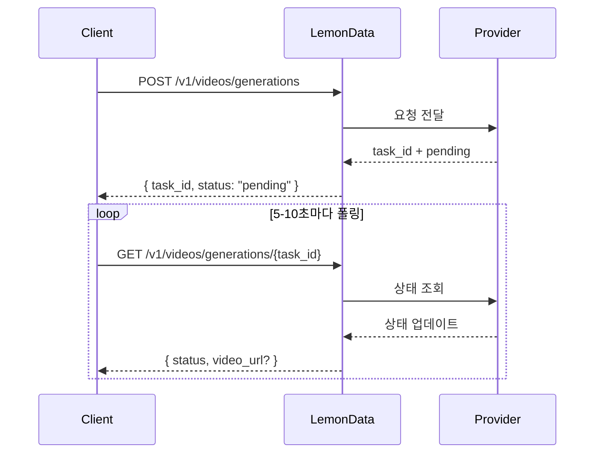

## 개요

LemonData는 단일 통합 API를 통해 11개 제공업체의 **69개 이상의 비디오 생성 모델**에 대한 액세스를 제공합니다. 비디오 생성은 **비동기식**으로 이루어집니다 — 요청을 제출하고 task ID를 받은 다음, 결과를 확인하기 위해 폴링(poll)합니다.

<Info>
모델 목록은 수시로 업데이트됩니다. 최신 사용 가능 모델 및 가격은 [Models 페이지](https://lemondata.cc/ko/models)를 방문하거나 [Models API](/api-reference/models/list-models)를 사용하세요.
</Info>

### 비동기 워크플로우



<CodeGroup>

```python Python
import requests
import time

API_KEY = "sk-your-api-key"
BASE = "https://api.lemondata.cc/v1"
headers = {"Authorization": f"Bearer {API_KEY}"}

# Step 1: Submit generation request
resp = requests.post(f"{BASE}/videos/generations",
    headers=headers,
    json={
        "model": "kling-v2.6-pro",
        "prompt": "A golden retriever running on a beach at sunset, cinematic 4K",
        "duration": 5,
        "aspect_ratio": "16:9"
    }
)
task_id = resp.json()["task_id"]

# Step 2: Poll for result
while True:
    status = requests.get(f"{BASE}/videos/generations/{task_id}", headers=headers).json()
    if status["status"] in ("completed", "succeeded"):
        print(f"Video URL: {status['video_url']}")
        break
    elif status["status"] == "failed":
        print(f"Failed: {status.get('error')}")
        break
    time.sleep(10)
```

```javascript JavaScript
const API