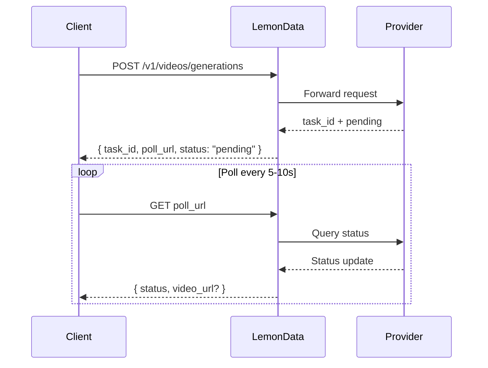

## 개요

LemonData는 단일 통합 API를 통해 11개 제공업체의 비디오 생성 모델에 대한 액세스를 제공합니다. 비디오 생성은 **비동기식**입니다 — 요청을 제출하면 task ID와 `poll_url`을 받은 다음, 결과를 조회하기 위해 polling합니다.

<Info>
모델 목록은 자주 업데이트됩니다. 최신 사용 가능 모델 및 가격은 [Models page](https://lemondata.cc/ko/models)를 방문하거나 [Models API](/api-reference/models/list-models)를 사용하세요.
</Info>

### 비동기 워크플로


```mermaid
sequenceDiagram
    participant Client
    participant LemonData
    participant Provider

    Client->>LemonData: POST /v1/videos/generations
    LemonData->>Provider: Forward request
    Provider-->>LemonData: task_id + pending
    LemonData-->>Client: { task_id, poll_url, status: "pending" }

    loop Poll every 5-10s
        Client->>LemonData: GET poll_url
        LemonData->>Provider: Query status
        Provider-->>LemonData: Status update
        LemonData-->>Client: { status, video_url? }
    end
```

<CodeGroup>

```python Python
import requests
import time

API_KEY = "sk-your-api-key"
BASE = "https://api.lemondata.cc/v1"
headers = {"Authorization": f"Bearer {API_KEY}"}

# Step 1: Submit generation request
resp = requests.post(f"{BASE}/videos/generations",
    headers=headers,
    json={
        "model": "sora-2",
        "prompt": "A calm cinematic shot of a cat walking through a sunlit garden.",
        "operation": "text-to-video",
        "duration": 4,
        "aspect_ratio": "16:9"
    }
)
create_data = resp.json()
task_id = create_data["task_id"]
poll_url = create_data["poll_url"]

# Step 2: Poll for result
while True:
    status = requests.get(f"https://api.lemondata.cc{poll_url}", headers=headers).json()
    if status["status"] in ("completed", "succeeded"):
        print(f"Video URL: {status['video_url']}")
        break
    elif status["status"] == "failed":
        print(f"Failed: {status.get('error')}")
        break
    time.sleep(10)
```

```javascript JavaScript
const API_KEY = 'sk-your-api-key';
const BASE = 'https://api.lemondata.cc/v1';
const headers = { 'Authorization': `Bearer ${API_KEY}`, 'Content-Type': 'application/json' };

// Step 1: Submit
const { task_id, poll_url } = await fetch(`${BASE}/videos/generations`, {
  method: 'POST', headers,
  body: JSON.stringify({
    model: 'sora-2',
    prompt: 'A calm cinematic shot of a cat walking through a sunlit garden.',
    operation: 'text-to-video',
    duration: 4,
    aspect_ratio: '16:9'
  })
}).then(r => r.json());

// Step 2: Poll
const poll = setInterval(async () => {
  const status = await fetch(`https://api.lemondata.cc${poll_url}`, { headers }).then(r => r.json());
  if (['completed', 'succeeded'].includes(status.status)) {
    console.log('Video URL:', status.video_url);
    clearInterval(poll);
  } else if (status.status === 'failed') {
    console.error('Failed:', status.error);
    clearInterval(poll);
  }
}, 10000);
```

</CodeGroup>

## 모델 기능 매트릭스

각 모델은 서로 다른 작업에서 강점을 가집니다. 이 매트릭스를 사용하여 사용 사례에 적합한 모델을 선택하세요.

**범례**: ✅ 지원 | ❌ 미지원

| Series | Provider | T2V | I2V | Keyframe | Extension | Editing | Max Duration |
|--------|----------|-----|-----|----------|-----------|---------|-------------|
| **Sora** | OpenAI | ✅ | ❌ | ❌ | ❌ | ❌ | ~20s |
| **Kling** | Kuaishou | ✅ | ✅ | ❌ | ✅ | ❌ | 10s |
| **Veo** | Google | ✅ | ✅ | ✅ | ❌ | ❌ | 8s |
| **Seedance** | ByteDance | ✅ | ✅ | ✅ | ✅ | ✅ | 10s |
| **Hailuo** | MiniMax | ✅ | ✅ | ❌ | ❌ | ❌ | 10s |
| **Wan** | Alibaba | ✅ | ✅ | ❌ | ❌ | ❌ | 5s |
| **Runway** | Runway | ❌ | ✅ | ❌ | ❌ | ❌ | 10s |
| **Luma** | Luma | ✅ | ❌ | ❌ | ✅ | ❌ | 5s |
| **Vidu** | Vidu | ✅ | ✅ | ✅ | ❌ | ❌ | 8s |
| **Grok** | xAI | ✅ | ❌ | ❌ | ❌ | ❌ | ~15s |
| **Higgsfield** | Higgsfield | ✅ | ❌ | ❌ | ❌ | ❌ | ~5s |

### 기능 정의

- **T2V (Text-to-Video)**: 텍스트 프롬프트로부터 비디오 생성
- **I2V (Image-to-Video)**: 정적 이미지를 비디오로 애니메이션화합니다. 가장 폭넓은 호환성을 위해 공개 `image_url`을 제공하세요.
- **Keyframe**: `start_image` + `end_image`로 시작 및 종료 프레임 제어
- **Extension**: 기존 비디오의 길이 확장
- **Editing**: 기존 비디오의 특정 요소 수정

## 시리즈별 사용 가능한 모델

### Sora (OpenAI)

| Model | Quality | Notes |
|-------|---------|-------|
| `sora-2` | Standard | 기본 예제 모델 |
| `sora-2-pro` | High | 더 높은 품질, 더 긴 생성 시간 |
| `sora-2-characters` | Standard | 캐릭터 중심 생성 |

### Kling (Kuaishou)

| Model | Capability | Notes |
|-------|-----------|-------|
| `kling-v2.6-pro` | T2V | 최신 세대, 전문가급 품질 |
| `kling-v2.6-std` | T2V | 최신 세대, 빠름 |
| `kling-v2.5-turbo-std` | T2V | Turbo 등급 |
| `kling-v2.5-turbo-pro` | T2V | Turbo 속도, pro 품질 |
| `kling-v2.1-master` | T2V/I2V | Master 품질 |
| `kling-v2.1-pro` | T2V/I2V | 전문가급 품질 |
| `kling-v2.1-standard` | T2V/I2V | 표준 품질 |
| `kling-video` | T2V/I2V | 기본 모델 |
| `kling-video-extend` | Extension | 기존 비디오 확장 |
| `kling-video-o1-pro` | T2V | O1 추론, pro 품질 |
| `kling-video-o1-std` | T2V | O1 추론, standard |
| `kling-effects` | Effects | 시각 효과 적용 |
| `kling-omni-video` | T2V | Omni 모델 |
| `kling-motion-control` | T2V | 모션 제어 생성 |

### Veo (Google)

| Model | Quality | Notes |
|-------|---------|-------|
| `veo2` | Standard | Veo 2 시리즈 모델 |
| `veo3.1` | Standard | Google의 최신 비디오 모델 |
| `veo3.1-pro` | High | 전문가급 품질 |
| `veo3.1-4k` | Ultra | 4K 해상도 출력 |
| `veo3.1-fast` | Fast | 더 빠른 생성 |
| `veo3.1-fast-4k` | Fast + 4K | 4K 출력의 빠른 생성 |
| `veo3.1-components` | Standard | 컴포넌트 기반 생성 |
| `veo3` | Standard | 이전 세대 |
| `veo3-pro` | High | 이전 세대, 전문가용 |
| `veo3-fast` | Fast | 이전 세대, 빠름 |

### Seedance (ByteDance)

| Model | Capability | Notes |
|-------|-----------|-------|
| `seedance-2-0` | T2V/I2V/Keyframe/Extension/Editing | 최신, 가장 뛰어난 기능 |
| `seedance-1-5-pro` | T2V/I2V | 이전 세대, pro 품질 |
| `seedance-1-0-pro` | T2V/I2V | 1세대, pro |
| `seedance-1-0-pro-fast` | T2V/I2V | 1세대, 빠름 |
| `seedance-1-0-lite-t2v` | T2V | 경량 text-to-video |
| `seedance-1-0-lite-i2v` | I2V | 경량 image-to-video |

<Note>
Seedance 2.0은 multimodal-to-video, 비디오 확장, 비디오 편집을 포함한 가장 폭넓은 기능을 지원하며, 모두 동일한 API endpoint를 통해 사용할 수 있습니다.
</Note>

### Hailuo (MiniMax)

| Model | Quality | Notes |
|-------|---------|-------|
| `hailuo-2.3` | Standard | 우수한 품질 |
| `hailuo-2.3-pro` | High | 더 높은 품질의 출력 |
| `hailuo-2.3-fast` | Fast | 더 빠른 생성 |
| `hailuo-2.3-standard` | Standard | 표준 등급 |
| `video-01` | Standard | MiniMax video-01 |
| `video-01-live` | Standard | 라이브 스타일 생성 |

### Wan (Alibaba)

| Model | Capability | Notes |
|-------|-----------|-------|
| `wan-2.6` | T2V | 최신 text-to-video |
| `wan2.6-i2v` | I2V | 최신 image-to-video |
| `wan-2.5` | T2V | 이전 세대 |
| `wan2.5-i2v-preview` | I2V | 이전 세대 I2V |
| `wan-2.2-plus` | T2V | 더 이른 세대 |
| `vace-14b` | T2V | VACE 아키텍처 |

### Runway

| Model | Duration | Notes |
|-------|----------|-------|
| `runwayml-gen4-turbo-5` | 5s | 빠른 생성 |
| `runwayml-gen4-turbo-10` | 10s | 더 긴 클립 |

### Luma

| Model | Capability | Notes |
|-------|-----------|-------|
| `luma-video-api` | T2V | Text-to-video |
| `luma-video-extend-api` | Extension | 기존 비디오 확장 |

### Vidu (Shengshu)

| Model | Quality | Notes |
|-------|---------|-------|
| `viduq3-turbo` | Fast | Turbo 등급 |
| `viduq3-pro` | High | 최신 세대 |
| `viduq2-pro` | High | 이전 세대, pro |
| `viduq2-pro-fast` | Fast | 이전 세대, 빠른 pro |
| `viduq2` | Standard | 이전 세대, standard |
| `viduq2-turbo` | Fast | Turbo 속도 |
| `vidu2.0` | Standard | 기본 모델 |

### Grok (xAI)

| Model | Notes |
|-------|-------|
| `grok-video-3` | xAI의 비디오 생성 모델 |
| `grok-video-3-10s` | 10초 변형 |

### Higgsfield

| Model | Notes |
|-------|-------|
| `higgsfield-turbo` | 가장 빠름, 더 낮은 비용 |
| `higgsfield-standard` | 표준 품질 |
| `higgsfield-lite` | 경량 |

## 사용 예제

### Text-to-Video (T2V)

가장 일반적인 사용 사례입니다. 모든 모델이 이를 지원합니다.

```python
response = requests.post(f"{BASE}/videos/generations",
    headers=headers,
    json={
        "model": "sora-2",
        "prompt": "A calm cinematic shot of a cat walking through a sunlit garden.",
        "operation": "text-to-video",
        "duration": 4,
        "aspect_ratio": "16:9"
    }
)
```

### Image-to-Video (I2V)

정적 이미지를 애니메이션화합니다. 비디오 모델 전반에서 가장 폭넓은 호환성을 위해 원본 이미지를 호스팅하고 `image_url`을 전달하세요.

```python
# Using image URL
response = requests.post(f"{BASE}/videos/generations",
    headers=headers,
    json={
        "model": "hailuo-2.3-fast",
        "prompt": "The scene begins from the provided image and adds gentle natural motion.",
        "operation": "image-to-video",
        "image_url": "https://example.com/portrait.jpg",
        "duration": 6,
        "aspect_ratio": "16:9"
    }
)

```

### Keyframe 제어 (시작 + 종료 이미지)

정확한 전환을 위해 첫 번째 프레임과 마지막 프레임을 모두 제어합니다. 현재 Seedance 2.0에서 지원됩니다.

```python
response = requests.post(f"{BASE}/videos/generations",
    headers=headers,
    json={
        "model": "viduq2-pro",
        "prompt": "Smooth transition from day to night, city lights gradually turning on",
        "operation": "start-end-to-video",
        "start_image": "https://example.com/city-day.jpg",
        "end_image": "https://example.com/city-night.jpg",
        "duration": 5,
        "resolution": "720p",
        "aspect_ratio": "16:9"
    }
)
```

### 비디오 확장

기존 비디오의 길이를 확장합니다. 확장 기능을 지원하는 모델을 사용하세요.

```python
response = requests.post(f"{BASE}/videos/generations",
    headers=headers,
    json={
        "model": "kling-video-extend",
        "prompt": "Continue the scene naturally",
        "image_url": "https://example.com/last-frame.jpg"
    }
)
```

## 파라미터 참조

| Parameter | Type | Description |
|-----------|------|-------------|
| `model` | string | 모델 ID (기본값: `sora-2`) |
| `prompt` | string | **필수.** 비디오의 텍스트 설명 |
| `image_url` | string | 시작 이미지의 URL (I2V용) |
| `image` | string | data URL 형식의 인라인 이미지입니다. 호환 모델에서 지원되지만, `image_url`이 가장 폭넓은 호환성을 제공합니다. |
| `duration` | integer | 비디오 길이(초) (1-60, 모델에 따라 다름) |
| `aspect_ratio` | string | `16:9`, `9:16`, `1:1` 등 |
| `resolution` | string | `1080p`, `720p`, `4k` |
| `fps` | integer | 초당 프레임 수 (1-120) |
| `negative_prompt` | string | 생성에서 피해야 할 내용 |
| `seed` | integer | 재현성을 위한 랜덤 seed |
| `cfg_scale` | number | 가이던스 스케일 (0-20) |
| `motion_strength` | number | 모션 강도 (0-1) |
| `start_image` | string | 시작 keyframe의 URL |
| `end_image` | string | 종료 keyframe의 URL |

<Warning>
모든 파라미터가 모든 모델에서 지원되는 것은 아닙니다. 지원되지 않는 파라미터는 자동으로 무시됩니다. 지원되는 파라미터는 해당 모델의 문서를 확인하세요.
</Warning>

## 모델 선택 가이드

<CardGroup cols={2}>
  <Card title="최고 품질" icon="crown">
    **Seedance 2.0** 또는 **Kling v2.6 Pro** — 영화 같은 품질, 풍부한 디테일, 자연스러운 모션
  </Card>
  <Card title="가장 빠른 생성" icon="bolt">
    **Higgsfield Turbo** 또는 **Hailuo 2.3** — 프로토타이핑과 반복 작업을 위한 빠른 결과
  </Card>
  <Card title="가장 다재다능함" icon="wand-magic-sparkles">
    **Seedance 2.0** — 하나의 모델에서 T2V, I2V, keyframe, extension, editing 지원
  </Card>
  <Card title="최고의 가성비" icon="coins">
    **Wan 2.6** 또는 **Hailuo 2.3** — 더 낮은 생성 비용으로 경쟁력 있는 품질
  </Card>
</CardGroup>

## 과금

비디오 생성에는 **생성당 고정 요금제**가 적용됩니다. 비디오 길이와 관계없이 task가 제출될 때 한 번 과금됩니다. 생성에 실패하면 요금은 자동으로 환불됩니다.

현재 가격은 [Models page](https://lemondata.cc/ko/models) 또는 [Pricing API](/api-reference/pricing/get-pricing)를 통해 확인하세요.