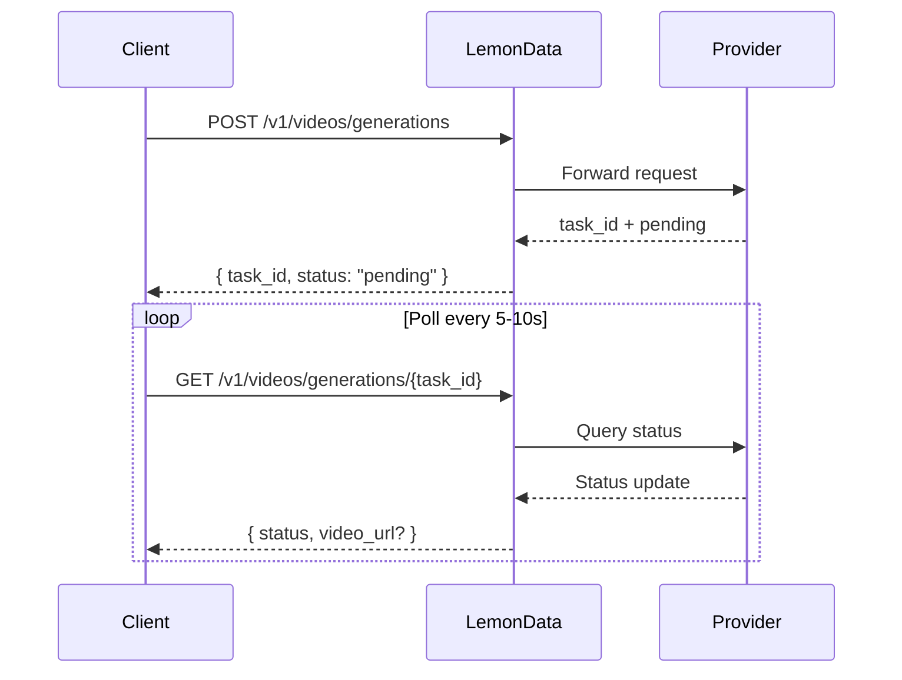

## Visão Geral

A LemonData fornece acesso a **mais de 69 modelos de geração de vídeo** de 11 provedores por meio de uma única API unificada. A geração de vídeo é **assíncrona** — você envia uma solicitação e recebe um ID de tarefa (task ID) e, em seguida, realiza a consulta (poll) pelo resultado.

<Info>
A lista de modelos é atualizada frequentemente. Para os modelos e preços mais recentes disponíveis, visite a [Models page](https://lemondata.cc/pt/models) ou use a [Models API](/api-reference/models/list-models).
</Info>

### Fluxo de Trabalho Assíncrono



<CodeGroup>

```python Python
import requests
import time

API_KEY = "sk-your-api-key"
BASE = "https://api.lemondata.cc/v1"
headers = {"Authorization": f"Bearer {API_KEY}"}

# Passo 1: Enviar solicitação de geração
resp = requests.post(f"{BASE}/videos/generations",
    headers=headers,
    json={
        "model": "kling-v2.6-pro",
        "prompt": "A golden retriever running on a beach at sunset, cinematic 4K",
        "duration": 5,
        "aspect_ratio": "16:9"
    }
)
task_id = resp.json()["task_id"]

# Passo 2: Consultar o resultado
while True:
    status = requests.get(f"{BASE}/videos/generations/{task_id}", headers=headers).json()
    if status["status"] in ("completed", "succeeded"):
        print(f"Video URL: {status['video_url']}")
        break
    elif status["status"] == "failed":
        print(f"Failed: {status.get('error')}")
        break
    time.sleep(10)
```

```javascript JavaScript
const API_KEY = 'sk-your-api-key';
const BASE = 'https://api.lemondata.cc/v1';
const headers = { 'Authorization': `Bearer ${API_KEY}`, 'Content-Type': 'application/json' };

// Passo 1: Enviar
const { task_id } = await fetch(`${BASE}/videos/generations`, {
  method: 'POST', headers,
  body: JSON.stringify({
    model: 'kling-v2.6-pro',
    prompt: 'A golden retriever running on a beach at sunset, cinematic 4K',
    duration: 5,
    aspect_ratio: '16:9'
  })
}).then(r => r.json());

// Passo 2: Consultar
const poll = setInterval(async () => {
  const status = await fetch(`${BASE}/videos/generations/${task_id}`, { headers }).then(r => r.json());
  if (['completed', 'succeeded'].includes(status.status)) {
    console.log('Video URL:', status.video_url);
    clearInterval(poll);
  } else if (status.status === 'failed') {
    console.error('Failed:', status.error);
    clearInterval(poll);
  }
}, 10000);
```

</CodeGroup>

## Matriz de Capacidades dos Modelos

Diferentes modelos se destacam em diferentes tarefas. Use esta matriz para escolher o modelo certo para o seu caso de uso.

**Legenda**: ✅ Suportado | ❌ Não suportado

| Série | Provedor | T2V | I2V | Keyframe | Extensão | Edição | Duração Máxima |
|--------|----------|-----|-----|----------|-----------|---------|-------------|
| **Sora** | OpenAI | ✅ | ❌ | ❌ | ❌ | ❌ | ~20s |
| **Kling** | Kuaishou | ✅ | ✅ | ❌ | ✅ | ❌ | 10s |
| **Veo** | Google | ✅ | ❌ | ❌ | ❌ | ❌ | 8s |
| **Seedance** | ByteDance | ✅ | ✅ | ✅ | ✅ | ✅ | 10s |
| **Hailuo** | MiniMax | ✅ | ✅ | ❌ | ❌ | ❌ | 6s |
| **Wan** | Alibaba | ✅ | ✅ | ❌ | ❌ | ❌ | 5s |
| **Runway** | Runway | ✅ | ✅ | ❌ | ❌ | ❌ | 10s |
| **Luma** | Luma | ✅ | ❌ | ❌ | ✅ | ❌ | 5s |
| **Vidu** | Vidu | ✅ | ✅ | ❌ | ❌ | ❌ | 8s |
| **Grok** | xAI | ✅ | ❌ | ❌ | ❌ | ❌ | ~10s |
| **Higgsfield** | Higgsfield | ✅ | ❌ | ❌ | ❌ | ❌ | ~5s |

### Definições de Capacidades

- **T2V (Text-to-Video)**: Gerar vídeo a partir de um prompt de texto
- **I2V (Image-to-Video)**: Animar uma imagem estática em vídeo usando `image_url` ou `image`
- **Keyframe**: Controlar os quadros inicial e final com `start_image` + `end_image`
- **Extensão**: Estender a duração de um vídeo existente
- **Edição**: Modificar aspectos específicos de um vídeo existente

## Modelos Disponíveis por Série

### Sora (OpenAI)

| Modelo | Qualidade | Notas |
|-------|---------|-------|
| `sora-2` | Padrão | Modelo padrão, bom equilíbrio entre qualidade e velocidade |
| `sora-2-pro` | Alta | Qualidade superior, tempo de geração mais longo |
| `sora-2-characters` | Padrão | Geração focada em personagens |

### Kling (Kuaishou)

| Modelo | Capacidade | Notas |
|-------|-----------|-------|
| `kling-v2.6-pro` | T2V | Geração mais recente, qualidade profissional |
| `kling-v2.6-std` | T2V | Geração mais recente, rápido |
| `kling-v2.5-turbo-pro` | T2V | Velocidade turbo, qualidade pro |
| `kling-v2.1-master` | T2V/I2V | Qualidade master |
| `kling-v2.1-pro` | T2V/I2V | Qualidade profissional |
| `kling-v2.1-standard` | T2V/I2V | Qualidade padrão |
| `kling-video` | T2V/I2V | Modelo base |
| `kling-video-extend` | Extensão | Estender vídeos existentes |
| `kling-video-o1-pro` | T2V | Raciocínio O1, qualidade pro |
| `kling-video-o1-std` | T2V | Raciocínio O1, padrão |
| `kling-effects` | Efeitos | Aplicar efeitos visuais |
| `kling-omni-video` | T2V | Modelo Omni |
| `kling-motion-control` | T2V | Geração com controle de movimento |

### Veo (Google)

| Modelo | Qualidade | Notas |
|-------|---------|-------|
| `veo3.1` | Padrão | Modelo de vídeo mais recente do Google |
| `veo3.1-pro` | Alta | Qualidade profissional |
| `veo3.1-4k` | Ultra | Saída em resolução 4K |
| `veo3.1-fast` | Rápido | Geração mais rápida |
| `veo3.1-fast-4k` | Rápido + 4K | Geração rápida com saída em 4K |
| `veo3.1-components` | Padrão | Geração baseada em componentes |
| `veo3` | Padrão | Geração anterior |
| `veo3-pro` | Alta | Geração anterior, profissional |
| `veo3-fast` | Rápido | Geração anterior, rápida |

### Seedance (ByteDance)

| Modelo | Capacidade | Notas |
|-------|-----------|-------|
| `seedance-2-0` | T2V/I2V/Keyframe/Extensão/Edição | Mais recente, mais capaz |
| `seedance-1-5-pro` | T2V/I2V | Geração anterior, qualidade pro |
| `seedance-1-0-pro` | T2V/I2V | Primeira geração, pro |
| `seedance-1-0-pro-fast` | T2V/I2V | Primeira geração, rápida |
| `seedance-1-0-lite-t2v` | T2V | Text-to-video leve |
| `seedance-1-0-lite-i2v` | I2V | Image-to-video leve |

<Note>
O Seedance 2.0 suporta a mais ampla gama de capacidades, incluindo multimodal-to-video, extensão de vídeo e edição de vídeo — tudo através do mesmo endpoint de API.
</Note>

### Hailuo (MiniMax)

| Modelo | Qualidade | Notas |
|-------|---------|-------|
| `hailuo-2.3` | Padrão | Boa qualidade |
| `hailuo-2.3-pro` | Alta | Saída de qualidade superior |
| `hailuo-2.3-fast` | Rápido | Geração mais rápida |
| `hailuo-2.3-standard` | Padrão | Nível padrão |
| `video-01` | Padrão | MiniMax video-01 |
| `video-01-live` | Padrão | Geração em estilo live |

### Wan (Alibaba)

| Modelo | Capacidade | Notas |
|-------|-----------|-------|
| `wan-2.6` | T2V | Text-to-video mais recente |
| `wan2.6-i2v` | I2V | Image-to-video mais recente |
| `wan-2.5` | T2V | Geração anterior |
| `wan2.5-i2v-preview` | I2V | I2V da geração anterior |
| `wan-2.2-plus` | T2V | Geração mais antiga |
| `vace-14b` | T2V | Arquitetura VACE |

### Runway

| Modelo | Duração | Notas |
|-------|----------|-------|
| `runwayml-gen4-turbo-5` | 5s | Geração rápida |
| `runwayml-gen4-turbo-10` | 10s | Clipes mais longos |

### Luma

| Modelo | Capacidade | Notas |
|-------|-----------|-------|
| `luma-video-api` | T2V | Text-to-video |
| `luma-video-extend-api` | Extensão | Estender vídeos existentes |

### Vidu (Shengshu)

| Modelo | Qualidade | Notas |
|-------|---------|-------|
| `viduq3-pro` | Alta | Geração mais recente |
| `viduq2-pro` | Alta | Geração anterior, pro |
| `viduq2-pro-fast` | Rápido | Geração anterior, pro rápida |
| `viduq2` | Padrão | Geração anterior, padrão |
| `viduq2-turbo` | Rápido | Velocidade turbo |
| `vidu2.0` | Padrão | Modelo base |

### Grok (xAI)

| Modelo | Notas |
|-------|-------|
| `grok-video-3` | Modelo de geração de vídeo da xAI |
| `grok-video-3-10s` | Variante de 10 segundos |

### Higgsfield

| Modelo | Notas |
|-------|-------|
| `higgsfield-turbo` | Mais rápido, custo menor |
| `higgsfield-standard` | Qualidade padrão |
| `higgsfield-lite` | Versão leve |

## Exemplos de Uso

### Text-to-Video (T2V)

O caso de uso mais comum. Todos os modelos suportam isso.

```python
response = requests.post(f"{BASE}/videos/generations",
    headers=headers,
    json={
        "model": "veo3.1-pro",
        "prompt": "Aerial drone shot of a coastal city at golden hour, waves crashing against cliffs",
        "duration": 5,
        "aspect_ratio": "16:9",
        "resolution": "1080p"
    }
)
```

### Image-to-Video (I2V)

Animar uma imagem estática. Use `image_url` para uma URL ou `image` para dados em base64.

```python
# Usando URL da imagem
response = requests.post(f"{BASE}/videos/generations",
    headers=headers,
    json={
        "model": "wan2.6-i2v",
        "prompt": "The person slowly turns and smiles at the camera",
        "image_url": "https://example.com/portrait.jpg"
    }
)

# Usando imagem em base64
import base64
with open("photo.jpg", "rb") as f:
    image_b64 = base64.b64encode(f.read()).decode()

response = requests.post(f"{BASE}/videos/generations",
    headers=headers,
    json={
        "model": "kling-v2.1-master",
        "prompt": "Gentle wind blows through the scene",
        "image": f"data:image/jpeg;base64,{image_b64}"
    }
)
```

### Controle de Keyframe (Imagem Inicial + Final)

Controle tanto o primeiro quanto o último quadro para transições precisas. Atualmente suportado pelo Seedance 2.0.

```python
response = requests.post(f"{BASE}/videos/generations",
    headers=headers,
    json={
        "model": "seedance-2-0",
        "prompt": "Smooth transition from day to night, city lights gradually turning on",
        "start_image": "https://example.com/city-day.jpg",
        "end_image": "https://example.com/city-night.jpg",
        "duration": 5
    }
)
```

### Extensão de Vídeo

Estender a duração de um vídeo existente. Use modelos com capacidade de extensão.

```python
response = requests.post(f"{BASE}/videos/generations",
    headers=headers,
    json={
        "model": "kling-video-extend",
        "prompt": "Continue the scene naturally",
        "image_url": "https://example.com/last-frame.jpg"
    }
)
```

## Referência de Parâmetros

| Parâmetro | Tipo | Descrição |
|-----------|------|-------------|
| `model` | string | ID do modelo (padrão: `sora-2`) |
| `prompt` | string | **Obrigatório.** Descrição em texto do vídeo |
| `image_url` | string | URL da imagem inicial (para I2V) |
| `image` | string | Imagem codificada em base64 com prefixo de URL de dados (para I2V) |
| `duration` | integer | Duração do vídeo em segundos (1-60, dependente do modelo) |
| `aspect_ratio` | string | `16:9`, `9:16`, `1:1`, etc. |
| `resolution` | string | `1080p`, `720p`, `4k` |
| `fps` | integer | Quadros por segundo (1-120) |
| `negative_prompt` | string | O que evitar na geração |
| `seed` | integer | Semente aleatória para reprodutibilidade |
| `cfg_scale` | number | Escala de orientação (0-20) |
| `motion_strength` | number | Intensidade do movimento (0-1) |
| `start_image` | string | URL do keyframe inicial |
| `end_image` | string | URL do keyframe final |

<Warning>
Nem todos os parâmetros são suportados por todos os modelos. Parâmetros não suportados são ignorados silenciosamente. Verifique a documentação do modelo para os parâmetros suportados.
</Warning>

## Guia de Seleção de Modelo

<CardGroup cols={2}>
  <Card title="Melhor Qualidade" icon="crown">
    **Seedance 2.0** ou **Kling v2.6 Pro** — qualidade cinematográfica, detalhes ricos, movimento natural
  </Card>
  <Card title="Geração Mais Rápida" icon="bolt">
    **Higgsfield Turbo** ou **Hailuo 2.3** — resultados rápidos para prototipagem e iteração
  </Card>
  <Card title="Mais Versátil" icon="wand-magic-sparkles">
    **Seedance 2.0** — suporta T2V, I2V, keyframe, extensão e edição em um único modelo
  </Card>
  <Card title="Melhor Custo-benefício" icon="coins">
    **Wan 2.6** ou **Hailuo 2.3** — qualidade competitiva a um custo menor por geração
  </Card>
</CardGroup>

## Faturamento

A geração de vídeo utiliza um **preço fixo por geração**. Você é cobrado uma vez quando a tarefa é enviada, independentemente da duração do vídeo. Se a geração falhar, a cobrança é reembolsada automaticamente.

Verifique os preços atuais na [Models page](https://lemondata.cc/pt/models) ou através da [Pricing API](/api-reference/pricing/get-pricing).