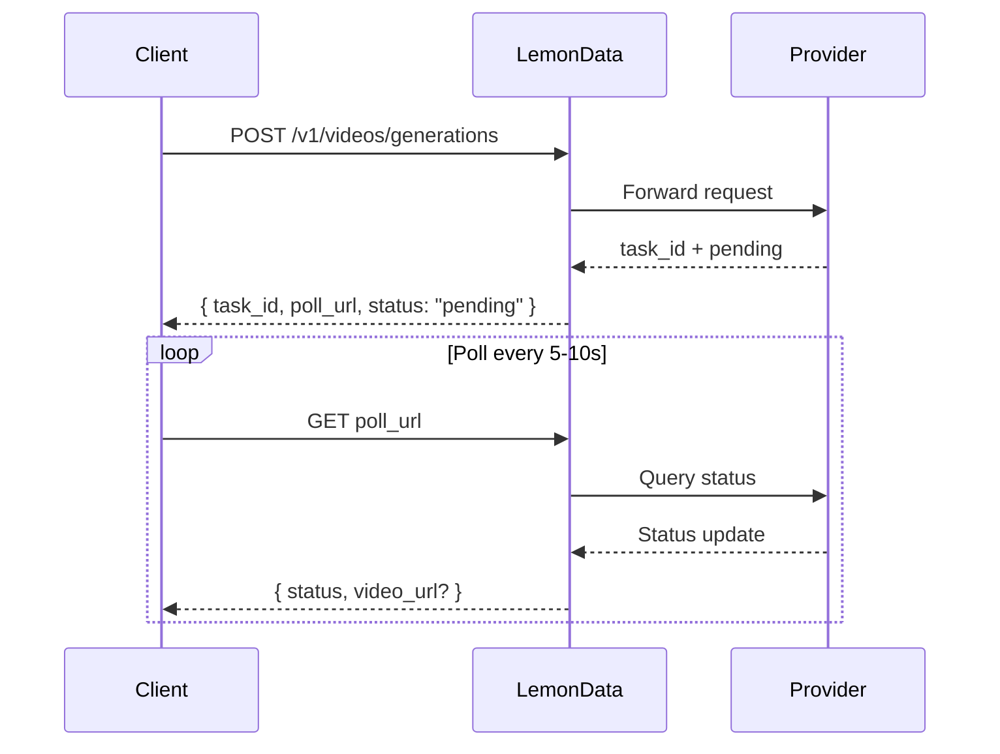

## Visão geral

A LemonData fornece acesso a modelos de geração de vídeo de 11 provedores por meio de uma única API unificada. A geração de vídeo é **assíncrona** — você envia uma solicitação, recebe um ID de tarefa e `poll_url`, e então faz polling para obter o resultado.

<Info>
A lista de modelos é atualizada com frequência. Para ver os modelos disponíveis mais recentes e os preços, visite a [página de Modelos](https://lemondata.cc/pt/models) ou use a [API de Modelos](/api-reference/models/list-models).
</Info>

<Warning>
Audio behavior is model-dependent. In LemonData, Veo 3 family requests default to audio-on when `output_audio` is omitted. Some models are silent by default or silent-only. For passthrough-governed models, pass `output_audio=true` to make a best-effort upstream audio request.
</Warning>


### Fluxo assíncrono


```mermaid
sequenceDiagram
    participant Client
    participant LemonData
    participant Provider

    Client->>LemonData: POST /v1/videos/generations
    LemonData->>Provider: Forward request
    Provider-->>LemonData: task_id + pending
    LemonData-->>Client: { task_id, poll_url, status: "pending" }

    loop Poll every 5-10s
        Client->>LemonData: GET poll_url
        LemonData->>Provider: Query status
        Provider-->>LemonData: Status update
        LemonData-->>Client: { status, video_url? }
    end
```

<CodeGroup>

```python Python
import requests
import time

API_KEY = "sk-your-api-key"
BASE = "https://api.lemondata.cc/v1"
headers = {"Authorization": f"Bearer {API_KEY}"}

# Step 1: Submit generation request
resp = requests.post(f"{BASE}/videos/generations",
    headers=headers,
    json={
        "model": "sora-2",
        "prompt": "A calm cinematic shot of a cat walking through a sunlit garden.",
        "operation": "text-to-video",
        "duration": 4,
        "aspect_ratio": "16:9"
    }
)
create_data = resp.json()
task_id = create_data["task_id"]
poll_url = create_data["poll_url"]

# Step 2: Poll for result
while True:
    status = requests.get(f"https://api.lemondata.cc{poll_url}", headers=headers).json()
    if status["status"] in ("completed", "succeeded"):
        print(f"Video URL: {status['video_url']}")
        break
    elif status["status"] == "failed":
        print(f"Failed: {status.get('error')}")
        break
    time.sleep(10)
```

```javascript JavaScript
const API_KEY = 'sk-your-api-key';
const BASE = 'https://api.lemondata.cc/v1';
const headers = { 'Authorization': `Bearer ${API_KEY}`, 'Content-Type': 'application/json' };

// Step 1: Submit
const { task_id, poll_url } = await fetch(`${BASE}/videos/generations`, {
  method: 'POST', headers,
  body: JSON.stringify({
    model: 'sora-2',
    prompt: 'A calm cinematic shot of a cat walking through a sunlit garden.',
    operation: 'text-to-video',
    duration: 4,
    aspect_ratio: '16:9'
  })
}).then(r => r.json());

// Step 2: Poll
const poll = setInterval(async () => {
  const status = await fetch(`https://api.lemondata.cc${poll_url}`, { headers }).then(r => r.json());
  if (['completed', 'succeeded'].includes(status.status)) {
    console.log('Video URL:', status.video_url);
    clearInterval(poll);
  } else if (status.status === 'failed') {
    console.error('Failed:', status.error);
    clearInterval(poll);
  }
}, 10000);
```

</CodeGroup>

## Matriz de capacidades dos modelos

Diferentes modelos se destacam em diferentes tarefas. Use esta matriz para escolher o modelo certo para o seu caso de uso.

**Legenda**: ✅ Compatível | ❌ Não compatível

| Series | Provider | T2V | I2V | Keyframe | Extension | Editing | Max Duration |
|--------|----------|-----|-----|----------|-----------|---------|-------------|
| **Sora** | OpenAI | ✅ | ❌ | ❌ | ❌ | ❌ | ~20s |
| **Kling** | Kuaishou | ✅ | ✅ | ❌ | ✅ | ❌ | 10s |
| **Veo** | Google | ✅ | ✅ | ✅ | ❌ | ❌ | 8s |
| **Seedance** | ByteDance | ✅ | ✅ | ✅ | ✅ | ✅ | 10s |
| **Hailuo** | MiniMax | ✅ | ✅ | ❌ | ❌ | ❌ | 10s |
| **Wan** | Alibaba | ✅ | ✅ | ❌ | ❌ | ❌ | 5s |
| **Runway** | Runway | ❌ | ✅ | ❌ | ❌ | ❌ | 10s |
| **Luma** | Luma | ✅ | ❌ | ❌ | ✅ | ❌ | 5s |
| **Vidu** | Vidu | ✅ | ✅ | ✅ | ❌ | ❌ | 8s |
| **Grok** | xAI | ✅ | ❌ | ❌ | ❌ | ❌ | ~15s |
| **Higgsfield** | Higgsfield | ✅ | ❌ | ❌ | ❌ | ❌ | ~5s |

### Definições de capacidade

- **T2V (Text-to-Video)**: Gera vídeo a partir de um prompt de texto
- **I2V (Image-to-Video)**: Anima uma imagem estática em vídeo. Para a compatibilidade mais ampla, forneça um `image_url` público.
- **Keyframe**: Controla os quadros inicial e final com `start_image` + `end_image`
- **Extension**: Estende a duração de um vídeo existente
- **Editing**: Modifica aspectos específicos de um vídeo existente

## Inventário atual de modelos públicos

### OpenAI

| Model | Operações públicas |
|-------|-------------------|
| `sora-2` | Text-to-video, image-to-video |
| `sora-2-pro` | Text-to-video, image-to-video |
| `sora-2-pro-storyboard` | Image-to-video |

### Kuaishou

| Model | Operações públicas |
|-------|-------------------|
| `kling-3.0-motion-control` | Motion control |
| `kling-3.0-video` | Text-to-video, image-to-video, start-end-to-video |
| `kling-v2.5-turbo-pro` | Text-to-video, image-to-video, start-end-to-video |
| `kling-v2.5-turbo-std` | Text-to-video, image-to-video |
| `kling-v2.6-pro` | Text-to-video, image-to-video, start-end-to-video |
| `kling-v2.6-std` | Text-to-video, image-to-video |
| `kling-v3.0-pro` | Text-to-video, image-to-video, start-end-to-video |
| `kling-v3.0-std` | Text-to-video, image-to-video, start-end-to-video |
| `kling-video-o1-pro` | Text-to-video, image-to-video, reference-to-video, start-end-to-video, video-to-video |
| `kling-video-o1-std` | Text-to-video, image-to-video, reference-to-video, start-end-to-video, video-to-video |

### Google

| Model | Operações públicas |
|-------|-------------------|
| `veo3` | Text-to-video, image-to-video |
| `veo3-fast` | Text-to-video, image-to-video |
| `veo3-pro` | Text-to-video, image-to-video |
| `veo3.1` | Text-to-video, image-to-video, reference-to-video, start-end-to-video |
| `veo3.1-fast` | Text-to-video, image-to-video, reference-to-video, start-end-to-video |
| `veo3.1-pro` | Text-to-video, image-to-video, start-end-to-video |

### ByteDance

| Model | Operações públicas |
|-------|-------------------|
| `seedance-1.5-pro` | Text-to-video, image-to-video |

### MiniMax

| Model | Operações públicas |
|-------|-------------------|
| `hailuo-2.3-fast` | Image-to-video |
| `hailuo-2.3-pro` | Text-to-video, image-to-video |
| `hailuo-2.3-standard` | Text-to-video, image-to-video |

### Alibaba

| Model | Operações públicas |
|-------|-------------------|
| `wan-2.2-plus` | Text-to-video, image-to-video |
| `wan-2.5` | Text-to-video, image-to-video |
| `wan-2.6` | Text-to-video, image-to-video, reference-to-video |

### Shengshu

| Model | Operações públicas |
|-------|-------------------|
| `viduq2` | Text-to-video, reference-to-video |
| `viduq2-pro` | Image-to-video, reference-to-video, start-end-to-video |
| `viduq2-pro-fast` | Image-to-video, start-end-to-video |
| `viduq2-turbo` | Image-to-video, start-end-to-video |
| `viduq3-pro` | Text-to-video, image-to-video, start-end-to-video |
| `viduq3-turbo` | Text-to-video, image-to-video, start-end-to-video |

### xAI

| Model | Operações públicas |
|-------|-------------------|
| `grok-imagine-image-to-video` | Image-to-video |
| `grok-imagine-text-to-video` | Text-to-video |
| `grok-imagine-upscale` | Video-to-video |

### Other

| Model | Operações públicas |
|-------|-------------------|
| `topaz-video-upscale` | Video-to-video |


## Exemplos de uso

### Text-to-Video (T2V)

O caso de uso mais comum. Todos os modelos suportam isso.

```python
response = requests.post(f"{BASE}/videos/generations",
    headers=headers,
    json={
        "model": "sora-2",
        "prompt": "A calm cinematic shot of a cat walking through a sunlit garden.",
        "operation": "text-to-video",
        "duration": 4,
        "aspect_ratio": "16:9"
    }
)
```

### Image-to-Video (I2V)

Anime uma imagem estática. Para a compatibilidade mais ampla entre os modelos de vídeo, hospede a imagem de origem e passe `image_url`.

```python
# Using image URL
response = requests.post(f"{BASE}/videos/generations",
    headers=headers,
    json={
        "model": "hailuo-2.3-fast",
        "prompt": "The scene begins from the provided image and adds gentle natural motion.",
        "operation": "image-to-video",
        "image_url": "https://example.com/portrait.jpg",
        "duration": 6,
        "aspect_ratio": "16:9"
    }
)

```

### Controle por keyframe (imagem inicial + final)

Controle tanto o primeiro quanto o último quadro para transições precisas. Atualmente suportado pelo Seedance 2.0.

```python
response = requests.post(f"{BASE}/videos/generations",
    headers=headers,
    json={
        "model": "viduq2-pro",
        "prompt": "Smooth transition from day to night, city lights gradually turning on",
        "operation": "start-end-to-video",
        "start_image": "https://example.com/city-day.jpg",
        "end_image": "https://example.com/city-night.jpg",
        "duration": 5,
        "resolution": "720p",
        "aspect_ratio": "16:9"
    }
)
```

### Extensão de vídeo

Estenda a duração de um vídeo existente. Use modelos com capacidade de extensão.

```python
response = requests.post(f"{BASE}/videos/generations",
    headers=headers,
    json={
        "model": "kling-video-extend",
        "prompt": "Continue the scene naturally",
        "image_url": "https://example.com/last-frame.jpg"
    }
)
```

## Referência de parâmetros

| Parameter | Type | Description |
|-----------|------|-------------|
| `model` | string | ID do modelo (padrão: `sora-2`) |
| `prompt` | string | **Obrigatório.** Descrição em texto do vídeo |
| `image_url` | string | URL da imagem inicial (para I2V) |
| `image` | string | Imagem inline como um data URL. Suportada por modelos compatíveis, mas `image_url` oferece a compatibilidade mais ampla. |
| `duration` | integer | Duração do vídeo em segundos (1-60, depende do modelo) |
| `aspect_ratio` | string | `16:9`, `9:16`, `1:1`, etc. |
| `resolution` | string | `1080p`, `720p`, `4k` |
| `fps` | integer | Quadros por segundo (1-120) |
| `negative_prompt` | string | O que evitar na geração |
| `seed` | integer | Seed aleatória para reprodutibilidade |
| `cfg_scale` | number | Escala de guidance (0-20) |
| `motion_strength` | number | Intensidade de movimento (0-1) |
| `start_image` | string | URL do keyframe inicial |
| `end_image` | string | URL do keyframe final |

<Warning>
Nem todos os parâmetros são suportados por todos os modelos. Parâmetros não suportados são ignorados silenciosamente. Verifique a documentação do modelo para os parâmetros suportados.
</Warning>

## Guia de seleção de modelos

<CardGroup cols={2}>
  <Card title="Melhor qualidade" icon="crown">
    **Seedance 2.0** ou **Kling v2.6 Pro** — qualidade cinematográfica, detalhes ricos, movimento natural
  </Card>
  <Card title="Geração mais rápida" icon="bolt">
    **Higgsfield Turbo** ou **Hailuo 2.3** — resultados rápidos para prototipagem e iteração
  </Card>
  <Card title="Mais versátil" icon="wand-magic-sparkles">
    **Seedance 2.0** — suporta T2V, I2V, keyframe, extensão e edição em um único modelo
  </Card>
  <Card title="Melhor custo-benefício" icon="coins">
    **Wan 2.6** ou **Hailuo 2.3** — qualidade competitiva com menor custo por geração
  </Card>
</CardGroup>

## Cobrança

A geração de vídeo usa **preço fixo por geração**. Você é cobrado uma vez quando a tarefa é enviada, independentemente da duração do vídeo. Se a geração falhar, a cobrança é reembolsada automaticamente.

Verifique os preços atuais na [página de Modelos](https://lemondata.cc/pt/models) ou por meio da [API de Preços](/api-reference/pricing/get-pricing).
