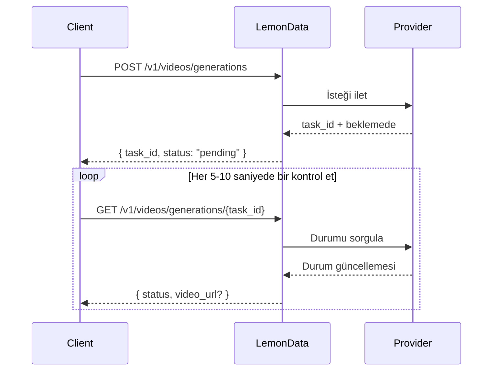

## Genel Bakış

LemonData, tek bir birleşik API aracılığıyla 11 sağlayıcıdan **69'dan fazla video üretim modeline** erişim sağlar. Video üretimi **asenkron** çalışır — bir istek gönderir ve bir görev kimliği (`task_id`) alırsınız, ardından sonucu kontrol edersiniz (poll).

<Info>
Model listesi sık sık güncellenmektedir. Mevcut en güncel modeller ve fiyatlandırma için [Modeller sayfasını](https://lemondata.cc/tr/models) ziyaret edin veya [Modeller API'sini](/api-reference/models/list-models) kullanın.
</Info>

### Asenkron İş Akışı



<CodeGroup>

```python Python
import requests
import time

API_KEY = "sk-your-api-key"
BASE = "https://api.lemondata.cc/v1"
headers = {"Authorization": f"Bearer {API_KEY}"}

# Adım 1: Üretim isteğini gönder
resp = requests.post(f"{BASE}/videos/generations",
    headers=headers,
    json={
        "model": "kling-v2.6-pro",
        "prompt": "A golden retriever running on a beach at sunset, cinematic 4K",
        "duration": 5,
        "aspect_ratio": "16:9"
    }
)
task_id = resp.json()["task_id"]

# Adım 2: Sonuç için sorgula
while True:
    status = requests.get(f"{BASE}/videos/generations/{task_id}", headers=headers).json()
    if status["status"] in ("completed", "succeeded"):
        print(f"Video URL: {status['video_url']}")
        break
    elif status["status"] == "failed":
        print(f"Failed: {status.get('error')}")
        break
    time.sleep(10)
```

```javascript JavaScript
const API_KEY = 'sk-your-api-key';
const BASE = 'https://api.lemondata.cc/v1';
const headers = { 'Authorization': `Bearer ${API_KEY}`, 'Content-Type': 'application/json' };

// Adım 1: Gönder
const { task_id } = await fetch(`${BASE}/videos/generations`, {
  method: 'POST', headers,
  body: JSON.stringify({
    model: 'kling-v2.6-pro',
    prompt: 'A golden retriever running on a beach at sunset, cinematic 4K',
    duration: 5,
    aspect_ratio: '16:9'
  })
}).then(r => r.json());

// Adım 2: Sorgula
const poll = setInterval(async () => {
  const status = await fetch(`${BASE}/videos/generations/${task_id}`, { headers }).then(r => r.json());
  if (['completed', 'succeeded'].includes(status.status)) {
    console.log('Video URL:', status.video_url);
    clearInterval(poll);
  } else if (status.status === 'failed') {
    console.error('Failed:', status.error);
    clearInterval(poll);
  }
}, 10000);
```

</CodeGroup>

## Model Yetenek Matrisi

Farklı modeller farklı görevlerde uzmanlaşmıştır. Kullanım durumunuz için doğru modeli seçmek için bu matrisi kullanın.

**Açıklama**: ✅ Destekleniyor | ❌ Desteklenmiyor

| Seri | Sağlayıcı | T2V | I2V | Anahtar Kare | Uzatma | Düzenleme | Maks. Süre |
|--------|----------|-----|-----|----------|-----------|---------|-------------|
| **Sora** | OpenAI | ✅ | ❌ | ❌ | ❌ | ❌ | ~20s |
| **Kling** | Kuaishou | ✅ | ✅ | ❌ | ✅ | ❌ | 10s |
| **Veo** | Google | ✅ | ❌ | ❌ | ❌ | ❌ | 8s |
| **Seedance** | ByteDance | ✅ | ✅ | ✅ | ✅ | ✅ | 10s |
| **Hailuo** | MiniMax | ✅ | ✅ | ❌ | ❌ | ❌ | 6s |
| **Wan** | Alibaba | ✅ | ✅ | ❌ | ❌ | ❌ | 5s |
| **Runway** | Runway | ✅ | ✅ | ❌ | ❌ | ❌ | 10s |
| **Luma** | Luma | ✅ | ❌ | ❌ | ✅ | ❌ | 5s |
| **Vidu** | Vidu | ✅ | ✅ | ❌ | ❌ | ❌ | 8s |
| **Grok** | xAI | ✅ | ❌ | ❌ | ❌ | ❌ | ~10s |
| **Higgsfield** | Higgsfield | ✅ | ❌ | ❌ | ❌ | ❌ | ~5s |

### Yetenek Tanımları

- **T2V (Metinden Videoya)**: Bir metin isteminden video üretin
- **I2V (Görselden Videoya)**: `image_url` veya `image` kullanarak statik bir görseli videoya dönüştürün
- **Anahtar Kare (Keyframe)**: `start_image` + `end_image` ile başlangıç ve bitiş karelerini kontrol edin
- **Uzatma (Extension)**: Mevcut bir videonun süresini uzatın
- **Düzenleme (Editing)**: Mevcut bir videonun belirli yönlerini değiştirin

## Serilere Göre Mevcut Modeller

### Sora (OpenAI)

| Model | Kalite | Notlar |
|-------|---------|-------|
| `sora-2` | Standart | Varsayılan model, kalite ve hız arasında iyi denge |
| `sora-2-pro` | Yüksek | Daha yüksek kalite, daha uzun üretim süresi |
| `sora-2-characters` | Standart | Karakter odaklı üretim |

### Kling (Kuaishou)

| Model | Yetenek | Notlar |
|-------|-----------|-------|
| `kling-v2.6-pro` | T2V | En son nesil, profesyonel kalite |
| `kling-v2.6-std` | T2V | En son nesil, hızlı |
| `kling-v2.5-turbo-pro` | T2V | Turbo hız, profesyonel kalite |
| `kling-v2.1-master` | T2V/I2V | Master kalite |
| `kling-v2.1-pro` | T2V/I2V | Profesyonel kalite |
| `kling-v2.1-standard` | T2V/I2V | Standart kalite |
| `kling-video` | T2V/I2V | Temel model |
| `kling-video-extend` | Uzatma | Mevcut videoları uzatın |
| `kling-video-o1-pro` | T2V | O1 muhakeme, profesyonel kalite |
| `kling-video-o1-std` | T2V | O1 muhakeme, standart |
| `kling-effects` | Efektler | Görsel efektler uygulayın |
| `kling-omni-video` | T2V | Omni model |
| `kling-motion-control` | T2V | Hareket kontrollü üretim |

### Veo (Google)

| Model | Kalite | Notlar |
|-------|---------|-------|
| `veo3.1` | Standart | Google'ın en yeni video modeli |
| `veo3.1-pro` | Yüksek | Profesyonel kalite |
| `veo3.1-4k` | Ultra | 4K çözünürlük çıktısı |
| `veo3.1-fast` | Hızlı | Daha hızlı üretim |
| `veo3.1-fast-4k` | Hızlı + 4K | 4K çıktı ile hızlı üretim |
| `veo3.1-components` | Standart | Bileşen tabanlı üretim |
| `veo3` | Standart | Önceki nesil |
| `veo3-pro` | Yüksek | Önceki nesil, profesyonel |
| `veo3-fast` | Hızlı | Önceki nesil, hızlı |

### Seedance (ByteDance)

| Model | Yetenek | Notlar |
|-------|-----------|-------|
| `seedance-2-0` | T2V/I2V/Keyframe/Extension/Editing | En yeni, en yetenekli |
| `seedance-1-5-pro` | T2V/I2V | Önceki nesil, profesyonel kalite |
| `seedance-1-0-pro` | T2V/I2V | Birinci nesil, profesyonel |
| `seedance-1-0-pro-fast` | T2V/I2V | Birinci nesil, hızlı |
| `seedance-1-0-lite-t2v` | T2V | Hafif metinden videoya |
| `seedance-1-0-lite-i2v` | I2V | Hafif görselden videoya |

<Note>
Seedance 2.0, çok modludan videoya, video uzatma ve video düzenleme dahil olmak üzere en geniş yetenek yelpazesini — tamamını aynı API uç noktası üzerinden — destekler.
</Note>

### Hailuo (MiniMax)

| Model | Kalite | Notlar |
|-------|---------|-------|
| `hailuo-2.3` | Standart | İyi kalite |
| `hailuo-2.3-pro` | Yüksek | Daha yüksek kaliteli çıktı |
| `hailuo-2.3-fast` | Hızlı | Daha hızlı üretim |
| `hailuo-2.3-standard` | Standart | Standart katman |
| `video-01` | Standart | MiniMax video-01 |
| `video-01-live` | Standart | Canlı stil üretim |

### Wan (Alibaba)

| Model | Yetenek | Notlar |
|-------|-----------|-------|
| `wan-2.6` | T2V | En yeni metinden videoya |
| `wan2.6-i2v` | I2V | En yeni görselden videoya |
| `wan-2.5` | T2V | Önceki nesil |
| `wan2.5-i2v-preview` | I2V | Önceki nesil I2V |
| `wan-2.2-plus` | T2V | Daha eski nesil |
| `vace-14b` | T2V | VACE mimarisi |

### Runway

| Model | Süre | Notlar |
|-------|----------|-------|
| `runwayml-gen4-turbo-5` | 5s | Hızlı üretim |
| `runwayml-gen4-turbo-10` | 10s | Daha uzun klipler |

### Luma

| Model | Yetenek | Notlar |
|-------|-----------|-------|
| `luma-video-api` | T2V | Metinden videoya |
| `luma-video-extend-api` | Uzatma | Mevcut videoları uzatın |

### Vidu (Shengshu)

| Model | Kalite | Notlar |
|-------|---------|-------|
| `viduq3-pro` | Yüksek | En son nesil |
| `viduq2-pro` | Yüksek | Önceki nesil, profesyonel |
| `viduq2-pro-fast` | Hızlı | Önceki nesil, hızlı profesyonel |
| `viduq2` | Standart | Önceki nesil, standart |
| `viduq2-turbo` | Hızlı | Turbo hız |
| `vidu2.0` | Standart | Temel model |

### Grok (xAI)

| Model | Notlar |
|-------|-------|
| `grok-video-3` | xAI'ın video üretim modeli |
| `grok-video-3-10s` | 10 saniyelik varyant |

### Higgsfield

| Model | Notlar |
|-------|-------|
| `higgsfield-turbo` | En hızlı, daha düşük maliyet |
| `higgsfield-standard` | Standart kalite |
| `higgsfield-lite` | Hafif |

## Kullanım Örnekleri

### Metinden Videoya (T2V)

En yaygın kullanım durumu. Tüm modeller bunu destekler.

```python
response = requests.post(f"{BASE}/videos/generations",
    headers=headers,
    json={
        "model": "veo3.1-pro",
        "prompt": "Aerial drone shot of a coastal city at golden hour, waves crashing against cliffs",
        "duration": 5,
        "aspect_ratio": "16:9",
        "resolution": "1080p"
    }
)
```

### Görselden Videoya (I2V)

Statik bir görseli hareketlendirin. Bir URL için `image_url` veya base64 verisi için `image` kullanın.

```python
# Görsel URL'si kullanarak
response = requests.post(f"{BASE}/videos/generations",
    headers=headers,
    json={
        "model": "wan2.6-i2v",
        "prompt": "The person slowly turns and smiles at the camera",
        "image_url": "https://example.com/portrait.jpg"
    }
)

# base64 görsel kullanarak
import base64
with open("photo.jpg", "rb") as f:
    image_b64 = base64.b64encode(f.read()).decode()

response = requests.post(f"{BASE}/videos/generations",
    headers=headers,
    json={
        "model": "kling-v2.1-master",
        "prompt": "Gentle wind blows through the scene",
        "image": f"data:image/jpeg;base64,{image_b64}"
    }
)
```

### Anahtar Kare Kontrolü (Başlangıç + Bitiş Görseli)

Hassas geçişler için hem ilk hem de son kareleri kontrol edin. Şu anda Seedance 2.0 tarafından desteklenmektedir.

```python
response = requests.post(f"{BASE}/videos/generations",
    headers=headers,
    json={
        "model": "seedance-2-0",
        "prompt": "Smooth transition from day to night, city lights gradually turning on",
        "start_image": "https://example.com/city-day.jpg",
        "end_image": "https://example.com/city-night.jpg",
        "duration": 5
    }
)
```

### Video Uzatma

Mevcut bir videonun süresini uzatın. Uzatma yeteneği olan modelleri kullanın.

```python
response = requests.post(f"{BASE}/videos/generations",
    headers=headers,
    json={
        "model": "kling-video-extend",
        "prompt": "Continue the scene naturally",
        "image_url": "https://example.com/last-frame.jpg"
    }
)
```

## Parametre Referansı

| Parametre | Tür | Açıklama |
|-----------|------|-------------|
| `model` | string | Model kimliği (varsayılan: `sora-2`) |
| `prompt` | string | **Gerekli.** Videonun metin açıklaması |
| `image_url` | string | Başlangıç görselinin URL'si (I2V için) |
| `image` | string | Veri URL'si öneki ile base64 kodlu görsel (I2V için) |
| `duration` | integer | Saniye cinsinden video süresi (1-60, modele bağlıdır) |
| `aspect_ratio` | string | `16:9`, `9:16`, `1:1`, vb. |
| `resolution` | string | `1080p`, `720p`, `4k` |
| `fps` | integer | Saniye başına kare sayısı (1-120) |
| `negative_prompt` | string | Üretimde nelerden kaçınılacağı |
| `seed` | integer | Tekrarlanabilirlik için rastgele tohum (seed) |
| `cfg_scale` | number | Yönlendirme ölçeği (0-20) |
| `motion_strength` | number | Hareket yoğunluğu (0-1) |
| `start_image` | string | Başlangıç anahtar karesinin URL'si |
| `end_image` | string | Bitiş anahtar karesinin URL'si |

<Warning>
Tüm parametreler her model tarafından desteklenmez. Desteklenmeyen parametreler sessizce yoksayılır. Desteklenen parametreler için modelin dokümantasyonunu kontrol edin.
</Warning>

## Model Seçim Rehberi

<CardGroup cols={2}>
  <Card title="En İyi Kalite" icon="crown">
    **Seedance 2.0** veya **Kling v2.6 Pro** — sinematik kalite, zengin detay, doğal hareket
  </Card>
  <Card title="En Hızlı Üretim" icon="bolt">
    **Higgsfield Turbo** veya **Hailuo 2.3** — prototipleme ve yineleme için hızlı sonuçlar
  </Card>
  <Card title="En Çok Yönlü" icon="wand-magic-sparkles">
    **Seedance 2.0** — tek bir modelde T2V, I2V, anahtar kare, uzatma ve düzenlemeyi destekler
  </Card>
  <Card title="En İyi Değer" icon="coins">
    **Wan 2.6** veya **Hailuo 2.3** — üretim başına daha düşük maliyetle rekabetçi kalite
  </Card>
</CardGroup>

## Faturalandırma

Video üretimi **üretim başına sabit fiyatlandırma** kullanır. Video süresinden bağımsız olarak, görev gönderildiğinde bir kez ücretlendirilirsiniz. Üretim başarısız olursa, ücret otomatik olarak iade edilir.

Güncel fiyatlandırmayı [Modeller sayfasından](https://lemondata.cc/tr/models) veya [Fiyatlandırma API'si](/api-reference/pricing/get-pricing) aracılığıyla kontrol edin.