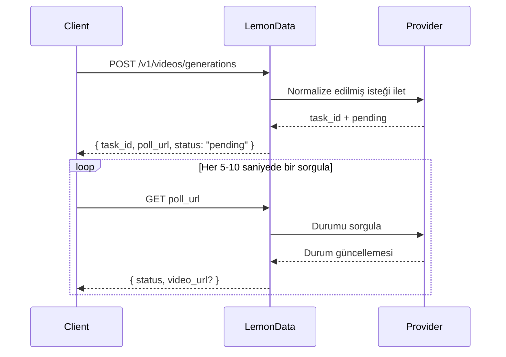

## Genel bakış

LemonData video oluşturmayı tek bir birleşik API üzerinden sunar. Üretim **asenkron** olarak çalışır: istek gönderirsiniz, `task_id` ve `poll_url` alırsınız, ardından nihai sonuç hazır olana kadar durumu düzenli olarak sorgularsınız.

<Info>
Eğer oluşturma yanıtı `poll_url` döndürüyorsa, doğrudan o adresi kullanın. Bu URL `/v1/tasks/{id}` ise, bunu video işleri için kanonik durum uç noktası olarak kabul edin; `/v1/videos/generations/{id}` yalnızca geriye dönük uyumluluk içindir.
</Info>

<Info>
Güncel herkese açık video modeli envanterini [Models API](/tr/api-reference/models/list-models) üzerinden veya [modeller sayfasında](https://lemondata.cc/tr/models) görebilirsiniz.
</Info>

<Warning>
Ses davranışı modele bağlıdır. LemonData’da `output_audio` gönderilmezse Veo 3 ailesi varsayılan olarak sesi açık kabul eder. Diğer herkese açık modeller sessiz olabilir ya da kararlı bir ses anahtarı sunmayabilir.
</Warning>

<Info>
Üretim entegrasyonlarında görsel, video ve ses girdileri için herkese açık `https` URL’lerini tercih edin. Uyumlu modeller `data:` URL’lerini kabul etmeye devam eder, ancak herkese açık URL’ler yeniden deneme, gözlemlenebilirlik ve hata ayıklama açısından daha sağlamdır.
</Info>

### Asenkron akış


```mermaid
sequenceDiagram
    participant Client
    participant LemonData
    participant Provider

    Client->>LemonData: POST /v1/videos/generations
    LemonData->>Provider: Normalize edilmiş isteği ilet
    Provider-->>LemonData: task_id + pending
    LemonData-->>Client: { task_id, poll_url, status: "pending" }

    loop Her 5-10 saniyede bir sorgula
        Client->>LemonData: GET poll_url
        LemonData->>Provider: Durumu sorgula
        Provider-->>LemonData: Durum güncellemesi
        LemonData-->>Client: { status, video_url? }
    end
```

## Güncel herkese açık işlemler

LemonData’nın güncel herkese açık video sözleşmesi şu işlemlere odaklanır:

- `text-to-video`
- `image-to-video`
- `reference-to-video`
- `start-end-to-video`
- `video-to-video`
- `motion-control`

Sözleşme ayrıca modele özgü akışlar için `audio-to-video` ve `video-extension` değerlerini de kabul eder, ancak bu doküman derlemesinde geniş şekilde etkinleştirilmiş herkese açık model listesinde bu iki yeteneği açıkça sunan bir model yoktur.

## Yetenek matrisi

**Gösterim**: ✅ Bu sağlayıcı ailesinde ilgili yeteneğe sahip en az bir etkin herkese açık model var | ❌ Etkin herkese açık modellerde şu anda temsil edilmiyor

| Seri | T2V | I2V | Referans | İlk-Son | V2V | Hareket |
|------|-----|-----|----------|---------|-----|---------|
| OpenAI | ✅ | ✅ | ❌ | ❌ | ❌ | ❌ |
| Kuaishou | ✅ | ✅ | ✅ | ✅ | ✅ | ✅ |
| Google | ✅ | ✅ | ✅ | ✅ | ❌ | ❌ |
| ByteDance | ✅ | ✅ | ❌ | ❌ | ❌ | ❌ |
| MiniMax | ✅ | ✅ | ❌ | ❌ | ❌ | ❌ |
| Alibaba | ✅ | ✅ | ✅ | ❌ | ❌ | ❌ |
| Shengshu | ✅ | ✅ | ✅ | ✅ | ❌ | ❌ |
| xAI | ✅ | ✅ | ❌ | ❌ | ✅ | ❌ |
| Diğer | ❌ | ❌ | ❌ | ❌ | ✅ | ❌ |

### Yetenek tanımları

- **T2V (Text-to-Video)**: metin prompt’undan video üretme
- **I2V (Image-to-Video)**: başlangıç görselinden video üretme; en geniş uyumluluk için `image_url` önerilir
- **Referans**: `reference_images` ile bir veya daha fazla referans görsel üzerinden koşullandırma
- **İlk-Son**: `start_image` ve `end_image` ile ilk ve son kareyi kontrol etme
- **V2V (Video-to-Video)**: mevcut bir videoyu birincil girdi olarak kullanma
- **Hareket**: özne görseli ile hareket referans videosunu birlikte kullanma

## Güncel herkese açık model envanteri

### OpenAI

| Model | Herkese açık işlemler |
|-------|-----------------------|
| `sora-2` | Metinden videoya, image-to-video |
| `sora-2-pro` | Metinden videoya, image-to-video |
| `sora-2-pro-storyboard` | Image-to-video |

### Kuaishou

| Model | Herkese açık işlemler |
|-------|-----------------------|
| `kling-3.0-motion-control` | Hareket kontrolü |
| `kling-3.0-video` | Metinden videoya, image-to-video, start-end-to-video |
| `kling-v2.5-turbo-pro` | Metinden videoya, image-to-video, start-end-to-video |
| `kling-v2.5-turbo-std` | Metinden videoya, image-to-video |
| `kling-v2.6-pro` | Metinden videoya, image-to-video, start-end-to-video |
| `kling-v2.6-std` | Metinden videoya, image-to-video |
| `kling-v3.0-pro` | Metinden videoya, image-to-video, start-end-to-video |
| `kling-v3.0-std` | Metinden videoya, image-to-video, start-end-to-video |
| `kling-video-o1-pro` | Metinden videoya, image-to-video, reference-to-video, start-end-to-video, video-to-video |
| `kling-video-o1-std` | Metinden videoya, image-to-video, reference-to-video, start-end-to-video, video-to-video |

### Google

| Model | Herkese açık işlemler |
|-------|-----------------------|
| `veo3` | Metinden videoya, image-to-video |
| `veo3-fast` | Metinden videoya, image-to-video |
| `veo3-pro` | Metinden videoya, image-to-video |
| `veo3.1` | Metinden videoya, image-to-video, reference-to-video, start-end-to-video |
| `veo3.1-fast` | Metinden videoya, image-to-video, reference-to-video, start-end-to-video |
| `veo3.1-pro` | Metinden videoya, image-to-video, start-end-to-video |

### ByteDance

| Model | Herkese açık işlemler |
|-------|-----------------------|
| `seedance-1.5-pro` | Metinden videoya, image-to-video |

### MiniMax

| Model | Herkese açık işlemler |
|-------|-----------------------|
| `hailuo-2.3-fast` | Image-to-video |
| `hailuo-2.3-pro` | Metinden videoya, image-to-video |
| `hailuo-2.3-standard` | Metinden videoya, image-to-video |

### Alibaba

| Model | Herkese açık işlemler |
|-------|-----------------------|
| `wan-2.2-plus` | Metinden videoya, image-to-video |
| `wan-2.5` | Metinden videoya, image-to-video |
| `wan-2.6` | Metinden videoya, image-to-video, reference-to-video |

### Shengshu

| Model | Herkese açık işlemler |
|-------|-----------------------|
| `viduq2` | Metinden videoya, reference-to-video |
| `viduq2-pro` | Image-to-video, reference-to-video, start-end-to-video |
| `viduq2-pro-fast` | Image-to-video, start-end-to-video |
| `viduq2-turbo` | Image-to-video, start-end-to-video |
| `viduq3-pro` | Metinden videoya, image-to-video, start-end-to-video |
| `viduq3-turbo` | Metinden videoya, image-to-video, start-end-to-video |

### xAI

| Model | Herkese açık işlemler |
|-------|-----------------------|
| `grok-imagine-image-to-video` | Image-to-video |
| `grok-imagine-text-to-video` | Metinden videoya |
| `grok-imagine-upscale` | Video-to-video |

### Diğer

| Model | Herkese açık işlemler |
|-------|-----------------------|
| `topaz-video-upscale` | Video-to-video |

## Kullanım örnekleri

### Text-to-video

```python
response = requests.post(f"{BASE}/videos/generations",
    headers=headers,
    json={
        "model": "sora-2",
        "prompt": "A calm cinematic shot of a cat walking through a sunlit garden.",
        "operation": "text-to-video",
        "duration": 4,
        "aspect_ratio": "16:9"
    }
)
```

### Image-to-video

```python
response = requests.post(f"{BASE}/videos/generations",
    headers=headers,
    json={
        "model": "hailuo-2.3-standard",
        "prompt": "The scene begins from the provided image and adds gentle natural motion.",
        "operation": "image-to-video",
        "image_url": "https://example.com/portrait.jpg",
        "duration": 6,
        "aspect_ratio": "16:9"
    }
)
```

### Reference-to-video

```python
response = requests.post(f"{BASE}/videos/generations",
    headers=headers,
    json={
        "model": "veo3.1",
        "prompt": "Keep the same subject identity and palette while adding subtle motion.",
        "operation": "reference-to-video",
        "reference_images": [
            "https://example.com/ref-a.jpg",
            "https://example.com/ref-b.jpg"
        ],
        "duration": 8,
        "resolution": "720p",
        "aspect_ratio": "9:16"
    }
)
```

### Start-end-to-video

```python
response = requests.post(f"{BASE}/videos/generations",
    headers=headers,
    json={
        "model": "viduq2-pro",
        "prompt": "Smooth transition from day to night.",
        "operation": "start-end-to-video",
        "start_image": "https://example.com/city-day.jpg",
        "end_image": "https://example.com/city-night.jpg",
        "duration": 5,
        "resolution": "720p",
        "aspect_ratio": "16:9"
    }
)
```

### Video-to-video

```python
response = requests.post(f"{BASE}/videos/generations",
    headers=headers,
    json={
        "model": "topaz-video-upscale",
        "operation": "video-to-video",
        "video_url": "https://example.com/source.mp4",
        "prompt": "Upscale this clip while preserving the original motion."
    }
)
```

### Motion control

```python
response = requests.post(f"{BASE}/videos/generations",
    headers=headers,
    json={
        "model": "kling-3.0-motion-control",
        "operation": "motion-control",
        "prompt": "Keep the subject stable while following the motion reference.",
        "image_url": "https://example.com/subject.png",
        "video_url": "https://example.com/motion.mp4",
        "resolution": "720p"
    }
)
```

## Parametre referansı

| Parametre | Tür | Not |
|-----------|-----|-----|
| `operation` | string | Üretimde açıkça göndermeniz önerilir |
| `image_url` | string | Görsel girdileri için en sağlam biçim |
| `image` | string | Yerel testler ve küçük entegrasyonlar için `data:` URL |
| `reference_images` | string[] | Referans görsel koşullandırması için kanonik herkese açık alan |
| `reference_image_type` | string | İsteğe bağlı `asset` / `style` seçicisi |
| `video_url` | string | Güncel herkese açık `video-to-video` ve `motion-control` modelleri için gereklidir |
| `audio_url` | string | Uygun olduğunda modele özgü ses koşullu akışlarda kullanılır |
| `output_audio` | boolean | Veo 3 ailesi alan gönderilmezse `true` kabul eder |

## Hızlı model seçimi rehberi

<CardGroup cols={2}>
  <Card title="En yüksek kalite" icon="crown">
    Kalite hızdan daha önemliyse **veo3.1-pro**, **kling-video-o1-pro** ve **viduq3-pro** güçlü seçeneklerdir.
  </Card>
  <Card title="Hızlı iterasyon" icon="bolt">
    Hızlı denemeler için **veo3.1-fast**, **hailuo-2.3-fast** ve **viduq3-turbo** iyi başlangıç noktalarıdır.
  </Card>
  <Card title="Referans ağırlıklı akışlar" icon="images">
    Özel referans görsel kontrolü gerekiyorsa **veo3.1**, **veo3.1-fast**, **wan-2.6** veya **kling-video-o1-pro / std** ile başlayın.
  </Card>
  <Card title="Video-to-video" icon="film">
    Şu anda genel olarak etkin herkese açık `video-to-video` yolları ağırlıklı olarak **topaz-video-upscale**, **grok-imagine-upscale** ve **kling-video-o1-pro / std** modellerini kapsar.
  </Card>
</CardGroup>

## Faturalama

Faturalama modele bağlıdır. Bazı herkese açık video modelleri pratikte istek başına fiyatlandırılırken, bazıları saniye bazlı fiyatlandırmaya daha yakındır. Güncel herkese açık fiyat yüzeyi için [modeller sayfasına](https://lemondata.cc/tr/models) veya [Pricing API](/tr/api-reference/pricing/get-pricing) bakın.
