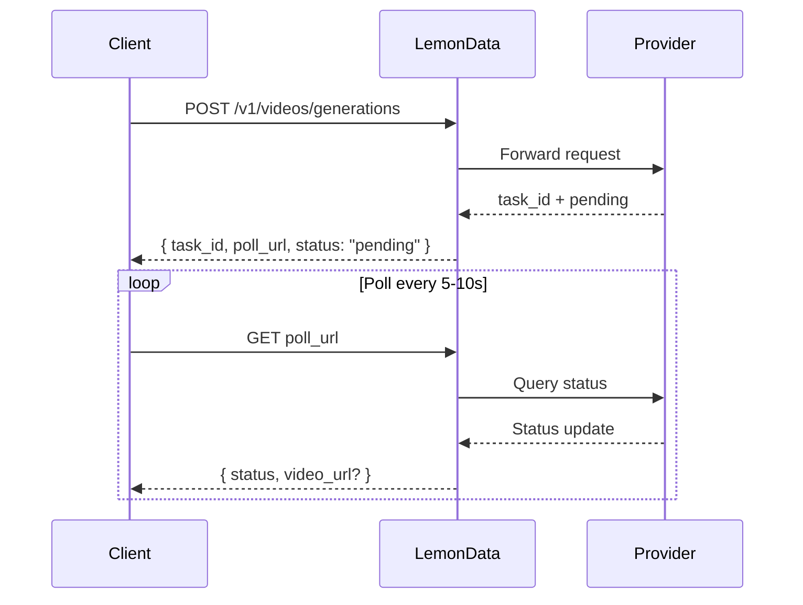

## Genel Bakış

LemonData, 11 sağlayıcının video oluşturma modellerine tek ve birleşik bir API üzerinden erişim sağlar. Video oluşturma **asenkron**dur — bir istek gönderirsiniz, bir görev kimliği ve `poll_url` alırsınız, ardından sonuç için sorgulama yaparsınız.

<Info>
Model listesi sık sık güncellenir. Mevcut en güncel modeller ve fiyatlandırma için [Models page](https://lemondata.cc/tr/models) sayfasını ziyaret edin veya [Models API](/api-reference/models/list-models) kullanın.
</Info>

<Warning>
Audio behavior is model-dependent. In LemonData, Veo 3 family requests default to audio-on when `output_audio` is omitted. Some models are silent by default or silent-only. For passthrough-governed models, pass `output_audio=true` to make a best-effort upstream audio request.
</Warning>


### Asenkron İş Akışı


```mermaid
sequenceDiagram
    participant Client
    participant LemonData
    participant Provider

    Client->>LemonData: POST /v1/videos/generations
    LemonData->>Provider: Forward request
    Provider-->>LemonData: task_id + pending
    LemonData-->>Client: { task_id, poll_url, status: "pending" }

    loop Poll every 5-10s
        Client->>LemonData: GET poll_url
        LemonData->>Provider: Query status
        Provider-->>LemonData: Status update
        LemonData-->>Client: { status, video_url? }
    end
```

<CodeGroup>

```python Python
import requests
import time

API_KEY = "sk-your-api-key"
BASE = "https://api.lemondata.cc/v1"
headers = {"Authorization": f"Bearer {API_KEY}"}

# Step 1: Submit generation request
resp = requests.post(f"{BASE}/videos/generations",
    headers=headers,
    json={
        "model": "sora-2",
        "prompt": "A calm cinematic shot of a cat walking through a sunlit garden.",
        "operation": "text-to-video",
        "duration": 4,
        "aspect_ratio": "16:9"
    }
)
create_data = resp.json()
task_id = create_data["task_id"]
poll_url = create_data["poll_url"]

# Step 2: Poll for result
while True:
    status = requests.get(f"https://api.lemondata.cc{poll_url}", headers=headers).json()
    if status["status"] in ("completed", "succeeded"):
        print(f"Video URL: {status['video_url']}")
        break
    elif status["status"] == "failed":
        print(f"Failed: {status.get('error')}")
        break
    time.sleep(10)
```

```javascript JavaScript
const API_KEY = 'sk-your-api-key';
const BASE = 'https://api.lemondata.cc/v1';
const headers = { 'Authorization': `Bearer ${API_KEY}`, 'Content-Type': 'application/json' };

// Step 1: Submit
const { task_id, poll_url } = await fetch(`${BASE}/videos/generations`, {
  method: 'POST', headers,
  body: JSON.stringify({
    model: 'sora-2',
    prompt: 'A calm cinematic shot of a cat walking through a sunlit garden.',
    operation: 'text-to-video',
    duration: 4,
    aspect_ratio: '16:9'
  })
}).then(r => r.json());

// Step 2: Poll
const poll = setInterval(async () => {
  const status = await fetch(`https://api.lemondata.cc${poll_url}`, { headers }).then(r => r.json());
  if (['completed', 'succeeded'].includes(status.status)) {
    console.log('Video URL:', status.video_url);
    clearInterval(poll);
  } else if (status.status === 'failed') {
    console.error('Failed:', status.error);
    clearInterval(poll);
  }
}, 10000);
```

</CodeGroup>

## Model Yetenek Matrisi

Farklı modeller farklı görevlerde öne çıkar. Kullanım senaryonuza uygun modeli seçmek için bu matrisi kullanın.

**Gösterim**: ✅ Desteklenir | ❌ Desteklenmez

| Series | Provider | T2V | I2V | Keyframe | Extension | Editing | Max Duration |
|--------|----------|-----|-----|----------|-----------|---------|-------------|
| **Sora** | OpenAI | ✅ | ❌ | ❌ | ❌ | ❌ | ~20s |
| **Kling** | Kuaishou | ✅ | ✅ | ❌ | ✅ | ❌ | 10s |
| **Veo** | Google | ✅ | ✅ | ✅ | ❌ | ❌ | 8s |
| **Seedance** | ByteDance | ✅ | ✅ | ✅ | ✅ | ✅ | 10s |
| **Hailuo** | MiniMax | ✅ | ✅ | ❌ | ❌ | ❌ | 10s |
| **Wan** | Alibaba | ✅ | ✅ | ❌ | ❌ | ❌ | 5s |
| **Runway** | Runway | ❌ | ✅ | ❌ | ❌ | ❌ | 10s |
| **Luma** | Luma | ✅ | ❌ | ❌ | ✅ | ❌ | 5s |
| **Vidu** | Vidu | ✅ | ✅ | ✅ | ❌ | ❌ | 8s |
| **Grok** | xAI | ✅ | ❌ | ❌ | ❌ | ❌ | ~15s |
| **Higgsfield** | Higgsfield | ✅ | ❌ | ❌ | ❌ | ❌ | ~5s |

### Yetenek Tanımları

- **T2V (Text-to-Video)**: Bir metin prompt'undan video oluşturma
- **I2V (Image-to-Video)**: Statik bir görseli videoya dönüştürme. En geniş uyumluluk için herkese açık bir `image_url` sağlayın.
- **Keyframe**: `start_image` + `end_image` ile başlangıç ve bitiş karelerini kontrol etme
- **Extension**: Mevcut bir videonun süresini uzatma
- **Editing**: Mevcut bir videonun belirli yönlerini değiştirme

## Serilere Göre Mevcut Modeller

### Sora (OpenAI)

| Model | Quality | Notes |
|-------|---------|-------|
| `sora-2` | Standard | Varsayılan örnek model |
| `sora-2-pro` | High | Daha yüksek kalite, daha uzun oluşturma süresi |
| `sora-2-characters` | Standard | Karakter odaklı oluşturma |

### Kling (Kuaishou)

| Model | Capability | Notes |
|-------|-----------|-------|
| `kling-v2.6-pro` | T2V | En yeni nesil, profesyonel kalite |
| `kling-v2.6-std` | T2V | En yeni nesil, hızlı |
| `kling-v2.5-turbo-std` | T2V | Turbo katmanı |
| `kling-v2.5-turbo-pro` | T2V | Turbo hız, pro kalite |
| `kling-v2.1-master` | T2V/I2V | Master kalite |
| `kling-v2.1-pro` | T2V/I2V | Profesyonel kalite |
| `kling-v2.1-standard` | T2V/I2V | Standart kalite |
| `kling-video` | T2V/I2V | Temel model |
| `kling-video-extend` | Extension | Mevcut videoları uzatır |
| `kling-video-o1-pro` | T2V | O1 muhakeme, pro kalite |
| `kling-video-o1-std` | T2V | O1 muhakeme, standart |
| `kling-effects` | Effects | Görsel efektler uygular |
| `kling-omni-video` | T2V | Omni model |
| `kling-3.0-motion-control` | Motion Control | Hareket kontrollü oluşturma |

### Veo (Google)

| Model | Quality | Notes |
|-------|---------|-------|
| `veo2` | Standard | Veo 2 serisi modeli |
| `veo3.1` | Standard | Google'ın en yeni video modeli |
| `veo3.1-pro` | High | Profesyonel kalite |
| `veo3.1-4k` | Ultra | 4K çözünürlük çıkışı |
| `veo3.1-fast` | Fast | Daha hızlı oluşturma |
| `veo3.1-fast-4k` | Fast + 4K | 4K çıktı ile hızlı oluşturma |
| `veo3.1-components` | Standard | Bileşen tabanlı oluşturma |
| `veo3` | Standard | Önceki nesil |
| `veo3-pro` | High | Önceki nesil, profesyonel |
| `veo3-fast` | Fast | Önceki nesil, hızlı |

### Seedance (ByteDance)

| Model | Capability | Notes |
|-------|-----------|-------|
| `seedance-2-0` | T2V/I2V/Keyframe/Extension/Editing | En yeni, en yetenekli |
| `seedance-1-5-pro` | T2V/I2V | Önceki nesil, pro kalite |
| `seedance-1-0-pro` | T2V/I2V | İlk nesil, pro |
| `seedance-1-0-pro-fast` | T2V/I2V | İlk nesil, hızlı |
| `seedance-1-0-lite-t2v` | T2V | Hafif text-to-video |
| `seedance-1-0-lite-i2v` | I2V | Hafif image-to-video |

<Note>
Seedance 2.0, multimodal-to-video, video uzatma ve video düzenleme dahil en geniş yetenek aralığını destekler — üstelik hepsi aynı API endpoint üzerinden.
</Note>

### Hailuo (MiniMax)

| Model | Quality | Notes |
|-------|---------|-------|
| `hailuo-2.3` | Standard | İyi kalite |
| `hailuo-2.3-pro` | High | Daha yüksek kaliteli çıktı |
| `hailuo-2.3-fast` | Fast | Daha hızlı oluşturma |
| `hailuo-2.3-standard` | Standard | Standart katman |
| `video-01` | Standard | MiniMax video-01 |
| `video-01-live` | Standard | Canlı tarzı oluşturma |

### Wan (Alibaba)

| Model | Capability | Notes |
|-------|-----------|-------|
| `wan-2.6` | T2V | En yeni text-to-video |
| `wan2.6-i2v` | I2V | En yeni image-to-video |
| `wan-2.5` | T2V | Önceki nesil |
| `wan2.5-i2v-preview` | I2V | Önceki nesil I2V |
| `wan-2.2-plus` | T2V | Daha eski nesil |
| `vace-14b` | T2V | VACE mimarisi |

### Runway

| Model | Duration | Notes |
|-------|----------|-------|
| `runwayml-gen4-turbo-5` | 5s | Hızlı oluşturma |
| `runwayml-gen4-turbo-10` | 10s | Daha uzun klipler |

### Luma

| Model | Capability | Notes |
|-------|-----------|-------|
| `luma-video-api` | T2V | Text-to-video |
| `luma-video-extend-api` | Extension | Mevcut videoları uzatır |

### Vidu (Shengshu)

| Model | Quality | Notes |
|-------|---------|-------|
| `viduq3-turbo` | Fast | Turbo katmanı |
| `viduq3-pro` | High | En yeni nesil |
| `viduq2-pro` | High | Önceki nesil, pro |
| `viduq2-pro-fast` | Fast | Önceki nesil, hızlı pro |
| `viduq2` | Standard | Önceki nesil, standart |
| `viduq2-turbo` | Fast | Turbo hız |
| `vidu2.0` | Standard | Temel model |

### Grok (xAI)

| Model | Notes |
|-------|-------|
| `grok-video-3` | xAI'ın video oluşturma modeli |
| `grok-video-3-10s` | 10 saniyelik varyant |

### Higgsfield

| Model | Notes |
|-------|-------|
| `higgsfield-turbo` | En hızlı, daha düşük maliyet |
| `higgsfield-standard` | Standart kalite |
| `higgsfield-lite` | Hafif |

## Kullanım Örnekleri

### Text-to-Video (T2V)

En yaygın kullanım senaryosu. Tüm modeller bunu destekler.

```python
response = requests.post(f"{BASE}/videos/generations",
    headers=headers,
    json={
        "model": "sora-2",
        "prompt": "A calm cinematic shot of a cat walking through a sunlit garden.",
        "operation": "text-to-video",
        "duration": 4,
        "aspect_ratio": "16:9"
    }
)
```

### Image-to-Video (I2V)

Statik bir görseli canlandırın. Video modelleri arasında en geniş uyumluluk için kaynak görseli barındırın ve `image_url` geçin.

```python
# Using image URL
response = requests.post(f"{BASE}/videos/generations",
    headers=headers,
    json={
        "model": "hailuo-2.3-fast",
        "prompt": "The scene begins from the provided image and adds gentle natural motion.",
        "operation": "image-to-video",
        "image_url": "https://example.com/portrait.jpg",
        "duration": 6,
        "aspect_ratio": "16:9"
    }
)

```

### Keyframe Kontrolü (Başlangıç + Bitiş Görseli)

Hassas geçişler için hem ilk hem de son kareyi kontrol edin. Şu anda Seedance 2.0 tarafından desteklenmektedir.

```python
response = requests.post(f"{BASE}/videos/generations",
    headers=headers,
    json={
        "model": "viduq2-pro",
        "prompt": "Smooth transition from day to night, city lights gradually turning on",
        "operation": "start-end-to-video",
        "start_image": "https://example.com/city-day.jpg",
        "end_image": "https://example.com/city-night.jpg",
        "duration": 5,
        "resolution": "720p",
        "aspect_ratio": "16:9"
    }
)
```

### Video Uzatma

Mevcut bir videonun süresini uzatın. Uzatma yeteneğine sahip modelleri kullanın.

```python
response = requests.post(f"{BASE}/videos/generations",
    headers=headers,
    json={
        "model": "kling-video-extend",
        "prompt": "Continue the scene naturally",
        "image_url": "https://example.com/last-frame.jpg"
    }
)
```

## Parametre Referansı

| Parameter | Type | Description |
|-----------|------|-------------|
| `model` | string | Model kimliği (varsayılan: `sora-2`) |
| `prompt` | string | **Gerekli.** Videonun metinsel açıklaması |
| `image_url` | string | Başlangıç görselinin URL'si (I2V için) |
| `image` | string | Data URL olarak satır içi görsel. Uyumlu modeller tarafından desteklenir, ancak `image_url` en geniş uyumluluğu sağlar. |
| `duration` | integer | Video süresi saniye cinsinden (1-60, modele bağlı) |
| `aspect_ratio` | string | `16:9`, `9:16`, `1:1`, vb. |
| `resolution` | string | `1080p`, `720p`, `4k` |
| `fps` | integer | Saniye başına kare sayısı (1-120) |
| `negative_prompt` | string | Oluşturma sırasında kaçınılması gerekenler |
| `seed` | integer | Yeniden üretilebilirlik için rastgele seed |
| `cfg_scale` | number | Yönlendirme ölçeği (0-20) |
| `motion_strength` | number | Hareket yoğunluğu (0-1) |
| `start_image` | string | Başlangıç keyframe'inin URL'si |
| `end_image` | string | Bitiş keyframe'inin URL'si |

<Warning>
Tüm parametreler her model tarafından desteklenmez. Desteklenmeyen parametreler sessizce yok sayılır. Desteklenen parametreler için modelin dokümantasyonunu kontrol edin.
</Warning>

## Model Seçim Rehberi

<CardGroup cols={2}>
  <Card title="En İyi Kalite" icon="crown">
    **Seedance 2.0** veya **Kling v2.6 Pro** — sinematik kalite, zengin ayrıntı, doğal hareket
  </Card>
  <Card title="En Hızlı Oluşturma" icon="bolt">
    **Higgsfield Turbo** veya **Hailuo 2.3** — prototipleme ve iterasyon için hızlı sonuçlar
  </Card>
  <Card title="En Çok Yönlü" icon="wand-magic-sparkles">
    **Seedance 2.0** — tek bir modelde T2V, I2V, keyframe, uzatma ve düzenlemeyi destekler
  </Card>
  <Card title="En İyi Fiyat/Performans" icon="coins">
    **Wan 2.6** veya **Hailuo 2.3** — oluşturma başına daha düşük maliyetle rekabetçi kalite
  </Card>
</CardGroup>

## Faturalandırma

Video oluşturma, **oluşturma başına sabit fiyatlandırma** kullanır. Video süresinden bağımsız olarak, görev gönderildiğinde bir kez ücretlendirilirsiniz. Oluşturma başarısız olursa, ücret otomatik olarak iade edilir.

Güncel fiyatlandırmayı [Models page](https://lemondata.cc/tr/models) üzerinde veya [Pricing API](/api-reference/pricing/get-pricing) aracılığıyla kontrol edin.
