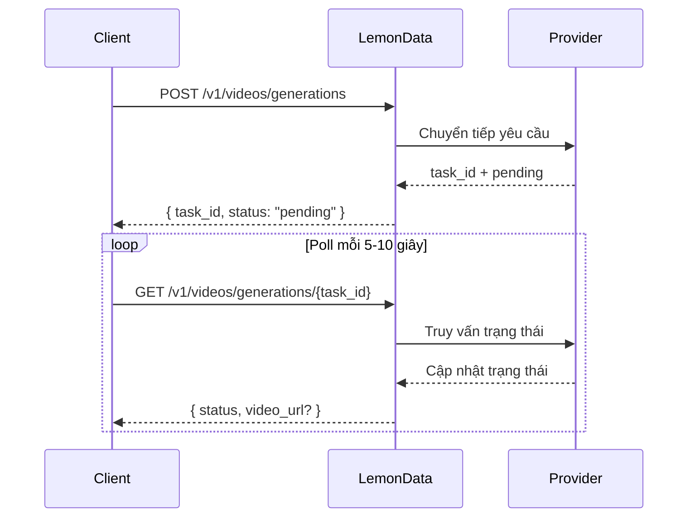

## Tổng quan

LemonData cung cấp quyền truy cập vào **hơn 69 mô hình tạo video** từ 11 nhà cung cấp thông qua một API thống nhất duy nhất. Quá trình tạo video là **bất đồng bộ (asynchronous)** — bạn gửi một yêu cầu và nhận được một task ID, sau đó thực hiện poll để lấy kết quả.

<Info>
Danh sách mô hình được cập nhật thường xuyên. Để biết các mô hình và giá cả mới nhất, hãy truy cập [Models page](https://lemondata.cc/vi/models) hoặc sử dụng [Models API](/api-reference/models/list-models).
</Info>

### Quy trình bất đồng bộ



<CodeGroup>

```python Python
import requests
import time

API_KEY = "sk-your-api-key"
BASE = "https://api.lemondata.cc/v1"
headers = {"Authorization": f"Bearer {API_KEY}"}

# Step 1: Submit generation request
resp = requests.post(f"{BASE}/videos/generations",
    headers=headers,
    json={
        "model": "kling-v2.6-pro",
        "prompt": "A golden retriever running on a beach at sunset, cinematic 4K",
        "duration": 5,
        "aspect_ratio": "16:9"
    }
)
task_id = resp.json()["task_id"]

# Step 2: Poll for result
while True:
    status = requests.get(f"{BASE}/videos/generations/{task_id}", headers=headers).json()
    if status["status"] in ("completed", "succeeded"):
        print(f"Video URL: {status['video_url']}")
        break
    elif status["status"] == "failed":
        print(f"Failed: {status.get('error')}")
        break
    time.sleep(10)
```

```javascript JavaScript
const API_KEY = 'sk-your-api-key';
const BASE = 'https://api.lemondata.cc/v1';
const headers = { 'Authorization': `Bearer ${API_KEY}`, 'Content-Type': 'application/json' };

// Step 1: Submit
const { task_id } = await fetch(`${BASE}/videos/generations`, {
  method: 'POST', headers,
  body: JSON.stringify({
    model: 'kling-v2.6-pro',
    prompt: 'A golden retriever running on a beach at sunset, cinematic 4K',
    duration: 5,
    aspect_ratio: '16:9'
  })
}).then(r => r.json());

// Step 2: Poll
const poll = setInterval(async () => {
  const status = await fetch(`${BASE}/videos/generations/${task_id}`, { headers }).then(r => r.json());
  if (['completed', 'succeeded'].includes(status.status)) {
    console.log('Video URL:', status.video_url);
    clearInterval(poll);
  } else if (status.status === 'failed') {
    console.error('Failed:', status.error);
    clearInterval(poll);
  }
}, 10000);
```

</CodeGroup>

## Ma trận khả năng của mô hình

Các mô hình khác nhau có thế mạnh ở các tác vụ khác nhau. Sử dụng ma trận này để chọn mô hình phù hợp cho trường hợp sử dụng của bạn.

**Chú giải**: ✅ Được hỗ trợ | ❌ Không được hỗ trợ

| Dòng máy | Nhà cung cấp | T2V | I2V | Keyframe | Mở rộng | Chỉnh sửa | Thời lượng tối đa |
|--------|----------|-----|-----|----------|-----------|---------|-------------|
| **Sora** | OpenAI | ✅ | ❌ | ❌ | ❌ | ❌ | ~20s |
| **Kling** | Kuaishou | ✅ | ✅ | ❌ | ✅ | ❌ | 10s |
| **Veo** | Google | ✅ | ❌ | ❌ | ❌ | ❌ | 8s |
| **Seedance** | ByteDance | ✅ | ✅ | ✅ | ✅ | ✅ | 10s |
| **Hailuo** | MiniMax | ✅ | ✅ | ❌ | ❌ | ❌ | 6s |
| **Wan** | Alibaba | ✅ | ✅ | ❌ | ❌ | ❌ | 5s |
| **Runway** | Runway | ✅ | ✅ | ❌ | ❌ | ❌ | 10s |
| **Luma** | Luma | ✅ | ❌ | ❌ | ✅ | ❌ | 5s |
| **Vidu** | Vidu | ✅ | ✅ | ❌ | ❌ | ❌ | 8s |
| **Grok** | xAI | ✅ | ❌ | ❌ | ❌ | ❌ | ~10s |
| **Higgsfield** | Higgsfield | ✅ | ❌ | ❌ | ❌ | ❌ | ~5s |

### Định nghĩa khả năng

- **T2V (Text-to-Video)**: Tạo video từ một prompt văn bản
- **I2V (Image-to-Video)**: Chuyển hình ảnh tĩnh thành video bằng cách sử dụng `image_url` hoặc `image`
- **Keyframe**: Kiểm soát khung hình bắt đầu và kết thúc bằng `start_image` + `end_image`
- **Extension**: Mở rộng thời lượng của một video hiện có
- **Editing**: Sửa đổi các khía cạnh cụ thể của một video hiện có

## Các mô hình hiện có theo dòng

### Sora (OpenAI)

| Mô hình | Chất lượng | Ghi chú |
|-------|---------|-------|
| `sora-2` | Tiêu chuẩn | Mô hình mặc định, cân bằng tốt giữa chất lượng và tốc độ |
| `sora-2-pro` | Cao | Chất lượng cao hơn, thời gian tạo lâu hơn |
| `sora-2-characters` | Tiêu chuẩn | Tạo video tập trung vào nhân vật |

### Kling (Kuaishou)

| Mô hình | Khả năng | Ghi chú |
|-------|-----------|-------|
| `kling-v2.6-pro` | T2V | Thế hệ mới nhất, chất lượng chuyên nghiệp |
| `kling-v2.6-std` | T2V | Thế hệ mới nhất, tốc độ nhanh |
| `kling-v2.5-turbo-pro` | T2V | Tốc độ Turbo, chất lượng chuyên nghiệp |
| `kling-v2.1-master` | T2V/I2V | Chất lượng Master |
| `kling-v2.1-pro` | T2V/I2V | Chất lượng chuyên nghiệp |
| `kling-v2.1-standard` | T2V/I2V | Chất lượng tiêu chuẩn |
| `kling-video` | T2V/I2V | Mô hình cơ sở |
| `kling-video-extend` | Mở rộng | Mở rộng video hiện có |
| `kling-video-o1-pro` | T2V | Suy luận O1, chất lượng chuyên nghiệp |
| `kling-video-o1-std` | T2V | Suy luận O1, tiêu chuẩn |
| `kling-effects` | Hiệu ứng | Áp dụng các hiệu ứng hình ảnh |
| `kling-omni-video` | T2V | Mô hình Omni |
| `kling-motion-control` | T2V | Tạo video với kiểm soát chuyển động |

### Veo (Google)

| Mô hình | Chất lượng | Ghi chú |
|-------|---------|-------|
| `veo3.1` | Tiêu chuẩn | Mô hình video mới nhất của Google |
| `veo3.1-pro` | Cao | Chất lượng chuyên nghiệp |
| `veo3.1-4k` | Ultra | Đầu ra độ phân giải 4K |
| `veo3.1-fast` | Nhanh | Tạo video nhanh hơn |
| `veo3.1-fast-4k` | Nhanh + 4K | Tạo video nhanh với đầu ra 4K |
| `veo3.1-components` | Tiêu chuẩn | Tạo video dựa trên thành phần |
| `veo3` | Tiêu chuẩn | Thế hệ trước |
| `veo3-pro` | Cao | Thế hệ trước, chuyên nghiệp |
| `veo3-fast` | Nhanh | Thế hệ trước, nhanh |

### Seedance (ByteDance)

| Mô hình | Khả năng | Ghi chú |
|-------|-----------|-------|
| `seedance-2-0` | T2V/I2V/Keyframe/Mở rộng/Chỉnh sửa | Mới nhất, đa năng nhất |
| `seedance-1-5-pro` | T2V/I2V | Thế hệ trước, chất lượng chuyên nghiệp |
| `seedance-1-0-pro` | T2V/I2V | Thế hệ đầu tiên, chuyên nghiệp |
| `seedance-1-0-pro-fast` | T2V/I2V | Thế hệ đầu tiên, nhanh |
| `seedance-1-0-lite-t2v` | T2V | Text-to-video phiên bản nhẹ |
| `seedance-1-0-lite-i2v` | I2V | Image-to-video phiên bản nhẹ |

<Note>
Seedance 2.0 hỗ trợ phạm vi khả năng rộng nhất bao gồm multimodal-to-video, mở rộng video và chỉnh sửa video — tất cả thông qua cùng một API endpoint.
</Note>

### Hailuo (MiniMax)

| Mô hình | Chất lượng | Ghi chú |
|-------|---------|-------|
| `hailuo-2.3` | Tiêu chuẩn | Chất lượng tốt |
| `hailuo-2.3-pro` | Cao | Đầu ra chất lượng cao hơn |
| `hailuo-2.3-fast` | Nhanh | Tạo video nhanh hơn |
| `hailuo-2.3-standard` | Tiêu chuẩn | Cấp độ tiêu chuẩn |
| `video-01` | Tiêu chuẩn | MiniMax video-01 |
| `video-01-live` | Tiêu chuẩn | Tạo video phong cách live |

### Wan (Alibaba)

| Mô hình | Khả năng | Ghi chú |
|-------|-----------|-------|
| `wan-2.6` | T2V | Text-to-video mới nhất |
| `wan2.6-i2v` | I2V | Image-to-video mới nhất |
| `wan-2.5` | T2V | Thế hệ trước |
| `wan2.5-i2v-preview` | I2V | I2V thế hệ trước |
| `wan-2.2-plus` | T2V | Thế hệ sớm hơn |
| `vace-14b` | T2V | Kiến trúc VACE |

### Runway

| Mô hình | Thời lượng | Ghi chú |
|-------|----------|-------|
| `runwayml-gen4-turbo-5` | 5s | Tạo video nhanh |
| `runwayml-gen4-turbo-10` | 10s | Các đoạn clip dài hơn |

### Luma

| Mô hình | Khả năng | Ghi chú |
|-------|-----------|-------|
| `luma-video-api` | T2V | Text-to-video |
| `luma-video-extend-api` | Mở rộng | Mở rộng video hiện có |

### Vidu (Shengshu)

| Mô hình | Chất lượng | Ghi chú |
|-------|---------|-------|
| `viduq3-pro` | Cao | Thế hệ mới nhất |
| `viduq2-pro` | Cao | Thế hệ trước, chuyên nghiệp |
| `viduq2-pro-fast` | Nhanh | Thế hệ trước, chuyên nghiệp nhanh |
| `viduq2` | Tiêu chuẩn | Thế hệ trước, tiêu chuẩn |
| `viduq2-turbo` | Nhanh | Tốc độ Turbo |
| `vidu2.0` | Tiêu chuẩn | Mô hình cơ sở |

### Grok (xAI)

| Mô hình | Ghi chú |
|-------|-------|
| `grok-video-3` | Mô hình tạo video của xAI |
| `grok-video-3-10s` | Biến thể 10 giây |

### Higgsfield

| Mô hình | Ghi chú |
|-------|-------|
| `higgsfield-turbo` | Nhanh nhất, chi phí thấp hơn |
| `higgsfield-standard` | Chất lượng tiêu chuẩn |
| `higgsfield-lite` | Phiên bản nhẹ |

## Ví dụ sử dụng

### Text-to-Video (T2V)

Trường hợp sử dụng phổ biến nhất. Tất cả các mô hình đều hỗ trợ tính năng này.

```python
response = requests.post(f"{BASE}/videos/generations",
    headers=headers,
    json={
        "model": "veo3.1-pro",
        "prompt": "Aerial drone shot of a coastal city at golden hour, waves crashing against cliffs",
        "duration": 5,
        "aspect_ratio": "16:9",
        "resolution": "1080p"
    }
)
```

### Image-to-Video (I2V)

Chuyển hình ảnh tĩnh thành video. Sử dụng `image_url` cho URL hoặc `image` cho dữ liệu base64.

```python
# Using image URL
response = requests.post(f"{BASE}/videos/generations",
    headers=headers,
    json={
        "model": "wan2.6-i2v",
        "prompt": "The person slowly turns and smiles at the camera",
        "image_url": "https://example.com/portrait.jpg"
    }
)

# Using base64 image
import base64
with open("photo.jpg", "rb") as f:
    image_b64 = base64.b64encode(f.read()).decode()

response = requests.post(f"{BASE}/videos/generations",
    headers=headers,
    json={
        "model": "kling-v2.1-master",
        "prompt": "Gentle wind blows through the scene",
        "image": f"data:image/jpeg;base64,{image_b64}"
    }
)
```

### Kiểm soát Keyframe (Ảnh bắt đầu + Ảnh kết thúc)

Kiểm soát cả khung hình đầu tiên và cuối cùng để có các chuyển cảnh chính xác. Hiện được hỗ trợ bởi Seedance 2.0.

```python
response = requests.post(f"{BASE}/videos/generations",
    headers=headers,
    json={
        "model": "seedance-2-0",
        "prompt": "Smooth transition from day to night, city lights gradually turning on",
        "start_image": "https://example.com/city-day.jpg",
        "end_image": "https://example.com/city-night.jpg",
        "duration": 5
    }
)
```

### Mở rộng Video

Mở rộng thời lượng của một video hiện có. Sử dụng các mô hình có khả năng mở rộng (extension).

```python
response = requests.post(f"{BASE}/videos/generations",
    headers=headers,
    json={
        "model": "kling-video-extend",
        "prompt": "Continue the scene naturally",
        "image_url": "https://example.com/last-frame.jpg"
    }
)
```

## Tham chiếu tham số

| Tham số | Kiểu | Mô tả |
|-----------|------|-------------|
| `model` | string | ID mô hình (mặc định: `sora-2`) |
| `prompt` | string | **Bắt buộc.** Mô tả văn bản của video |
| `image_url` | string | URL của hình ảnh bắt đầu (cho I2V) |
| `image` | string | Hình ảnh mã hóa Base64 với tiền tố data URL (cho I2V) |
| `duration` | integer | Thời lượng video tính bằng giây (1-60, tùy thuộc vào mô hình) |
| `aspect_ratio` | string | `16:9`, `9:16`, `1:1`, v.v. |
| `resolution` | string | `1080p`, `720p`, `4k` |
| `fps` | integer | Số khung hình trên giây (1-120) |
| `negative_prompt` | string | Những gì cần tránh trong quá trình tạo |
| `seed` | integer | Seed ngẫu nhiên để tái lập kết quả |
| `cfg_scale` | number | Thang đo hướng dẫn (0-20) |
| `motion_strength` | number | Cường độ chuyển động (0-1) |
| `start_image` | string | URL của keyframe bắt đầu |
| `end_image` | string | URL của keyframe kết thúc |

<Warning>
Không phải tất cả các tham số đều được hỗ trợ bởi mọi mô hình. Các tham số không được hỗ trợ sẽ bị bỏ qua một cách âm thầm. Kiểm tra tài liệu của mô hình để biết các tham số được hỗ trợ.
</Warning>

## Hướng dẫn chọn mô hình

<CardGroup cols={2}>
  <Card title="Chất lượng tốt nhất" icon="crown">
    **Seedance 2.0** hoặc **Kling v2.6 Pro** — chất lượng điện ảnh, chi tiết phong phú, chuyển động tự nhiên
  </Card>
  <Card title="Tạo nhanh nhất" icon="bolt">
    **Higgsfield Turbo** hoặc **Hailuo 2.3** — kết quả nhanh chóng để tạo mẫu và thử nghiệm
  </Card>
  <Card title="Linh hoạt nhất" icon="wand-magic-sparkles">
    **Seedance 2.0** — hỗ trợ T2V, I2V, keyframe, mở rộng và chỉnh sửa trong một mô hình duy nhất
  </Card>
  <Card title="Giá trị tốt nhất" icon="coins">
    **Wan 2.6** hoặc **Hailuo 2.3** — chất lượng cạnh tranh với chi phí thấp hơn cho mỗi lần tạo
  </Card>
</CardGroup>

## Thanh toán

Việc tạo video sử dụng **giá cố định cho mỗi lần tạo**. Bạn sẽ bị tính phí một lần khi task được gửi, bất kể thời lượng video. Nếu quá trình tạo thất bại, khoản phí sẽ được tự động hoàn lại.

Kiểm tra giá hiện tại trên [Models page](https://lemondata.cc/vi/models) hoặc thông qua [Pricing API](/api-reference/pricing/get-pricing).