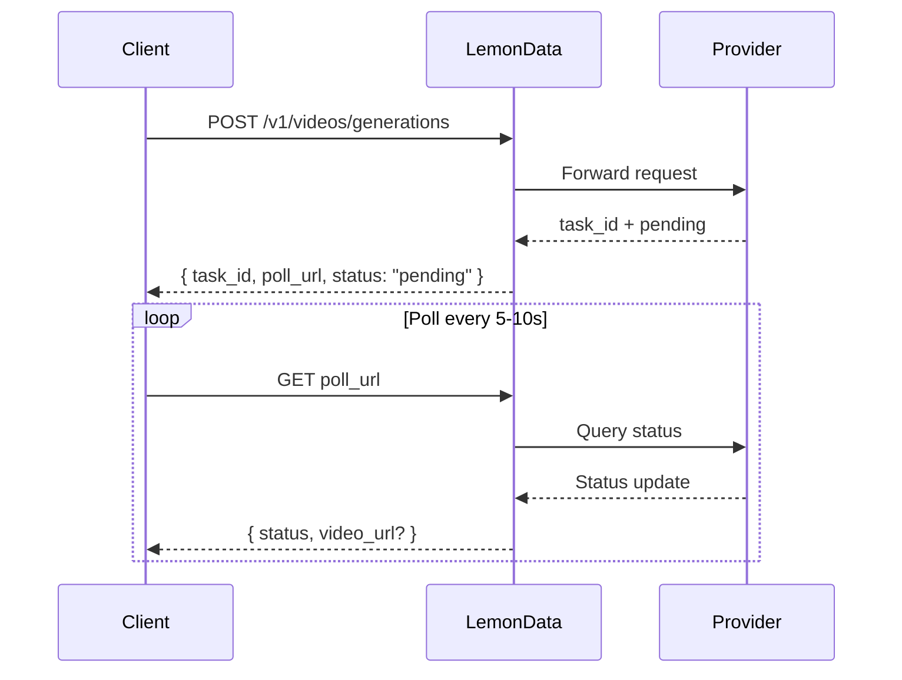

## Tổng quan

LemonData cung cấp quyền truy cập vào các model tạo video từ 11 nhà cung cấp thông qua một API hợp nhất duy nhất. Việc tạo video là **bất đồng bộ** — bạn gửi một request, nhận về một task ID và `poll_url`, sau đó poll để lấy kết quả.

<Info>
Danh sách model được cập nhật thường xuyên. Để xem các model khả dụng mới nhất và giá cả, hãy truy cập [trang Models](https://lemondata.cc/vi/models) hoặc sử dụng [Models API](/api-reference/models/list-models).
</Info>

<Warning>
Audio behavior is model-dependent. In LemonData, Veo 3 family requests default to audio-on when `output_audio` is omitted. Some models are silent by default or silent-only. For passthrough-governed models, pass `output_audio=true` to make a best-effort upstream audio request.
</Warning>


### Quy trình bất đồng bộ


```mermaid
sequenceDiagram
    participant Client
    participant LemonData
    participant Provider

    Client->>LemonData: POST /v1/videos/generations
    LemonData->>Provider: Forward request
    Provider-->>LemonData: task_id + pending
    LemonData-->>Client: { task_id, poll_url, status: "pending" }

    loop Poll every 5-10s
        Client->>LemonData: GET poll_url
        LemonData->>Provider: Query status
        Provider-->>LemonData: Status update
        LemonData-->>Client: { status, video_url? }
    end
```

<CodeGroup>

```python Python
import requests
import time

API_KEY = "sk-your-api-key"
BASE = "https://api.lemondata.cc/v1"
headers = {"Authorization": f"Bearer {API_KEY}"}

# Step 1: Submit generation request
resp = requests.post(f"{BASE}/videos/generations",
    headers=headers,
    json={
        "model": "sora-2",
        "prompt": "A calm cinematic shot of a cat walking through a sunlit garden.",
        "operation": "text-to-video",
        "duration": 4,
        "aspect_ratio": "16:9"
    }
)
create_data = resp.json()
task_id = create_data["task_id"]
poll_url = create_data["poll_url"]

# Step 2: Poll for result
while True:
    status = requests.get(f"https://api.lemondata.cc{poll_url}", headers=headers).json()
    if status["status"] in ("completed", "succeeded"):
        print(f"Video URL: {status['video_url']}")
        break
    elif status["status"] == "failed":
        print(f"Failed: {status.get('error')}")
        break
    time.sleep(10)
```

```javascript JavaScript
const API_KEY = 'sk-your-api-key';
const BASE = 'https://api.lemondata.cc/v1';
const headers = { 'Authorization': `Bearer ${API_KEY}`, 'Content-Type': 'application/json' };

// Step 1: Submit
const { task_id, poll_url } = await fetch(`${BASE}/videos/generations`, {
  method: 'POST', headers,
  body: JSON.stringify({
    model: 'sora-2',
    prompt: 'A calm cinematic shot of a cat walking through a sunlit garden.',
    operation: 'text-to-video',
    duration: 4,
    aspect_ratio: '16:9'
  })
}).then(r => r.json());

// Step 2: Poll
const poll = setInterval(async () => {
  const status = await fetch(`https://api.lemondata.cc${poll_url}`, { headers }).then(r => r.json());
  if (['completed', 'succeeded'].includes(status.status)) {
    console.log('Video URL:', status.video_url);
    clearInterval(poll);
  } else if (status.status === 'failed') {
    console.error('Failed:', status.error);
    clearInterval(poll);
  }
}, 10000);
```

</CodeGroup>

## Ma trận khả năng của model

Các model khác nhau vượt trội ở các tác vụ khác nhau. Hãy sử dụng ma trận này để chọn model phù hợp cho trường hợp sử dụng của bạn.

**Chú thích**: ✅ Hỗ trợ | ❌ Không hỗ trợ

| Series | Provider | T2V | I2V | Keyframe | Extension | Editing | Max Duration |
|--------|----------|-----|-----|----------|-----------|---------|-------------|
| **Sora** | OpenAI | ✅ | ❌ | ❌ | ❌ | ❌ | ~20s |
| **Kling** | Kuaishou | ✅ | ✅ | ❌ | ✅ | ❌ | 10s |
| **Veo** | Google | ✅ | ✅ | ✅ | ❌ | ❌ | 8s |
| **Seedance** | ByteDance | ✅ | ✅ | ✅ | ✅ | ✅ | 10s |
| **Hailuo** | MiniMax | ✅ | ✅ | ❌ | ❌ | ❌ | 10s |
| **Wan** | Alibaba | ✅ | ✅ | ❌ | ❌ | ❌ | 5s |
| **Runway** | Runway | ❌ | ✅ | ❌ | ❌ | ❌ | 10s |
| **Luma** | Luma | ✅ | ❌ | ❌ | ✅ | ❌ | 5s |
| **Vidu** | Vidu | ✅ | ✅ | ✅ | ❌ | ❌ | 8s |
| **Grok** | xAI | ✅ | ❌ | ❌ | ❌ | ❌ | ~15s |
| **Higgsfield** | Higgsfield | ✅ | ❌ | ❌ | ❌ | ❌ | ~5s |

### Định nghĩa khả năng

- **T2V (Text-to-Video)**: Tạo video từ một prompt văn bản
- **I2V (Image-to-Video)**: Biến một hình ảnh tĩnh thành video. Để có khả năng tương thích rộng nhất, hãy cung cấp `image_url` công khai.
- **Keyframe**: Điều khiển khung hình đầu và cuối bằng `start_image` + `end_image`
- **Extension**: Mở rộng thời lượng của một video hiện có
- **Editing**: Chỉnh sửa các khía cạnh cụ thể của một video hiện có

## Inventory model công khai hiện tại

### OpenAI

| Model | Thao tác công khai |
|-------|-------------------|
| `sora-2` | Text-to-video, image-to-video |
| `sora-2-pro` | Text-to-video, image-to-video |
| `sora-2-pro-storyboard` | Image-to-video |

### Kuaishou

| Model | Thao tác công khai |
|-------|-------------------|
| `kling-3.0-motion-control` | Motion control |
| `kling-3.0-video` | Text-to-video, image-to-video, start-end-to-video |
| `kling-v2.5-turbo-pro` | Text-to-video, image-to-video, start-end-to-video |
| `kling-v2.5-turbo-std` | Text-to-video, image-to-video |
| `kling-v2.6-pro` | Text-to-video, image-to-video, start-end-to-video |
| `kling-v2.6-std` | Text-to-video, image-to-video |
| `kling-v3.0-pro` | Text-to-video, image-to-video, start-end-to-video |
| `kling-v3.0-std` | Text-to-video, image-to-video, start-end-to-video |
| `kling-video-o1-pro` | Text-to-video, image-to-video, reference-to-video, start-end-to-video, video-to-video |
| `kling-video-o1-std` | Text-to-video, image-to-video, reference-to-video, start-end-to-video, video-to-video |

### Google

| Model | Thao tác công khai |
|-------|-------------------|
| `veo3` | Text-to-video, image-to-video |
| `veo3-fast` | Text-to-video, image-to-video |
| `veo3-pro` | Text-to-video, image-to-video |
| `veo3.1` | Text-to-video, image-to-video, reference-to-video, start-end-to-video |
| `veo3.1-fast` | Text-to-video, image-to-video, reference-to-video, start-end-to-video |
| `veo3.1-pro` | Text-to-video, image-to-video, start-end-to-video |

### ByteDance

| Model | Thao tác công khai |
|-------|-------------------|
| `seedance-1.5-pro` | Text-to-video, image-to-video |

### MiniMax

| Model | Thao tác công khai |
|-------|-------------------|
| `hailuo-2.3-fast` | Image-to-video |
| `hailuo-2.3-pro` | Text-to-video, image-to-video |
| `hailuo-2.3-standard` | Text-to-video, image-to-video |

### Alibaba

| Model | Thao tác công khai |
|-------|-------------------|
| `wan-2.2-plus` | Text-to-video, image-to-video |
| `wan-2.5` | Text-to-video, image-to-video |
| `wan-2.6` | Text-to-video, image-to-video, reference-to-video |

### Shengshu

| Model | Thao tác công khai |
|-------|-------------------|
| `viduq2` | Text-to-video, reference-to-video |
| `viduq2-pro` | Image-to-video, reference-to-video, start-end-to-video |
| `viduq2-pro-fast` | Image-to-video, start-end-to-video |
| `viduq2-turbo` | Image-to-video, start-end-to-video |
| `viduq3-pro` | Text-to-video, image-to-video, start-end-to-video |
| `viduq3-turbo` | Text-to-video, image-to-video, start-end-to-video |

### xAI

| Model | Thao tác công khai |
|-------|-------------------|
| `grok-imagine-image-to-video` | Image-to-video |
| `grok-imagine-text-to-video` | Text-to-video |
| `grok-imagine-upscale` | Video-to-video |

### Other

| Model | Thao tác công khai |
|-------|-------------------|
| `topaz-video-upscale` | Video-to-video |


## Ví dụ sử dụng

### Text-to-Video (T2V)

Trường hợp sử dụng phổ biến nhất. Tất cả các model đều hỗ trợ điều này.

```python
response = requests.post(f"{BASE}/videos/generations",
    headers=headers,
    json={
        "model": "sora-2",
        "prompt": "A calm cinematic shot of a cat walking through a sunlit garden.",
        "operation": "text-to-video",
        "duration": 4,
        "aspect_ratio": "16:9"
    }
)
```

### Image-to-Video (I2V)

Biến một hình ảnh tĩnh thành video. Để có khả năng tương thích rộng nhất giữa các model video, hãy host hình ảnh nguồn và truyền `image_url`.

```python
# Using image URL
response = requests.post(f"{BASE}/videos/generations",
    headers=headers,
    json={
        "model": "hailuo-2.3-fast",
        "prompt": "The scene begins from the provided image and adds gentle natural motion.",
        "operation": "image-to-video",
        "image_url": "https://example.com/portrait.jpg",
        "duration": 6,
        "aspect_ratio": "16:9"
    }
)

```

### Điều khiển Keyframe (Hình ảnh đầu + cuối)

Điều khiển cả khung hình đầu tiên và cuối cùng để có các chuyển cảnh chính xác. Hiện được hỗ trợ bởi Seedance 2.0.

```python
response = requests.post(f"{BASE}/videos/generations",
    headers=headers,
    json={
        "model": "viduq2-pro",
        "prompt": "Smooth transition from day to night, city lights gradually turning on",
        "operation": "start-end-to-video",
        "start_image": "https://example.com/city-day.jpg",
        "end_image": "https://example.com/city-night.jpg",
        "duration": 5,
        "resolution": "720p",
        "aspect_ratio": "16:9"
    }
)
```

### Mở rộng video

Mở rộng thời lượng của một video hiện có. Sử dụng các model có khả năng extension.

```python
response = requests.post(f"{BASE}/videos/generations",
    headers=headers,
    json={
        "model": "kling-video-extend",
        "prompt": "Continue the scene naturally",
        "image_url": "https://example.com/last-frame.jpg"
    }
)
```

## Tham chiếu tham số

| Parameter | Type | Description |
|-----------|------|-------------|
| `model` | string | ID của model (mặc định: `sora-2`) |
| `prompt` | string | **Bắt buộc.** Mô tả văn bản của video |
| `image_url` | string | URL của hình ảnh bắt đầu (cho I2V) |
| `image` | string | Hình ảnh inline dưới dạng data URL. Được hỗ trợ bởi các model tương thích, nhưng `image_url` mang lại khả năng tương thích rộng nhất. |
| `duration` | integer | Thời lượng video tính bằng giây (1-60, phụ thuộc model) |
| `aspect_ratio` | string | `16:9`, `9:16`, `1:1`, v.v. |
| `resolution` | string | `1080p`, `720p`, `4k` |
| `fps` | integer | Số khung hình mỗi giây (1-120) |
| `negative_prompt` | string | Những gì cần tránh trong quá trình tạo |
| `seed` | integer | Seed ngẫu nhiên để tái lập kết quả |
| `cfg_scale` | number | Thang hướng dẫn (0-20) |
| `motion_strength` | number | Cường độ chuyển động (0-1) |
| `start_image` | string | URL của keyframe bắt đầu |
| `end_image` | string | URL của keyframe kết thúc |

<Warning>
Không phải mọi tham số đều được hỗ trợ bởi mọi model. Các tham số không được hỗ trợ sẽ bị bỏ qua một cách im lặng. Hãy kiểm tra tài liệu của model để biết các tham số được hỗ trợ.
</Warning>

## Hướng dẫn chọn model

<CardGroup cols={2}>
  <Card title="Chất lượng tốt nhất" icon="crown">
    **Seedance 2.0** hoặc **Kling v2.6 Pro** — chất lượng điện ảnh, chi tiết phong phú, chuyển động tự nhiên
  </Card>
  <Card title="Tạo nhanh nhất" icon="bolt">
    **Higgsfield Turbo** hoặc **Hailuo 2.3** — kết quả nhanh cho tạo mẫu và lặp lại
  </Card>
  <Card title="Linh hoạt nhất" icon="wand-magic-sparkles">
    **Seedance 2.0** — hỗ trợ T2V, I2V, keyframe, extension và editing trong một model
  </Card>
  <Card title="Giá trị tốt nhất" icon="coins">
    **Wan 2.6** hoặc **Hailuo 2.3** — chất lượng cạnh tranh với chi phí thấp hơn cho mỗi lần tạo
  </Card>
</CardGroup>

## Thanh toán

Tạo video sử dụng **mức giá cố định cho mỗi lần tạo**. Bạn sẽ bị tính phí một lần khi task được gửi, bất kể thời lượng video. Nếu quá trình tạo thất bại, khoản phí sẽ được hoàn lại tự động.

Kiểm tra giá hiện tại trên [trang Models](https://lemondata.cc/vi/models) hoặc thông qua [Pricing API](/api-reference/pricing/get-pricing).
