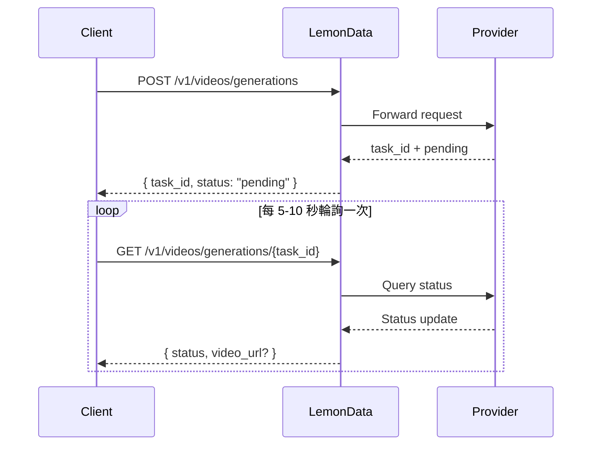

## 總覽

LemonData 透過單一整合的 API 提供來自 11 個供應商的 **69 個以上的影片生成模型**。影片生成是**非同步**的 — 您提交請求並收到一個 task ID，然後輪詢結果。

<Info>
模型列表會頻繁更新。如需獲取最新的可用模型和定價，請造訪 [Models page](https://lemondata.cc/zh-Hant/models) 或使用 [Models API](/api-reference/models/list-models)。
</Info>

### 非同步工作流



<CodeGroup>

```python Python
import requests
import time

API_KEY = "sk-your-api-key"
BASE = "https://api.lemondata.cc/v1"
headers = {"Authorization": f"Bearer {API_KEY}"}

# Step 1: Submit generation request
resp = requests.post(f"{BASE}/videos/generations",
    headers=headers,
    json={
        "model": "kling-v2.6-pro",
        "prompt": "A golden retriever running on a beach at sunset, cinematic 4K",
        "duration": 5,
        "aspect_ratio": "16:9"
    }
)
task_id = resp.json()["task_id"]

# Step 2: Poll for result
while True:
    status = requests.get(f"{BASE}/videos/generations/{task_id}", headers=headers).json()
    if status["status"] in ("completed", "succeeded"):
        print(f"Video URL: {status['video_url']}")
        break
    elif status["status"] == "failed":
        print(f"Failed: {status.get('error')}")
        break
    time.sleep(10)
```

```javascript JavaScript
const API_KEY = 'sk-your-api-key';
const BASE = 'https://api.lemondata.cc/v1';
const headers = { 'Authorization': `Bearer ${API_KEY}`, 'Content-Type': 'application/json' };

// Step 1: Submit
const { task_id } = await fetch(`${BASE}/videos/generations`, {
  method: 'POST', headers,
  body: JSON.stringify({
    model: 'kling-v2.6-pro',
    prompt: 'A golden retriever running on a beach at sunset, cinematic 4K',
    duration: 5,
    aspect_ratio: '16:9'
  })
}).then(r => r.json());

// Step 2: Poll
const poll = setInterval(async () => {
  const status = await fetch(`${BASE}/videos/generations/${task_id}`, { headers }).then(r => r.json());
  if (['completed', 'succeeded'].includes(status.status)) {
    console.log('Video URL:', status.video_url);
    clearInterval(poll);
  } else if (status.status === 'failed') {
    console.error('Failed:', status.error);
    clearInterval(poll);
  }
}, 10000);
```

</CodeGroup>

## 模型能力矩陣

不同的模型擅長不同的任務。請使用此矩陣為您的使用場景選擇合適的模型。

**圖例**：✅ 支援 | ❌ 不支援

| 系列 | 供應商 | T2V | I2V | Keyframe | Extension | Editing | 最大時長 |
|--------|----------|-----|-----|----------|-----------|---------|-------------|
| **Sora** | OpenAI | ✅ | ❌ | ❌ | ❌ | ❌ | ~20s |
| **Kling** | 快手 | ✅ | ✅ | ❌ | ✅ | ❌ | 10s |
| **Veo** | Google | ✅ | ❌ | ❌ | ❌ | ❌ | 8s |
| **Seedance** | 字節跳動 | ✅ | ✅ | ✅ | ✅ | ✅ | 10s |
| **Hailuo** | MiniMax | ✅ | ✅ | ❌ | ❌ | ❌ | 6s |
| **Wan** | 阿里巴巴 | ✅ | ✅ | ❌ | ❌ | ❌ | 5s |
| **Runway** | Runway | ✅ | ✅ | ❌ | ❌ | ❌ | 10s |
| **Luma** | Luma | ✅ | ❌ | ❌ | ✅ | ❌ | 5s |
| **Vidu** | 生數科技 | ✅ | ✅ | ❌ | ❌ | ❌ | 8s |
| **Grok** | xAI | ✅ | ❌ | ❌ | ❌ | ❌ | ~10s |
| **Higgsfield** | Higgsfield | ✅ | ❌ | ❌ | ❌ | ❌ | ~5s |

### 能力定義

- **T2V (Text-to-Video)**：從文字提示詞生成影片
- **I2V (Image-to-Video)**：使用 `image_url` 或 `image` 將靜態圖片轉為動態影片
- **Keyframe**：使用 `start_image` + `end_image` 控制起始和結束影格
- **Extension**：延伸現有影片的時長
- **Editing**：修改現有影片的特定面向

## 各系列可用模型

### Sora (OpenAI)

| 模型 | 品質 | 備註 |
|-------|---------|-------|
| `sora-2` | 標準 | 預設模型，品質與速度平衡良好 |
| `sora-2-pro` | 高 | 品質更高，生成時間較長 |
| `sora-2-characters` | 標準 | 專注於角色的生成 |

### Kling (快手)

| 模型 | 能力 | 備註 |
|-------|-----------|-------|
| `kling-v2.6-pro` | T2V | 最新一代，專業品質 |
| `kling-v2.6-std` | T2V | 最新一代，快速 |
| `kling-v2.5-turbo-pro` | T2V | Turbo 速度，專業品質 |
| `kling-v2.1-master` | T2V/I2V | 大師級品質 |
| `kling-v2.1-pro` | T2V/I2V | 專業品質 |
| `kling-v2.1-standard` | T2V/I2V | 標準品質 |
| `kling-video` | T2V/I2V | 基礎模型 |
| `kling-video-extend` | Extension | 延伸現有影片 |
| `kling-video-o1-pro` | T2V | O1 推理，專業品質 |
| `kling-video-o1-std` | T2V | O1 推理，標準 |
| `kling-effects` | Effects | 套用視覺效果 |
| `kling-omni-video` | T2V | Omni 模型 |
| `kling-motion-control` | T2V | 動作控制生成 |

### Veo (Google)

| 模型 | 品質 | 備註 |
|-------|---------|-------|
| `veo3.1` | 標準 | Google 最新的影片模型 |
| `veo3.1-pro` | 高 | 專業品質 |
| `veo3.1-4k` | 極高 | 4K 解析度輸出 |
| `veo3.1-fast` | 快速 | 生成速度更快 |
| `veo3.1-fast-4k` | 快速 + 4K | 快速生成並提供 4K 輸出 |
| `veo3.1-components` | 標準 | 基於組件的生成 |
| `veo3` | 標準 | 前一代模型 |
| `veo3-pro` | 高 | 前一代，專業級 |
| `veo3-fast` | 快速 | 前一代，快速 |

### Seedance (字節跳動)

| 模型 | 能力 | 備註 |
|-------|-----------|-------|
| `seedance-2-0` | T2V/I2V/Keyframe/Extension/Editing | 最新且最強大 |
| `seedance-1-5-pro` | T2V/I2V | 前一代，專業品質 |
| `seedance-1-0-pro` | T2V/I2V | 第一代，專業級 |
| `seedance-1-0-pro-fast` | T2V/I2V | 第一代，快速 |
| `seedance-1-0-lite-t2v` | T2V | 輕量化文字轉影片 |
| `seedance-1-0-lite-i2v` | I2V | 輕量化圖片轉影片 |

<Note>
Seedance 2.0 支援最廣泛的功能，包括多模態轉影片、影片延伸和影片編輯 — 全部透過同一個 API 端點實現。
</Note>

### Hailuo (MiniMax)

| 模型 | 品質 | 備註 |
|-------|---------|-------|
| `hailuo-2.3` | 標準 | 品質良好 |
| `hailuo-2.3-pro` | 高 | 更高品質的輸出 |
| `hailuo-2.3-fast` | 快速 | 生成速度更快 |
| `hailuo-2.3-standard` | 標準 | 標準層級 |
| `video-01` | 標準 | MiniMax video-01 |
| `video-01-live` | 標準 | 直播風格生成 |

### Wan (阿里巴巴)

| 模型 | 能力 | 備註 |
|-------|-----------|-------|
| `wan-2.6` | T2V | 最新文字轉影片 |
| `wan2.6-i2v` | I2V | 最新圖片轉影片 |
| `wan-2.5` | T2V | 前一代模型 |
| `wan2.5-i2v-preview` | I2V | 前一代 I2V 預覽版 |
| `wan-2.2-plus` | T2V | 早期版本 |
| `vace-14b` | T2V | VACE 架構 |

### Runway

| 模型 | 時長 | 備註 |
|-------|----------|-------|
| `runwayml-gen4-turbo-5` | 5s | 快速生成 |
| `runwayml-gen4-turbo-10` | 10s | 更長的片段 |

### Luma

| 模型 | 能力 | 備註 |
|-------|-----------|-------|
| `luma-video-api` | T2V | 文字轉影片 |
| `luma-video-extend-api` | Extension | 延伸現有影片 |

### Vidu (生數科技)

| 模型 | 品質 | 備註 |
|-------|---------|-------|
| `viduq3-pro` | 高 | 最新一代 |
| `viduq2-pro` | 高 | 前一代，專業級 |
| `viduq2-pro-fast` | 快速 | 前一代，快速專業級 |
| `viduq2` | 標準 | 前一代，標準級 |
| `viduq2-turbo` | 快速 | Turbo 速度 |
| `vidu2.0` | 標準 | 基礎模型 |

### Grok (xAI)

| 模型 | 備註 |
|-------|-------|
| `grok-video-3` | xAI 的影片生成模型 |
| `grok-video-3-10s` | 10 秒變體 |

### Higgsfield

| 模型 | 備註 |
|-------|-------|
| `higgsfield-turbo` | 最快，成本較低 |
| `higgsfield-standard` | 標準品質 |
| `higgsfield-lite` | 輕量化 |

## 使用範例

### 文字轉影片 (T2V)

最常見的使用場景。所有模型都支援此功能。

```python
response = requests.post(f"{BASE}/videos/generations",
    headers=headers,
    json={
        "model": "veo3.1-pro",
        "prompt": "Aerial drone shot of a coastal city at golden hour, waves crashing against cliffs",
        "duration": 5,
        "aspect_ratio": "16:9",
        "resolution": "1080p"
    }
)
```

### 圖片轉影片 (I2V)

讓靜態圖片動起來。使用 `image_url` 提供 URL，或使用 `image` 提供 base64 數據。

```python
# Using image URL
response = requests.post(f"{BASE}/videos/generations",
    headers=headers,
    json={
        "model": "wan2.6-i2v",
        "prompt": "The person slowly turns and smiles at the camera",
        "image_url": "https://example.com/portrait.jpg"
    }
)

# Using base64 image
import base64
with open("photo.jpg", "rb") as f:
    image_b64 = base64.b64encode(f.read()).decode()

response = requests.post(f"{BASE}/videos/generations",
    headers=headers,
    json={
        "model": "kling-v2.1-master",
        "prompt": "Gentle wind blows through the scene",
        "image": f"data:image/jpeg;base64,{image_b64}"
    }
)
```

### 關鍵影格控制 (起始 + 結束圖片)

同時控制第一影格和最後一影格，以實現精確的過渡。目前由 Seedance 2.0 支援。

```python
response = requests.post(f"{BASE}/videos/generations",
    headers=headers,
    json={
        "model": "seedance-2-0",
        "prompt": "Smooth transition from day to night, city lights gradually turning on",
        "start_image": "https://example.com/city-day.jpg",
        "end_image": "https://example.com/city-night.jpg",
        "duration": 5
    }
)
```

### 影片延伸

延伸現有影片的時長。請使用具備延伸能力的模型。

```python
response = requests.post(f"{BASE}/videos/generations",
    headers=headers,
    json={
        "model": "kling-video-extend",
        "prompt": "Continue the scene naturally",
        "image_url": "https://example.com/last-frame.jpg"
    }
)
```

## 參數參考

| 參數 | 類型 | 描述 |
|-----------|------|-------------|
| `model` | string | 模型 ID (預設：`sora-2`) |
| `prompt` | string | **必填。** 影片的文字描述 |
| `image_url` | string | 起始圖片的 URL (用於 I2V) |
| `image` | string | 帶有資料 URL 前綴的 Base64 編碼圖片 (用於 I2V) |
| `duration` | integer | 影片時長，以秒為單位 (1-60，取決於模型) |
| `aspect_ratio` | string | `16:9`, `9:16`, `1:1` 等 |
| `resolution` | string | `1080p`, `720p`, `4k` |
| `fps` | integer | 每秒影格數 (1-120) |
| `negative_prompt` | string | 生成中要避免的內容 |
| `seed` | integer | 用於可重現性的隨機種子 |
| `cfg_scale` | number | 引導比例 (0-20) |
| `motion_strength` | number | 動作強度 (0-1) |
| `start_image` | string | 起始關鍵影格的 URL |
| `end_image` | string | 結束關鍵影格的 URL |

<Warning>
並非所有模型都支援所有參數。不支援的參數將被自動忽略。請查看模型文件以了解支援的參數。
</Warning>

## 模型選擇指南

<CardGroup cols={2}>
  <Card title="最佳品質" icon="crown">
    **Seedance 2.0** 或 **Kling v2.6 Pro** — 電影級品質、細節豐富、動作自然
  </Card>
  <Card title="最快生成" icon="bolt">
    **Higgsfield Turbo** 或 **Hailuo 2.3** — 快速獲得結果，適用於原型設計和迭代
  </Card>
  <Card title="功能最全" icon="wand-magic-sparkles">
    **Seedance 2.0** — 在單一模型中支援 T2V、I2V、關鍵影格、延伸和編輯
  </Card>
  <Card title="最佳性價比" icon="coins">
    **Wan 2.6** 或 **Hailuo 2.3** — 以較低的單次生成成本提供具競爭力的品質
  </Card>
</CardGroup>

## 計費

影片生成採用**固定的單次生成定價**。無論影片時長如何，系統都會在提交任務時收取一次費用。如果生成失敗，費用將自動退還。

請在 [Models page](https://lemondata.cc/zh-Hant/models) 或透過 [Pricing API](/api-reference/pricing/get-pricing) 查看當前定價。