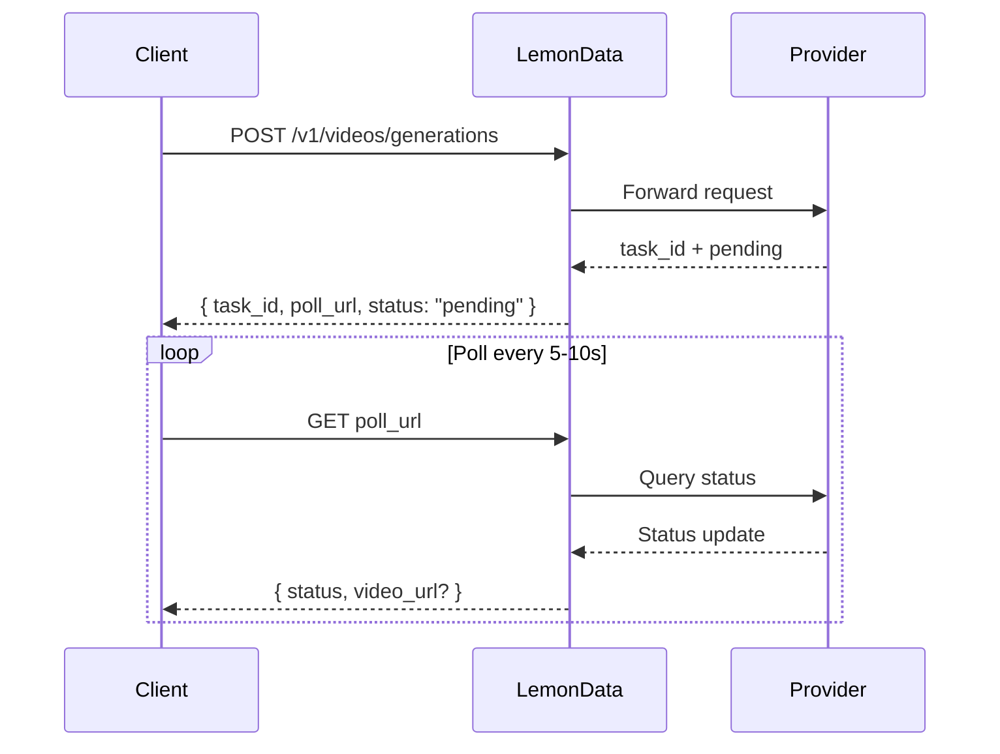

## 概覽

LemonData 透過單一統一 API 提供來自 11 家供應商的影片生成模型存取。影片生成為**非同步**流程 — 你提交請求後，會收到 task ID 與 `poll_url`，然後再輪詢取得結果。

<Info>
模型清單會頻繁更新。若要查看最新可用模型與價格，請造訪 [Models page](https://lemondata.cc/zh-Hant/models) 或使用 [Models API](/api-reference/models/list-models)。
</Info>

<Warning>
音訊行為取決於具體模型。在 LemonData 中，Veo 3 家族在省略 `output_audio` 時預設按有聲處理；部分模型預設無聲，或僅支援無聲。對於 passthrough 治理的模型，可顯式傳 `output_audio=true`，由上游盡力判斷是否生成音訊。
</Warning>


### 非同步工作流程


```mermaid
sequenceDiagram
    participant Client
    participant LemonData
    participant Provider

    Client->>LemonData: POST /v1/videos/generations
    LemonData->>Provider: Forward request
    Provider-->>LemonData: task_id + pending
    LemonData-->>Client: { task_id, poll_url, status: "pending" }

    loop Poll every 5-10s
        Client->>LemonData: GET poll_url
        LemonData->>Provider: Query status
        Provider-->>LemonData: Status update
        LemonData-->>Client: { status, video_url? }
    end
```

<CodeGroup>

```python Python
import requests
import time

API_KEY = "sk-your-api-key"
BASE = "https://api.lemondata.cc/v1"
headers = {"Authorization": f"Bearer {API_KEY}"}

# Step 1: Submit generation request
resp = requests.post(f"{BASE}/videos/generations",
    headers=headers,
    json={
        "model": "sora-2",
        "prompt": "A calm cinematic shot of a cat walking through a sunlit garden.",
        "operation": "text-to-video",
        "duration": 4,
        "aspect_ratio": "16:9"
    }
)
create_data = resp.json()
task_id = create_data["task_id"]
poll_url = create_data["poll_url"]

# Step 2: Poll for result
while True:
    status = requests.get(f"https://api.lemondata.cc{poll_url}", headers=headers).json()
    if status["status"] in ("completed", "succeeded"):
        print(f"Video URL: {status['video_url']}")
        break
    elif status["status"] == "failed":
        print(f"Failed: {status.get('error')}")
        break
    time.sleep(10)
```

```javascript JavaScript
const API_KEY = 'sk-your-api-key';
const BASE = 'https://api.lemondata.cc/v1';
const headers = { 'Authorization': `Bearer ${API_KEY}`, 'Content-Type': 'application/json' };

// Step 1: Submit
const { task_id, poll_url } = await fetch(`${BASE}/videos/generations`, {
  method: 'POST', headers,
  body: JSON.stringify({
    model: 'sora-2',
    prompt: 'A calm cinematic shot of a cat walking through a sunlit garden.',
    operation: 'text-to-video',
    duration: 4,
    aspect_ratio: '16:9'
  })
}).then(r => r.json());

// Step 2: Poll
const poll = setInterval(async () => {
  const status = await fetch(`https://api.lemondata.cc${poll_url}`, { headers }).then(r => r.json());
  if (['completed', 'succeeded'].includes(status.status)) {
    console.log('Video URL:', status.video_url);
    clearInterval(poll);
  } else if (status.status === 'failed') {
    console.error('Failed:', status.error);
    clearInterval(poll);
  }
}, 10000);
```

</CodeGroup>

## 模型能力矩陣

不同模型各自擅長不同任務。請使用此矩陣為你的使用情境選擇合適的模型。

**圖例**：✅ 支援 | ❌ 不支援

| Series | Provider | T2V | I2V | Keyframe | Extension | Editing | Max Duration |
|--------|----------|-----|-----|----------|-----------|---------|-------------|
| **Sora** | OpenAI | ✅ | ❌ | ❌ | ❌ | ❌ | ~20s |
| **Kling** | Kuaishou | ✅ | ✅ | ❌ | ✅ | ❌ | 10s |
| **Veo** | Google | ✅ | ✅ | ✅ | ❌ | ❌ | 8s |
| **Seedance** | ByteDance | ✅ | ✅ | ✅ | ✅ | ✅ | 10s |
| **Hailuo** | MiniMax | ✅ | ✅ | ❌ | ❌ | ❌ | 10s |
| **Wan** | Alibaba | ✅ | ✅ | ❌ | ❌ | ❌ | 5s |
| **Runway** | Runway | ❌ | ✅ | ❌ | ❌ | ❌ | 10s |
| **Luma** | Luma | ✅ | ❌ | ❌ | ✅ | ❌ | 5s |
| **Vidu** | Vidu | ✅ | ✅ | ✅ | ❌ | ❌ | 8s |
| **Grok** | xAI | ✅ | ❌ | ❌ | ❌ | ❌ | ~15s |
| **Higgsfield** | Higgsfield | ✅ | ❌ | ❌ | ❌ | ❌ | ~5s |

### 能力定義

- **T2V (Text-to-Video)**：根據文字 prompt 生成影片
- **I2V (Image-to-Video)**：將靜態圖片製作成動畫影片。為了獲得最廣泛的相容性，請提供公開的 `image_url`。
- **Keyframe**：使用 `start_image` + `end_image` 控制起始與結束影格
- **Extension**：延長現有影片的時長
- **Editing**：修改現有影片的特定方面

## 目前公開模型清單

### OpenAI

| Model | 公開操作 |
|-------|-------------------|
| `sora-2` | Text-to-video, image-to-video |
| `sora-2-pro` | Text-to-video, image-to-video |
| `sora-2-pro-storyboard` | Image-to-video |

### Kuaishou

| Model | 公開操作 |
|-------|-------------------|
| `kling-3.0-motion-control` | Motion control |
| `kling-3.0-video` | Text-to-video, image-to-video, start-end-to-video |
| `kling-v2.5-turbo-pro` | Text-to-video, image-to-video, start-end-to-video |
| `kling-v2.5-turbo-std` | Text-to-video, image-to-video |
| `kling-v2.6-pro` | Text-to-video, image-to-video, start-end-to-video |
| `kling-v2.6-std` | Text-to-video, image-to-video |
| `kling-v3.0-pro` | Text-to-video, image-to-video, start-end-to-video |
| `kling-v3.0-std` | Text-to-video, image-to-video, start-end-to-video |
| `kling-video-o1-pro` | Text-to-video, image-to-video, reference-to-video, start-end-to-video, video-to-video |
| `kling-video-o1-std` | Text-to-video, image-to-video, reference-to-video, start-end-to-video, video-to-video |

### Google

| Model | 公開操作 |
|-------|-------------------|
| `veo3` | Text-to-video, image-to-video |
| `veo3-fast` | Text-to-video, image-to-video |
| `veo3-pro` | Text-to-video, image-to-video |
| `veo3.1` | Text-to-video, image-to-video, reference-to-video, start-end-to-video |
| `veo3.1-fast` | Text-to-video, image-to-video, reference-to-video, start-end-to-video |
| `veo3.1-pro` | Text-to-video, image-to-video, start-end-to-video |

### ByteDance

| Model | 公開操作 |
|-------|-------------------|
| `seedance-1.5-pro` | Text-to-video, image-to-video |

### MiniMax

| Model | 公開操作 |
|-------|-------------------|
| `hailuo-2.3-fast` | Image-to-video |
| `hailuo-2.3-pro` | Text-to-video, image-to-video |
| `hailuo-2.3-standard` | Text-to-video, image-to-video |

### Alibaba

| Model | 公開操作 |
|-------|-------------------|
| `wan-2.2-plus` | Text-to-video, image-to-video |
| `wan-2.5` | Text-to-video, image-to-video |
| `wan-2.6` | Text-to-video, image-to-video, reference-to-video |

### Shengshu

| Model | 公開操作 |
|-------|-------------------|
| `viduq2` | Text-to-video, reference-to-video |
| `viduq2-pro` | Image-to-video, reference-to-video, start-end-to-video |
| `viduq2-pro-fast` | Image-to-video, start-end-to-video |
| `viduq2-turbo` | Image-to-video, start-end-to-video |
| `viduq3-pro` | Text-to-video, image-to-video, start-end-to-video |
| `viduq3-turbo` | Text-to-video, image-to-video, start-end-to-video |

### xAI

| Model | 公開操作 |
|-------|-------------------|
| `grok-imagine-image-to-video` | Image-to-video |
| `grok-imagine-text-to-video` | Text-to-video |
| `grok-imagine-upscale` | Video-to-video |

### Other

| Model | 公開操作 |
|-------|-------------------|
| `topaz-video-upscale` | Video-to-video |


## 使用範例

### Text-to-Video (T2V)

最常見的使用情境。所有模型都支援此功能。

```python
response = requests.post(f"{BASE}/videos/generations",
    headers=headers,
    json={
        "model": "sora-2",
        "prompt": "A calm cinematic shot of a cat walking through a sunlit garden.",
        "operation": "text-to-video",
        "duration": 4,
        "aspect_ratio": "16:9"
    }
)
```

### Image-to-Video (I2V)

將靜態圖片製作成動畫影片。為了在各種影片模型之間獲得最廣泛的相容性，請託管來源圖片並傳入 `image_url`。

```python
# Using image URL
response = requests.post(f"{BASE}/videos/generations",
    headers=headers,
    json={
        "model": "hailuo-2.3-fast",
        "prompt": "The scene begins from the provided image and adds gentle natural motion.",
        "operation": "image-to-video",
        "image_url": "https://example.com/portrait.jpg",
        "duration": 6,
        "aspect_ratio": "16:9"
    }
)

```

### Keyframe Control (Start + End Image)

同時控制第一幀與最後一幀，以實現精確轉場。目前由 Seedance 2.0 支援。

```python
response = requests.post(f"{BASE}/videos/generations",
    headers=headers,
    json={
        "model": "viduq2-pro",
        "prompt": "Smooth transition from day to night, city lights gradually turning on",
        "operation": "start-end-to-video",
        "start_image": "https://example.com/city-day.jpg",
        "end_image": "https://example.com/city-night.jpg",
        "duration": 5,
        "resolution": "720p",
        "aspect_ratio": "16:9"
    }
)
```

### 影片延展

延長現有影片的時長。請使用具備延展能力的模型。

```python
response = requests.post(f"{BASE}/videos/generations",
    headers=headers,
    json={
        "model": "kling-video-extend",
        "prompt": "Continue the scene naturally",
        "image_url": "https://example.com/last-frame.jpg"
    }
)
```

## 參數說明

| Parameter | Type | Description |
|-----------|------|-------------|
| `model` | string | 模型 ID（預設：`sora-2`） |
| `prompt` | string | **必填。** 影片的文字描述 |
| `image_url` | string | 起始圖片的 URL（用於 I2V） |
| `image` | string | 以 data URL 形式傳入的內嵌圖片。相容模型支援此方式，但 `image_url` 具有最廣泛的相容性。 |
| `duration` | integer | 影片時長（秒）（1-60，視模型而定） |
| `aspect_ratio` | string | `16:9`、`9:16`、`1:1` 等 |
| `resolution` | string | `1080p`、`720p`、`4k` |
| `fps` | integer | 每秒影格數（1-120） |
| `negative_prompt` | string | 生成時要避免的內容 |
| `seed` | integer | 用於重現結果的隨機 seed |
| `cfg_scale` | number | 引導強度（0-20） |
| `motion_strength` | number | 動作強度（0-1） |
| `start_image` | string | 起始關鍵影格的 URL |
| `end_image` | string | 結束關鍵影格的 URL |

<Warning>
並非每個模型都支援所有參數。不支援的參數會被靜默忽略。請查看模型文件以確認支援的參數。
</Warning>

## 模型選擇指南

<CardGroup cols={2}>
  <Card title="最佳品質" icon="crown">
    **Seedance 2.0** 或 **Kling v2.6 Pro** — 電影級品質、細節豐富、動作自然
  </Card>
  <Card title="最快生成" icon="bolt">
    **Higgsfield Turbo** 或 **Hailuo 2.3** — 適合原型設計與反覆迭代的快速結果
  </Card>
  <Card title="最全能" icon="wand-magic-sparkles">
    **Seedance 2.0** — 單一模型即支援 T2V、I2V、keyframe、extension 與 editing
  </Card>
  <Card title="最佳性價比" icon="coins">
    **Wan 2.6** 或 **Hailuo 2.3** — 以較低的單次生成成本提供具競爭力的品質
  </Card>
</CardGroup>

## 計費

影片生成採用**固定單次生成計費**。任務提交時會先收費一次，與影片時長無關。若生成失敗，費用將自動退還。

請在 [Models page](https://lemondata.cc/zh-Hant/models) 查看目前價格，或透過 [Pricing API](/api-reference/pricing/get-pricing) 查詢。
