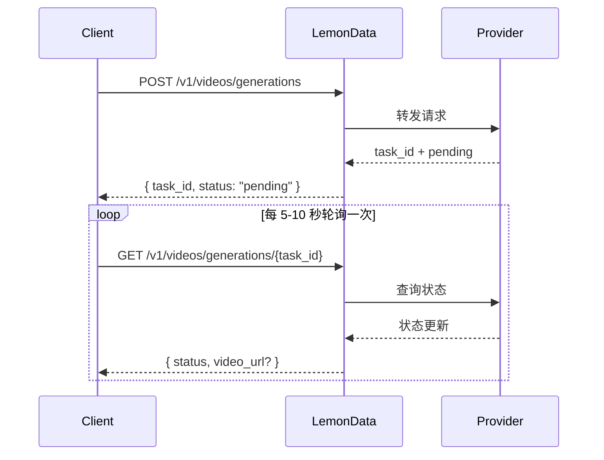

## 概览

LemonData 通过单一统一的 API 提供来自 11 个供应商的 **69 多个视频生成模型**。视频生成是**异步**的 —— 您提交请求并接收一个任务 ID，然后轮询结果。

<Info>
模型列表会频繁更新。有关最新可用模型和定价，请访问 [模型页面](https://lemondata.cc/zh/models) 或使用 [Models API](/api-reference/models/list-models)。
</Info>

### 异步工作流



<CodeGroup>

```python Python
import requests
import time

API_KEY = "sk-your-api-key"
BASE = "https://api.lemondata.cc/v1"
headers = {"Authorization": f"Bearer {API_KEY}"}

# 步骤 1：提交生成请求
resp = requests.post(f"{BASE}/videos/generations",
    headers=headers,
    json={
        "model": "kling-v2.6-pro",
        "prompt": "A golden retriever running on a beach at sunset, cinematic 4K",
        "duration": 5,
        "aspect_ratio": "16:9"
    }
)
task_id = resp.json()["task_id"]

# 步骤 2：轮询结果
while True:
    status = requests.get(f"{BASE}/videos/generations/{task_id}", headers=headers).json()
    if status["status"] in ("completed", "succeeded"):
        print(f"Video URL: {status['video_url']}")
        break
    elif status["status"] == "failed":
        print(f"Failed: {status.get('error')}")
        break
    time.sleep(10)
```

```javascript JavaScript
const API_KEY = 'sk-your-api-key';
const BASE = 'https://api.lemondata.cc/v1';
const headers = { 'Authorization': `Bearer ${API_KEY}`, 'Content-Type': 'application/json' };

// 步骤 1：提交
const { task_id } = await fetch(`${BASE}/videos/generations`, {
  method: 'POST', headers,
  body: JSON.stringify({
    model: 'kling-v2.6-pro',
    prompt: 'A golden retriever running on a beach at sunset, cinematic 4K',
    duration: 5,
    aspect_ratio: '16:9'
  })
}).then(r => r.json());

// 步骤 2：轮询
const poll = setInterval(async () => {
  const status = await fetch(`${BASE}/videos/generations/${task_id}`, { headers }).then(r => r.json());
  if (['completed', 'succeeded'].includes(status.status)) {
    console.log('Video URL:', status.video_url);
    clearInterval(poll);
  } else if (status.status === 'failed') {
    console.error('Failed:', status.error);
    clearInterval(poll);
  }
}, 10000);
```

</CodeGroup>

## 模型能力矩阵

不同的模型擅长不同的任务。使用此矩阵为您的用例选择合适的模型。

**图例**：✅ 支持 | ❌ 不支持

| 系列 | 供应商 | T2V | I2V | 关键帧 | 延长 | 编辑 | 最大时长 |
|--------|----------|-----|-----|----------|-----------|---------|-------------|
| **Sora** | OpenAI | ✅ | ❌ | ❌ | ❌ | ❌ | ~20s |
| **Kling** | 快手 | ✅ | ✅ | ❌ | ✅ | ❌ | 10s |
| **Veo** | Google | ✅ | ❌ | ❌ | ❌ | ❌ | 8s |
| **Seedance** | 字节跳动 | ✅ | ✅ | ✅ | ✅ | ✅ | 10s |
| **Hailuo** | MiniMax | ✅ | ✅ | ❌ | ❌ | ❌ | 6s |
| **Wan** | 阿里巴巴 | ✅ | ✅ | ❌ | ❌ | ❌ | 5s |
| **Runway** | Runway | ✅ | ✅ | ❌ | ❌ | ❌ | 10s |
| **Luma** | Luma | ✅ | ❌ | ❌ | ✅ | ❌ | 5s |
| **Vidu** | 生数科技 | ✅ | ✅ | ❌ | ❌ | ❌ | 8s |
| **Grok** | xAI | ✅ | ❌ | ❌ | ❌ | ❌ | ~10s |
| **Higgsfield** | Higgsfield | ✅ | ❌ | ❌ | ❌ | ❌ | ~5s |

### 能力定义

- **T2V (文生视频)**：从文本提示词生成视频
- **I2V (图生视频)**：使用 `image_url` 或 `image` 将静态图像动画化为视频
- **关键帧**：通过 `start_image` + `end_image` 控制起始和结束帧
- **延长**：延长现有视频的时长
- **编辑**：修改现有视频的特定方面

## 按系列划分的可用模型

### Sora (OpenAI)

| 模型 | 质量 | 备注 |
|-------|---------|-------|
| `sora-2` | 标准 | 默认模型，质量和速度平衡良好 |
| `sora-2-pro` | 高 | 更高质量，生成时间较长 |
| `sora-2-characters` | 标准 | 专注于角色的生成 |

### Kling (快手)

| 模型 | 能力 | 备注 |
|-------|-----------|-------|
| `kling-v2.6-pro` | T2V | 最新一代，专业级质量 |
| `kling-v2.6-std` | T2V | 最新一代，速度快 |
| `kling-v2.5-turbo-pro` | T2V | Turbo 速度，专业级质量 |
| `kling-v2.1-master` | T2V/I2V | 大师级质量 |
| `kling-v2.1-pro` | T2V/I2V | 专业级质量 |
| `kling-v2.1-standard` | T2V/I2V | 标准质量 |
| `kling-video` | T2V/I2V | 基础模型 |
| `kling-video-extend` | 延长 | 延长现有视频 |
| `kling-video-o1-pro` | T2V | O1 推理，专业级质量 |
| `kling-video-o1-std` | T2V | O1 推理，标准质量 |
| `kling-effects` | 特效 | 应用视觉特效 |
| `kling-omni-video` | T2V | Omni 模型 |
| `kling-motion-control` | T2V | 运动控制生成 |

### Veo (Google)

| 模型 | 质量 | 备注 |
|-------|---------|-------|
| `veo3.1` | 标准 | Google 最新的视频模型 |
| `veo3.1-pro` | 高 | 专业级质量 |
| `veo3.1-4k` | 超高 | 4K 分辨率输出 |
| `veo3.1-fast` | 快速 | 生成速度更快 |
| `veo3.1-fast-4k` | 快速 + 4K | 快速生成并支持 4K 输出 |
| `veo3.1-components` | 标准 | 基于组件的生成 |
| `veo3` | 标准 | 前一代模型 |
| `veo3-pro` | 高 | 前一代，专业级 |
| `veo3-fast` | 快速 | 前一代，快速 |

### Seedance (字节跳动)

| 模型 | 能力 | 备注 |
|-------|-----------|-------|
| `seedance-2-0` | T2V/I2V/关键帧/延长/编辑 | 最新，功能最全 |
| `seedance-1-5-pro` | T2V/I2V | 前一代，专业级质量 |
| `seedance-1-0-pro` | T2V/I2V | 第一代，专业级 |
| `seedance-1-0-pro-fast` | T2V/I2V | 第一代，快速 |
| `seedance-1-0-lite-t2v` | T2V | 轻量级文生视频 |
| `seedance-1-0-lite-i2v` | I2V | 轻量级图生视频 |

<Note>
Seedance 2.0 支持最广泛的能力，包括多模态生视频、视频延长和视频编辑 —— 全部通过同一个 API 端点实现。
</Note>

### Hailuo (MiniMax)

| 模型 | 质量 | 备注 |
|-------|---------|-------|
| `hailuo-2.3` | 标准 | 质量良好 |
| `hailuo-2.3-pro` | 高 | 更高质量输出 |
| `hailuo-2.3-fast` | 快速 | 生成速度更快 |
| `hailuo-2.3-standard` | 标准 | 标准层级 |
| `video-01` | 标准 | MiniMax video-01 |
| `video-01-live` | 标准 | 直播风格生成 |

### Wan (阿里巴巴)

| 模型 | 能力 | 备注 |
|-------|-----------|-------|
| `wan-2.6` | T2V | 最新文生视频 |
| `wan2.6-i2v` | I2V | 最新图生视频 |
| `wan-2.5` | T2V | 前一代模型 |
| `wan2.5-i2v-preview` | I2V | 前一代 I2V 预览版 |
| `wan-2.2-plus` | T2V | 早期模型 |
| `vace-14b` | T2V | VACE 架构 |

### Runway

| 模型 | 时长 | 备注 |
|-------|----------|-------|
| `runwayml-gen4-turbo-5` | 5s | 快速生成 |
| `runwayml-gen4-turbo-10` | 10s | 更长的片段 |

### Luma

| 模型 | 能力 | 备注 |
|-------|-----------|-------|
| `luma-video-api` | T2V | 文生视频 |
| `luma-video-extend-api` | 延长 | 延长现有视频 |

### Vidu (生数科技)

| 模型 | 质量 | 备注 |
|-------|---------|-------|
| `viduq3-pro` | 高 | 最新一代 |
| `viduq2-pro` | 高 | 前一代，专业级 |
| `viduq2-pro-fast` | 快速 | 前一代，快速专业级 |
| `viduq2` | 标准 | 前一代，标准 |
| `viduq2-turbo` | 快速 | Turbo 速度 |
| `vidu2.0` | 标准 | 基础模型 |

### Grok (xAI)

| 模型 | 备注 |
|-------|-------|
| `grok-video-3` | xAI 的视频生成模型 |
| `grok-video-3-10s` | 10 秒变体 |

### Higgsfield

| 模型 | 备注 |
|-------|-------|
| `higgsfield-turbo` | 最快，成本较低 |
| `higgsfield-standard` | 标准质量 |
| `higgsfield-lite` | 轻量级 |

## 使用示例

### 文生视频 (T2V)

最常见的用例。所有模型都支持此功能。

```python
response = requests.post(f"{BASE}/videos/generations",
    headers=headers,
    json={
        "model": "veo3.1-pro",
        "prompt": "Aerial drone shot of a coastal city at golden hour, waves crashing against cliffs",
        "duration": 5,
        "aspect_ratio": "16:9",
        "resolution": "1080p"
    }
)
```

### 图生视频 (I2V)

使静态图像动起来。使用 `image_url` 传递 URL，或使用 `image` 传递 base64 数据。

```python
# 使用图像 URL
response = requests.post(f"{BASE}/videos/generations",
    headers=headers,
    json={
        "model": "wan2.6-i2v",
        "prompt": "The person slowly turns and smiles at the camera",
        "image_url": "https://example.com/portrait.jpg"
    }
)

# 使用 base64 图像
import base64
with open("photo.jpg", "rb") as f:
    image_b64 = base64.b64encode(f.read()).decode()

response = requests.post(f"{BASE}/videos/generations",
    headers=headers,
    json={
        "model": "kling-v2.1-master",
        "prompt": "Gentle wind blows through the scene",
        "image": f"data:image/jpeg;base64,{image_b64}"
    }
)
```

### 关键帧控制（起始 + 结束图像）

同时控制第一帧和最后一帧以实现精确过渡。目前由 Seedance 2.0 支持。

```python
response = requests.post(f"{BASE}/videos/generations",
    headers=headers,
    json={
        "model": "seedance-2-0",
        "prompt": "Smooth transition from day to night, city lights gradually turning on",
        "start_image": "https://example.com/city-day.jpg",
        "end_image": "https://example.com/city-night.jpg",
        "duration": 5
    }
)
```

### 视频延长

延长现有视频的时长。请使用具有延长能力的模型。

```python
response = requests.post(f"{BASE}/videos/generations",
    headers=headers,
    json={
        "model": "kling-video-extend",
        "prompt": "Continue the scene naturally",
        "image_url": "https://example.com/last-frame.jpg"
    }
)
```

## 参数参考

| 参数 | 类型 | 描述 |
|-----------|------|-------------|
| `model` | string | 模型 ID (默认: `sora-2`) |
| `prompt` | string | **必填。** 视频的文本描述 |
| `image_url` | string | 起始图像的 URL (用于 I2V) |
| `image` | string | 带有数据 URL 前缀的 Base64 编码图像 (用于 I2V) |
| `duration` | integer | 视频时长，单位为秒 (1-60，取决于模型) |
| `aspect_ratio` | string | `16:9`, `9:16`, `1:1` 等 |
| `resolution` | string | `1080p`, `720p`, `4k` |
| `fps` | integer | 每秒帧数 (1-120) |
| `negative_prompt` | string | 生成中需要避免的内容 |
| `seed` | integer | 用于可复现性的随机种子 |
| `cfg_scale` | number | 引导比例 (0-20) |
| `motion_strength` | number | 运动强度 (0-1) |
| `start_image` | string | 起始关键帧的 URL |
| `end_image` | string | 结束关键帧的 URL |

<Warning>
并非所有模型都支持所有参数。不支持的参数将被静默忽略。请检查模型的文档以了解支持的参数。
</Warning>

## 模型选择指南

<CardGroup cols={2}>
  <Card title="最佳质量" icon="crown">
    **Seedance 2.0** 或 **Kling v2.6 Pro** —— 电影级质量，细节丰富，运动自然
  </Card>
  <Card title="最快生成" icon="bolt">
    **Higgsfield Turbo** 或 **Hailuo 2.3** —— 快速获取结果，适用于原型设计和迭代
  </Card>
  <Card title="最全能" icon="wand-magic-sparkles">
    **Seedance 2.0** —— 在一个模型中支持 T2V、I2V、关键帧、延长和编辑
  </Card>
  <Card title="最佳性价比" icon="coins">
    **Wan 2.6** 或 **Hailuo 2.3** —— 以较低的单次生成成本提供极具竞争力的质量
  </Card>
</CardGroup>

## 计费

视频生成采用**固定的单次生成定价**。无论视频时长如何，在提交任务时都会计费一次。如果生成失败，费用将自动退还。

在 [模型页面](https://lemondata.cc/zh/models) 或通过 [Pricing API](/api-reference/pricing/get-pricing) 查看当前定价。