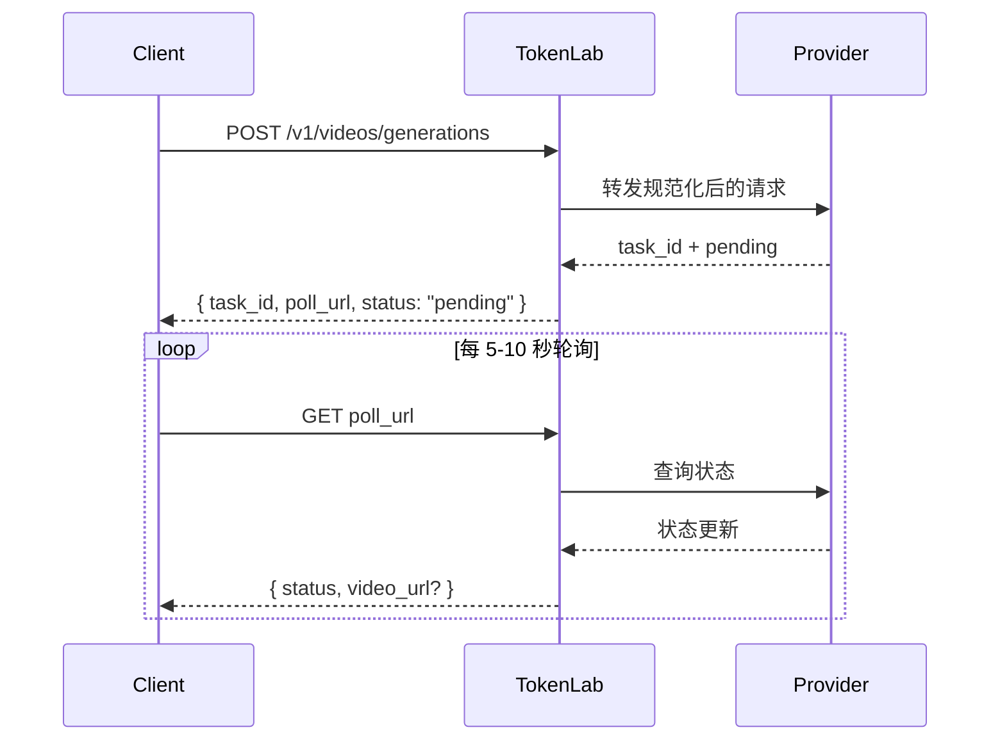

## 概述

TokenLab 通过统一 API 提供视频生成能力。视频生成是**异步**的：提交请求后会返回 `task_id` 和 `poll_url`，随后再轮询任务状态获取最终结果。

如果创建响应返回了 `poll_url`，请优先直接调用这个地址。若它指向 `/v1/tasks/{id}`，就把它视为公开视频任务的规范状态入口；`/v1/videos/generations/{id}` 只保留兼容用途。

### 可用性与轮询

模型库存会持续变化。要获取最新的公开视频模型可用性，请使用 [Models API](/zh/api-reference/models/list-models) 或访问[模型页面](https://tokenlab.sh/zh/models)。

### 模型与媒体行为

音频行为与具体模型有关。在 TokenLab 中，Veo 3 家族在省略 `output_audio` 时默认按开启音频处理；有些公开视频模型默认无声，或并未暴露稳定的音频切换开关。

生产环境建议优先使用公网可访问的 `https` URL 作为图片、视频和音频输入。兼容模型仍支持内联 `data:` URL，但 URL 更容易重试、观测和排障。

### 异步工作流


```mermaid
sequenceDiagram
    participant Client
    participant TokenLab
    participant Provider

    Client->>TokenLab: POST /v1/videos/generations
    TokenLab->>Provider: 转发规范化后的请求
    Provider-->>TokenLab: task_id + pending
    TokenLab-->>Client: { task_id, poll_url, status: "pending" }

    loop 每 5-10 秒轮询
        Client->>TokenLab: GET poll_url
        TokenLab->>Provider: 查询状态
        Provider-->>TokenLab: 状态更新
        TokenLab-->>Client: { status, video_url? }
    end
```

## 当前公开操作

TokenLab 公开视频契约接受以下操作值。支持情况与具体模型有关，并会随着供应商新增或下线能力而变化；依赖某个专用操作前，请先读取所选模型契约。

- `text-to-video`
- `image-to-video`
- `reference-to-video`
- `start-end-to-video`
- `video-to-video`
- `motion-control`
- `audio-to-video`
- `video-extension`

## 操作定义

- **T2V（Text-to-Video）**：根据文本提示词生成视频。
- **I2V（Image-to-Video）**：根据起始图片生成视频；为了兼容性更好，建议传 `image_url`。
- **Reference**：通过 `reference_images` 传入一张或多张参考图进行条件控制；部分模型还通过 `video_urls` 接受参考视频、通过 `audio_urls` 接受参考音频。
- **Start-End**：通过 `start_image` 和 `end_image` 控制首帧和尾帧。
- **V2V（Video-to-Video）**：以现有视频、已生成任务或供应商特定衍生流程作为来源。
- **Motion**：同时使用主体图片和动作参考视频。
- **Audio-to-Video**：通过音频条件控制的模型流程生成视频。
- **Video Extension**：继续或延展已有的视频生成任务。

## 模型发现

视频模型可用性变化很快。选择模型前，先获取当前公开视频推荐列表：

```bash
curl "https://api.tokenlab.sh/v1/models?recommended_for=video" \
  -H "Authorization: Bearer sk-your-api-key"
```

发送模型特定字段前，先读取所选模型：

```bash
curl "https://api.tokenlab.sh/v1/models/veo3.1" \
  -H "Authorization: Bearer sk-your-api-key"
```

请把 `tokenlab.capabilities`、`tokenlab.supported_operations`、`tokenlab.public_contract_summary` 和 `tokenlab.public_contract` 作为真值来源。下面的示例是工作流模式，不是完整模型库存。

## 使用示例

### 文生视频

```python
response = requests.post(f"{BASE}/videos/generations",
    headers=headers,
    json={
        "model": "veo3.1",
        "prompt": "A calm cinematic shot of a cat walking through a sunlit garden.",
        "operation": "text-to-video",
        "duration": 4,
        "aspect_ratio": "16:9"
    }
)
```

### 图生视频

```python
response = requests.post(f"{BASE}/videos/generations",
    headers=headers,
    json={
        "model": "hailuo-2.3-standard",
        "prompt": "The scene begins from the provided image and adds gentle natural motion.",
        "operation": "image-to-video",
        "image_url": "https://example.com/portrait.jpg",
        "duration": 6,
        "aspect_ratio": "16:9"
    }
)
```

### Kling 3.0 元素引用

当需要元素引用时，在 `kling-3.0-video` 请求中传入 `kling_elements`。请求需要包含图片条件输入（`image_url`、`image_urls`、`start_image` 或 `end_image`），并在提示词中用 `@name` 引用对应元素。

```python
response = requests.post(f"{BASE}/videos/generations",
    headers=headers,
    json={
        "model": "kling-3.0-video",
        "prompt": "Place @hero_bag on a studio turntable with soft product lighting.",
        "operation": "image-to-video",
        "image_url": "https://example.com/studio-start.png",
        "duration": 5,
        "resolution": "720p",
        "kling_elements": [
            {
                "name": "hero_bag",
                "description": "black leather handbag",
                "element_input_urls": [
                    "https://example.com/bag-front.png",
                    "https://example.com/bag-side.png"
                ]
            }
        ]
    }
)
```

### 参考图生视频

对于 `seedance-2.0` 和 `seedance-2.0-fast`，TokenLab 当前支持最多 9 张参考图，外加最多 3 段参考视频和 3 段参考音频。`duration` 只控制生成输出时长，不单独限制参考视频输入时长。 对于 `grok-imagine-video`，reference-to-video 最多接受 7 个图片参考（`reference_images` 或 `image_urls`），且 `duration` 最高为 10 秒。不要把参考图片与 `image_url` / `image` 首帧输入混用。`grok-imagine-video-1.5-preview` 仅支持图生视频。

```python
response = requests.post(f"{BASE}/videos/generations",
    headers=headers,
    json={
        "model": "veo3.1",
        "prompt": "Keep the same subject identity and palette while adding subtle motion.",
        "operation": "reference-to-video",
        "reference_images": [
            "https://example.com/ref-a.jpg",
            "https://example.com/ref-b.jpg"
        ],
        "duration": 8,
        "resolution": "720p",
        "aspect_ratio": "9:16"
    }
)
```

### 首尾帧控制

```python
response = requests.post(f"{BASE}/videos/generations",
    headers=headers,
    json={
        "model": "viduq2-pro",
        "prompt": "Smooth transition from day to night.",
        "operation": "start-end-to-video",
        "start_image": "https://example.com/city-day.jpg",
        "end_image": "https://example.com/city-night.jpg",
        "duration": 5,
        "resolution": "720p",
        "aspect_ratio": "16:9"
    }
)
```

### 视频转视频

对于 `grok-imagine-video` 的 video-to-video，请在 `video_url` 中传入公网 HTTPS `.mp4` URL。TokenLab 会把它转换为 xAI REST 的 `video.url` 请求体。你可以把 `resolution` 设为 `480p` 或 `720p`；该编辑流程不接受 `duration` 和 `aspect_ratio`。

```python
response = requests.post(f"{BASE}/videos/generations",
    headers=headers,
    json={
        "model": "grok-imagine-video",
        "operation": "video-to-video",
        "video_url": "https://example.com/source.mp4",
        "prompt": "Upscale this clip while preserving the original motion."
    }
)
```

### 动作控制

```python
response = requests.post(f"{BASE}/videos/generations",
    headers=headers,
    json={
        "model": "kling-3.0-motion-control",
        "operation": "motion-control",
        "prompt": "Keep the subject stable while following the motion reference.",
        "image_url": "https://example.com/subject.png",
        "video_url": "https://example.com/motion.mp4",
        "resolution": "720p"
    }
)
```

## 参数参考

| 参数 | 类型 | 说明 |
|------|------|------|
| `operation` | string | 生产环境建议显式传入 `operation`。 |
| `image_url` | string | 兼容性最好的图片输入形式。 |
| `image` | string | 内联 data URL，适合本地调试或小体积请求。 |
| `reference_images` | string[] | 参考图条件控制的规范公开字段。 |
| `reference_image_type` | string | 可选的 `asset` / `style` 角色选择器。 |
| `video_url` | string | 基于视频 URL 的 `video-to-video` 流程和 `motion-control` 需要该字段；部分衍生流程改用 `task_id`。 |
| `audio_url` | string | 用于模型特定的音频条件控制流程。 |
| `output_audio` | boolean | Veo 3 家族省略时默认按 `true` 处理。`kling-3.0-video` 接受该 selector 用于上游 sound 控制，省略时默认无声。 |

## 模型选择建议

<CardGroup cols={2}>
  <Card title="高质量优先" icon="crown">
    当画质优先于速度时，优先考虑 **veo3.1**、**kling-video-o1-pro** 或 **viduq3-pro**。
  </Card>
  <Card title="更快迭代" icon="bolt">
    需要更快出结果时，可先尝试 **veo3.1-fast**、**hailuo-2.3-fast** 或 **viduq3-turbo**。
  </Card>
  <Card title="参考图条件控制" icon="images">
    需要专门的参考图条件控制时，可优先考虑 **veo3.1**、**veo3.1-fast**、**wan-2.6** 或 **kling-video-o1-pro / std**。
  </Card>
  <Card title="视频转视频" icon="film">
    先调用 `GET /v1/models?recommended_for=video`；当前 V2V 类示例包括 **grok-imagine-video**、**seedance-2.0**、**veo3.1** 和 **kling-video-o1-pro / std**。
  </Card>
</CardGroup>

## 计费

视频计费与具体模型相关。有些公开视频模型表现为按次计费，有些则按秒计费。请以[模型页面](https://tokenlab.sh/zh/models)或 [Pricing API](/zh/api-reference/pricing/get-pricing) 的当前公开价格为准。
