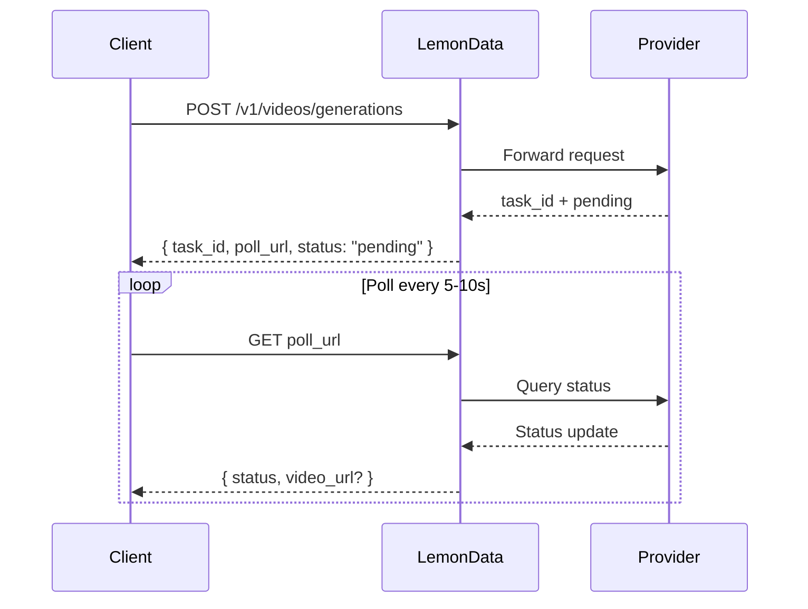

## 概述

LemonData 通过单一统一 API 提供对来自 11 家提供商的视频生成模型的访问。视频生成是**异步**的——你提交请求，接收一个任务 ID 和 `poll_url`，然后轮询结果。

<Info>
模型列表会频繁更新。要获取最新的可用模型和定价，请访问[模型页面](https://lemondata.cc/zh/models)或使用[Models API](/api-reference/models/list-models)。
</Info>

<Warning>
音频行为取决于具体模型。Veo 3 家族默认有声；部分模型默认无声，或仅支持无声。对于 passthrough 治理的模型，可显式传 `output_audio=true`，由上游尽力判断是否生成音频。
</Warning>


### 异步工作流


```mermaid
sequenceDiagram
    participant Client
    participant LemonData
    participant Provider

    Client->>LemonData: POST /v1/videos/generations
    LemonData->>Provider: Forward request
    Provider-->>LemonData: task_id + pending
    LemonData-->>Client: { task_id, poll_url, status: "pending" }

    loop Poll every 5-10s
        Client->>LemonData: GET poll_url
        LemonData->>Provider: Query status
        Provider-->>LemonData: Status update
        LemonData-->>Client: { status, video_url? }
    end
```

<CodeGroup>

```python Python
import requests
import time

API_KEY = "sk-your-api-key"
BASE = "https://api.lemondata.cc/v1"
headers = {"Authorization": f"Bearer {API_KEY}"}

# Step 1: Submit generation request
resp = requests.post(f"{BASE}/videos/generations",
    headers=headers,
    json={
        "model": "sora-2",
        "prompt": "A calm cinematic shot of a cat walking through a sunlit garden.",
        "operation": "text-to-video",
        "duration": 4,
        "aspect_ratio": "16:9"
    }
)
create_data = resp.json()
task_id = create_data["task_id"]
poll_url = create_data["poll_url"]

# Step 2: Poll for result
while True:
    status = requests.get(f"https://api.lemondata.cc{poll_url}", headers=headers).json()
    if status["status"] in ("completed", "succeeded"):
        print(f"Video URL: {status['video_url']}")
        break
    elif status["status"] == "failed":
        print(f"Failed: {status.get('error')}")
        break
    time.sleep(10)
```

```javascript JavaScript
const API_KEY = 'sk-your-api-key';
const BASE = 'https://api.lemondata.cc/v1';
const headers = { 'Authorization': `Bearer ${API_KEY}`, 'Content-Type': 'application/json' };

// Step 1: Submit
const { task_id, poll_url } = await fetch(`${BASE}/videos/generations`, {
  method: 'POST', headers,
  body: JSON.stringify({
    model: 'sora-2',
    prompt: 'A calm cinematic shot of a cat walking through a sunlit garden.',
    operation: 'text-to-video',
    duration: 4,
    aspect_ratio: '16:9'
  })
}).then(r => r.json());

// Step 2: Poll
const poll = setInterval(async () => {
  const status = await fetch(`https://api.lemondata.cc${poll_url}`, { headers }).then(r => r.json());
  if (['completed', 'succeeded'].includes(status.status)) {
    console.log('Video URL:', status.video_url);
    clearInterval(poll);
  } else if (status.status === 'failed') {
    console.error('Failed:', status.error);
    clearInterval(poll);
  }
}, 10000);
```

</CodeGroup>

## 模型能力矩阵

不同模型擅长不同任务。请使用此矩阵为你的使用场景选择合适的模型。

**图例**：✅ 支持 | ❌ 不支持

| Series | Provider | T2V | I2V | Keyframe | Extension | Editing | Max Duration |
|--------|----------|-----|-----|----------|-----------|---------|-------------|
| **Sora** | OpenAI | ✅ | ❌ | ❌ | ❌ | ❌ | ~20s |
| **Kling** | Kuaishou | ✅ | ✅ | ❌ | ✅ | ❌ | 10s |
| **Veo** | Google | ✅ | ✅ | ✅ | ❌ | ❌ | 8s |
| **Seedance** | ByteDance | ✅ | ✅ | ✅ | ✅ | ✅ | 10s |
| **Hailuo** | MiniMax | ✅ | ✅ | ❌ | ❌ | ❌ | 10s |
| **Wan** | Alibaba | ✅ | ✅ | ❌ | ❌ | ❌ | 5s |
| **Runway** | Runway | ❌ | ✅ | ❌ | ❌ | ❌ | 10s |
| **Luma** | Luma | ✅ | ❌ | ❌ | ✅ | ❌ | 5s |
| **Vidu** | Vidu | ✅ | ✅ | ✅ | ❌ | ❌ | 8s |
| **Grok** | xAI | ✅ | ❌ | ❌ | ❌ | ❌ | ~15s |
| **Higgsfield** | Higgsfield | ✅ | ❌ | ❌ | ❌ | ❌ | ~5s |

### 能力定义

- **T2V (Text-to-Video)**：根据文本提示生成视频
- **I2V (Image-to-Video)**：将静态图像制作成视频动画。为了获得最广泛的兼容性，请提供公开可访问的 `image_url`。
- **Keyframe**：使用 `start_image` + `end_image` 控制起始帧和结束帧
- **Extension**：扩展现有视频的时长
- **Editing**：修改现有视频的特定方面

## 按系列划分的可用模型

### Sora (OpenAI)

| Model | Quality | Notes |
|-------|---------|-------|
| `sora-2` | Standard | 默认示例模型 |
| `sora-2-pro` | High | 更高质量，生成时间更长 |
| `sora-2-characters` | Standard | 侧重角色的生成 |

### Kling (Kuaishou)

| Model | Capability | Notes |
|-------|-----------|-------|
| `kling-v2.6-pro` | T2V | 最新一代，专业级质量 |
| `kling-v2.6-std` | T2V | 最新一代，速度快 |
| `kling-v2.5-turbo-std` | T2V | Turbo 档位 |
| `kling-v2.5-turbo-pro` | T2V | Turbo 速度，专业级质量 |
| `kling-v2.1-master` | T2V/I2V | Master 质量 |
| `kling-v2.1-pro` | T2V/I2V | 专业级质量 |
| `kling-v2.1-standard` | T2V/I2V | 标准质量 |
| `kling-video` | T2V/I2V | 基础模型 |
| `kling-video-extend` | Extension | 扩展现有视频 |
| `kling-video-o1-pro` | T2V | O1 推理，专业级质量 |
| `kling-video-o1-std` | T2V | O1 推理，标准版 |
| `kling-effects` | Effects | 应用视觉特效 |
| `kling-omni-video` | T2V | Omni 模型 |
| `kling-motion-control` | T2V | 运动控制生成 |

### Veo (Google)

| Model | Quality | Notes |
|-------|---------|-------|
| `veo2` | Standard | Veo 2 系列模型 |
| `veo3.1` | Standard | Google 最新的视频模型 |
| `veo3.1-pro` | High | 专业级质量 |
| `veo3.1-4k` | Ultra | 4K 分辨率输出 |
| `veo3.1-fast` | Fast | 生成更快 |
| `veo3.1-fast-4k` | Fast + 4K | 快速生成并输出 4K |
| `veo3.1-components` | Standard | 基于组件的生成 |
| `veo3` | Standard | 上一代 |
| `veo3-pro` | High | 上一代，专业版 |
| `veo3-fast` | Fast | 上一代，快速版 |

### Seedance (ByteDance)

| Model | Capability | Notes |
|-------|-----------|-------|
| `seedance-2-0` | T2V/I2V/Keyframe/Extension/Editing | 最新、能力最全面 |
| `seedance-1-5-pro` | T2V/I2V | 上一代，专业级质量 |
| `seedance-1-0-pro` | T2V/I2V | 第一代，专业版 |
| `seedance-1-0-pro-fast` | T2V/I2V | 第一代，快速版 |
| `seedance-1-0-lite-t2v` | T2V | 轻量级文生视频 |
| `seedance-1-0-lite-i2v` | I2V | 轻量级图生视频 |

<Note>
Seedance 2.0 支持最广泛的能力范围，包括多模态到视频、视频扩展和视频编辑——全部通过同一个 API endpoint 实现。
</Note>

### Hailuo (MiniMax)

| Model | Quality | Notes |
|-------|---------|-------|
| `hailuo-2.3` | Standard | 质量良好 |
| `hailuo-2.3-pro` | High | 更高质量输出 |
| `hailuo-2.3-fast` | Fast | 生成更快 |
| `hailuo-2.3-standard` | Standard | 标准档位 |
| `video-01` | Standard | MiniMax video-01 |
| `video-01-live` | Standard | Live 风格生成 |

### Wan (Alibaba)

| Model | Capability | Notes |
|-------|-----------|-------|
| `wan-2.6` | T2V | 最新文生视频 |
| `wan2.6-i2v` | I2V | 最新图生视频 |
| `wan-2.5` | T2V | 上一代 |
| `wan2.5-i2v-preview` | I2V | 上一代 I2V |
| `wan-2.2-plus` | T2V | 更早一代 |
| `vace-14b` | T2V | VACE 架构 |

### Runway

| Model | Duration | Notes |
|-------|----------|-------|
| `runwayml-gen4-turbo-5` | 5s | 快速生成 |
| `runwayml-gen4-turbo-10` | 10s | 更长的视频片段 |

### Luma

| Model | Capability | Notes |
|-------|-----------|-------|
| `luma-video-api` | T2V | 文生视频 |
| `luma-video-extend-api` | Extension | 扩展现有视频 |

### Vidu (Shengshu)

| Model | Quality | Notes |
|-------|---------|-------|
| `viduq3-turbo` | Fast | Turbo 档位 |
| `viduq3-pro` | High | 最新一代 |
| `viduq2-pro` | High | 上一代，专业版 |
| `viduq2-pro-fast` | Fast | 上一代，快速专业版 |
| `viduq2` | Standard | 上一代，标准版 |
| `viduq2-turbo` | Fast | Turbo 速度 |
| `vidu2.0` | Standard | 基础模型 |

### Grok (xAI)

| Model | Notes |
|-------|-------|
| `grok-video-3` | xAI 的视频生成模型 |
| `grok-video-3-15s` | 15 秒变体 |

### Higgsfield

| Model | Notes |
|-------|-------|
| `higgsfield-turbo` | 最快，成本更低 |
| `higgsfield-standard` | 标准质量 |
| `higgsfield-lite` | 轻量版 |

## 使用示例

### 文生视频（T2V）

这是最常见的使用场景。所有模型都支持。

```python
response = requests.post(f"{BASE}/videos/generations",
    headers=headers,
    json={
        "model": "sora-2",
        "prompt": "A calm cinematic shot of a cat walking through a sunlit garden.",
        "operation": "text-to-video",
        "duration": 4,
        "aspect_ratio": "16:9"
    }
)
```

### 图生视频（I2V）

让静态图像动起来。为了在各类视频模型之间获得最广泛的兼容性，请托管源图像并传入 `image_url`。

```python
# Using image URL
response = requests.post(f"{BASE}/videos/generations",
    headers=headers,
    json={
        "model": "hailuo-2.3-fast",
        "prompt": "The scene begins from the provided image and adds gentle natural motion.",
        "operation": "image-to-video",
        "image_url": "https://example.com/portrait.jpg",
        "duration": 6,
        "aspect_ratio": "16:9"
    }
)

```

### 关键帧控制（开始图像 + 结束图像）

同时控制首帧和尾帧，以实现精确过渡。目前推荐使用 Vidu Q2 Pro。

```python
response = requests.post(f"{BASE}/videos/generations",
    headers=headers,
    json={
        "model": "viduq2-pro",
        "prompt": "Smooth transition from day to night, city lights gradually turning on",
        "operation": "start-end-to-video",
        "start_image": "https://example.com/city-day.jpg",
        "end_image": "https://example.com/city-night.jpg",
        "duration": 5,
        "resolution": "720p",
        "aspect_ratio": "16:9"
    }
)
```

### 视频扩展

扩展现有视频的时长。请使用支持扩展能力的模型。

```python
response = requests.post(f"{BASE}/videos/generations",
    headers=headers,
    json={
        "model": "kling-video-extend",
        "prompt": "Continue the scene naturally",
        "image_url": "https://example.com/last-frame.jpg"
    }
)
```

## 参数参考

| Parameter | Type | Description |
|-----------|------|-------------|
| `model` | string | 模型 ID（默认：`sora-2`） |
| `prompt` | string | **必填。** 视频的文本描述 |
| `image_url` | string | 起始图像的 URL（用于 I2V） |
| `image` | string | 作为 data URL 的内联图像。兼容模型支持此方式，但 `image_url` 提供最广泛的兼容性。 |
| `duration` | integer | 视频时长（秒）（1-60，取决于模型） |
| `aspect_ratio` | string | `16:9`、`9:16`、`1:1` 等 |
| `resolution` | string | `1080p`、`720p`、`4k` |
| `fps` | integer | 每秒帧数（1-120） |
| `negative_prompt` | string | 希望在生成中避免的内容 |
| `seed` | integer | 用于可复现性的随机种子 |
| `cfg_scale` | number | 引导强度（0-20） |
| `motion_strength` | number | 运动强度（0-1） |
| `start_image` | string | 起始关键帧的 URL |
| `end_image` | string | 结束关键帧的 URL |

<Warning>
并非所有参数都被每个模型支持。不支持的参数会被静默忽略。请查阅模型文档以了解支持的参数。
</Warning>

## 模型选择指南

<CardGroup cols={2}>
  <Card title="最佳质量" icon="crown">
    **Seedance 2.0** 或 **Kling v2.6 Pro** —— 电影级质量、细节丰富、运动自然
  </Card>
  <Card title="最快生成" icon="bolt">
    **Higgsfield Turbo** 或 **Hailuo 2.3** —— 为原型设计和迭代提供快速结果
  </Card>
  <Card title="最通用" icon="wand-magic-sparkles">
    **Seedance 2.0** —— 在一个模型中支持 T2V、I2V、关键帧、扩展和编辑
  </Card>
  <Card title="最佳性价比" icon="coins">
    **Wan 2.6** 或 **Hailuo 2.3** —— 在单次生成成本更低的同时提供有竞争力的质量
  </Card>
</CardGroup>

## 计费

视频生成采用**固定的按次生成定价**。无论视频时长如何，你都会在任务提交时被收取一次费用。如果生成失败，费用将自动退还。

请在[模型页面](https://lemondata.cc/zh/models)查看当前定价，或通过[Pricing API](/api-reference/pricing/get-pricing)获取。